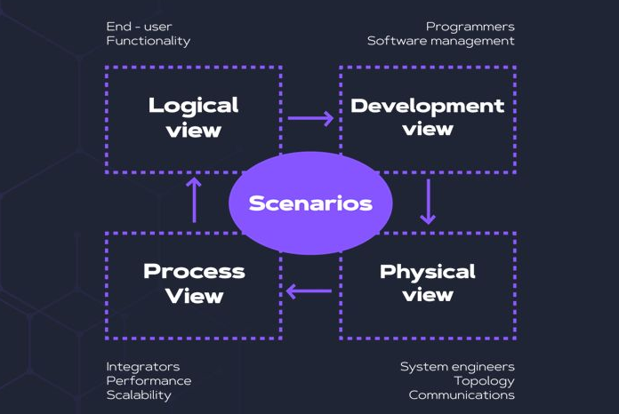
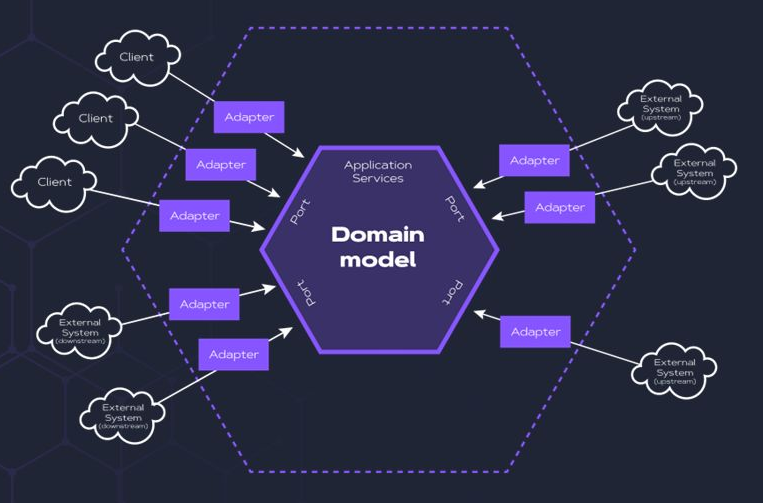
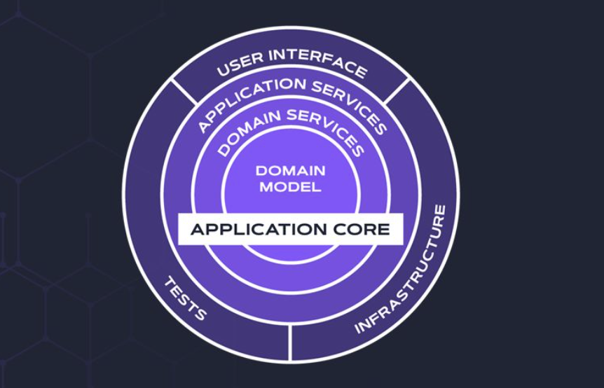
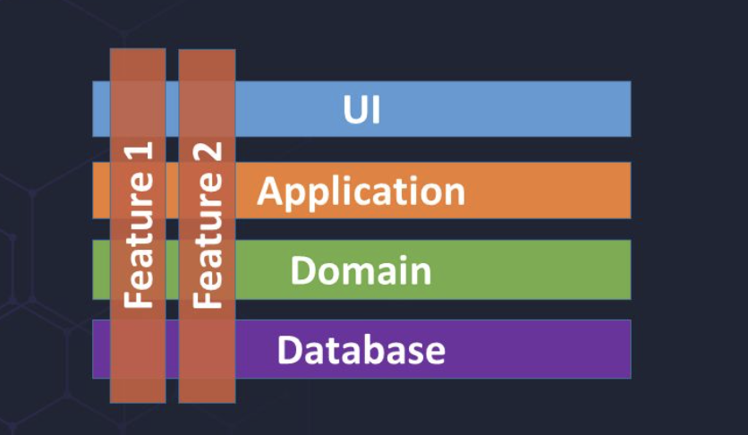

A arquitetura de software é um aspecto crítico do desenvolvimento de software. Envolve a estruturação de sistemas de software de alto nível para atender aos requisitos técnicos e de negócios. 

| Tipo | Entenda |
| ---- | -----   |
| Arquiteto Corporativo | O Enterprise Architect garante que a infraestrutura tecnológica da organização esteja alinhada com sua estratégia de negócios. Esta função integra a estratégia de TI com os objetivos de negócios e rege a conformidade com as políticas e regulamentos da empresa. |
| Arquiteto de Soluções | Como um elo entre os desafios do negócio e as soluções tecnológicas. |
| Arquiteto de Aplicativos | Concentra-se no design e na estrutura de aplicativos individuais, garantindo que atendam aos requisitos técnicos e de negócios. |
| Arquiteto Técnico |  Lida com os aspectos de infraestrutura técnica e hardware, garantindo que a infraestrutura tecnológica suporte os requisitos específicos do domínio. |
| Arquiteto de Dados |  Responsável por gerenciar, traçar estratégias e estruturar a arquitetura de dados da organização, garantindo a precisão e integridade dos dados.Eles desenvolvem e gerenciam a estratégia, políticas, padrões e práticas de dados, projetam modelos e estruturas de dados para apoiar as operações de negócios e garantem a precisão e integridade dos dados em todos os sistemas. |
| Arquiteto de Segurança | Concentra-se em projetar estruturas de segurança robustas, garantindo que a arquitetura do domínio esteja protegida contra possíveis ameaças e vulnerabilidades. |
| Cloud Architect |  Eles são essenciais para facilitar a transição de uma organização para a computação em nuvem, otimizando soluções em nuvem para desempenho, custo e escalabilidade. Esta função envolve projetar estratégias de arquitetura em nuvem, desenvolver soluções em nuvem, supervisionar a migração de sistemas para plataformas em nuvem e gerenciar relacionamentos com provedores de serviços em nuvem. |

# Modelo de Vista Arquitetônica 4+1

{width="900" height="600" style="display: block; margin: 0 auto"}

Define 4 visões simultâneas do ponto de vista dos vários stakeholders (confira nos comentários). Cada modo de exibição deve definir os componentes, conectores e contêineres do sistema, usar estilos apropriados e aplicar restrições a cada modo de exibição. 

1. Visão lógica: ilustra a divisão do funcionamento do sistema em domínios funcionais separados. O sistema precisará ser diagramado em vários níveis de abstração. Aqui, podemos usar diagramas de classe UML para descrever uma exibição ou domínios, subdomínios e contextos limitados no DDD.

2. Process View: isso nos aproxima de um exemplo operacional de software. Aqui, nos concentramos em um comportamento de tempo de execução. Ele explica os processos do sistema e sua comunicação. Podemos usar sequências UML ou diagramas de atividade aqui.

3. Visão física: considera os critérios não funcionais do sistema, incluindo escalabilidade, tolerância a falhas, desempenho e disponibilidade. Sua preocupação é a topologia dos componentes de software e sua conexão física. Outro modo de exibição para este é o modo de exibição de implantação (UML).

4. Visão de Desenvolvimento: concentra-se em como os módulos reais do programa estão organizados no ambiente de desenvolvimento de software. Bibliotecas de programas, subsistemas e outros componentes que podem ser criados por um ou mais desenvolvedores são mostrados. Aqui, geralmente usamos diagramas de componentes UML.

# Modelo Hexagonal

{width="900" height="600" style="display: block; margin: 0 auto"}

O que é Arquitetura Hexagonal?

Também é conhecido como Portas e Adaptadores, é um padrão de design de software cunhado pelo Dr. Alistair Cockburn em 2005. Ele enfatiza a separação da lógica de negócios das dependências externas e permite uma base de código mais flexível e de fácil manutenção. 

A ideia é tratar a funcionalidade principal como o centro (hexágono) e as várias dependências externas (bancos de dados, serviços web, interface do usuário, etc.) como portas que podem ser conectadas ou desconectadas.

Essa arquitetura destina-se a fazer com que o aplicativo seja controlado por usuários, programas ou testes e isolado de serviços externos, como bancos de dados. Para o conseguir, temos de reduzir o acoplamento entre o mundo exterior e o domínio central. Isso significa que a lógica de negócios deve ser isolada da infraestrutura e do código da estrutura.

Os principais elementos da arquitetura hexagonal são:

1. Domínio principal: a lógica de negócios principal e as entidades que definem o comportamento do aplicativo.

2. Atores: qualquer coisa do mundo real que possa interagir com um domínio. Pode ser um humano ou um teste. Existem dois tipos de atores: atores primários que usam um domínio (usuário, teste), que é o lado condutor, e atores secundários que fornecem a funcionalidade necessária para o domínio, que é o lado condutor.

3. Adaptadores: os componentes que permitem que o aplicativo interaja com sistemas e dependências externos. Os adaptadores primários convertem uma solicitação de alguma tecnologia em solicitações independentes de tecnologia que o domínio pode entender (GUI, teste), enquanto os adaptadores secundários convertem chamadas do domínio em tecnologia específica (SQL, sistema de arquivos). Os adaptadores são camadas de tradução entre o domínio e o mundo exterior.

4. Portas: As interfaces definidas para comunicação entre o domínio principal e os adaptadores. Há dois tipos de portas: as portas primárias especificam como o domínio pode ser usado e as secundárias especificam qual funcionalidade o domínio precisa.

# Modelo Cebola ou Onion Architecture

{width="900" height="600" style="display: block; margin: 0 auto"}

A Arquitetura Onion é semelhante à Arquitetura em Camadas. Na arquitetura Onion, as dependências fluem para dentro em direção ao núcleo do aplicativo. 

Ele também se baseia na Arquitetura Hexagonal, colocando a camada de domínio no centro do aplicativo e externalizando a interface do usuário e os sistemas externos. A Camada de Domínio contém a lógica de negócios e as entidades do aplicativo. Ele não depende de nenhuma outra camada, tornando-o o mais estável e menos propenso a mudar. Ao redor da Camada de Domínio estão camadas que dependem dela, como a Camada de Aplicativo, que contém os casos de uso e a lógica específica do aplicativo, e a Camada de Infraestrutura, que contém os detalhes de implementação de tecnologias como bancos de dados, interfaces de usuário e serviços externos.

Os principais benefícios do Onion Architecture são:

1. O aplicativo é construído em torno de um modelo de objeto independente

2. As camadas internas definem interfaces. Camadas externas implementam interfaces

3. A direção do acoplamento é em direção ao centro

4. Todo o código principal do aplicativo pode ser compilado e executado separadamente da infraestrutura

# Vertical Slice Architecture

{width="900" height="600" style="display: block; margin: 0 auto"}

Com a Vertical Slice Architecture, construímos nossa arquitetura sobre diferentes solicitações e agrupamos todas as preocupações do frontend ao backend. Aqui, acoplamos verticalmente ao longo da fatia, minimizando o acoplamento entre fatias e maximizando o acoplamento em uma fatia (coisas que mudam juntas, pertencem juntas).

O que isso nos traz é que não precisamos de tantas abstrações, como repositórios, serviços, etc. Com essa abordagem, cada fatia decide como abordar uma solicitação. Além disso, essa abordagem nos permite testar melhor nosso aplicativo, pois os limites do teste se tornam muito mais limpos, permitindo-nos escrever testes de integração com pouco deboche sem relação com o recurso que estamos testando.

A estrutura de código dessa arquitetura ficaria assim:
```
📂 API
|
📂 Características
 📂 ∟ Pedidos → GetOrder
```

# Arquitetos

[](https://mermaid.live/edit#pako:eNplUr1u2zAQfpUDpwQIkKWTURRwHCdoESdClG5aruRZZkvxlCOlog0y9FGKDp06BX0CvVgoWbKMduP3c3ffkXxSmg2phaqsNxXWhQcQ5nhyspTHxkaKjeDpaU8D5LyNX1FojwBubIkGARkyYU0hMBiCSwrkW3atrchHnsxXLBV2v7tfg-khiWGS7smNSioQAg6guarZJzi5cnbN4JmK1oO1-yGEfcNbKrsXbfn835BDnB3D0T5u0gBWb-bzx83NDC6yze2Elr776Wygfs77qkYdObw9_yTv0vL_5To2r5oQGWoUBD4k3BsfSHt23UtpNU6le45LiwHWoSbd_dkmOcyp7gS1oxnny2wGa4chWj0TH7Ade69YahaMtj0MW7bo7PwgQ9TDpAyNsLffR_0Q7ChM5tDTZxzeGK4FvaHQ346jnuoL_9JR8tyGSFVabHV3v57pjS1l9KozVVH6I9ak7_jUWwoVd6lboRbpaFC-FKrwz8mHTeT8m9dqEaWhMyXclDu12KILCTW1wUiXFlPramSfXwGuGfzZ)

## Arquitetura de Software

[](https://mermaid.live/edit#pako:eNo9z8FKA0EMBuBXGXJqoeB9EUFUvHgo7nUucSfdDu4kaybToqVP46EPsi_mbFe9_fnyE8gJOgkEDaTIIeHo2TkVsdXqXj9KNLKieHvzpneBXCs7O6LSej3XnHvKpmUuTJfpW9yCD5JGYWKLX4sv_EoDdlEYU13J9WINStfUxpKNEual-ywHUkaeLriAcy-R-4I9cf6TrYpJJ4P8C2wgkSaMof5zmtWD7SmRh6bGgPruwfO59rCYtJ_cQVM_oA2olH4PzQ6HXKcyBjR6jNgrpl89_wDdGGgY)

# Requisitos Arquiteturais

[](https://mermaid.live/edit#pako:eNpNT81KAzEQfpUwpxYK3hcRFutNodhrLtOdaXZwM1knyUFLn8cH8cVM3RW8zffLNxcYEjF0EEUp4uzVOUupbDav_F4lS0n5_u5kD701WLhUQ8nb7c3n3IHtnCyiDrwQfQOfrBhZS_rNEbs9UsqL_pQHnPAkkxDSmjlyaKX6_YULfuaA__W-UlthssqPGGfUEfNf_QvaGxfRsOiwg8hthlD76nLjPJSRI3vo2knN7cHrtfmwlnT80AG6YpV3YKmGEbozTrmhOhMW3gsGw7iy1x8D3GeJ)


# Partes interessadas
São pessoas ou grupos interessados no desempenho e/ou sucesso do projeto, ou que são limitados por ele. Não há modelo de gestão capaz de suportar o projeto se as pessoas erradas estiverem envolvidas, se as pessoas certas não estiverem envolvidas ou se as pessoas envolvidas não souberem o que se espera delas ou o que esperar das outras  pessoas. 
