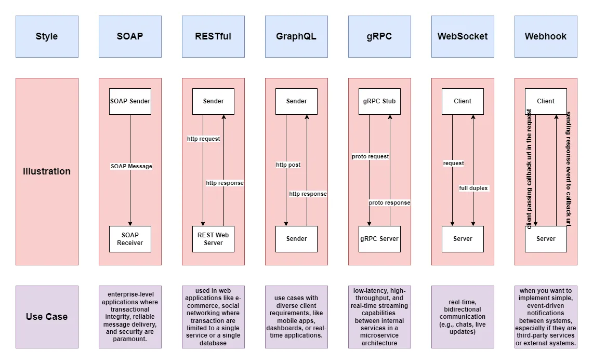

# APIs
Uma API é um conjunto de protocolos, rotinas e ferramentas para criar aplicativos de software. Ele especifica como os componentes de software devem interagir.

## Tipos de API:
  - [x] APIs públicas: abertas para uso por desenvolvedores externos (por exemplo, API do Twitter)
  - [x] APIs privadas: usadas internamente em uma organização
  - [x] APIs de parceiros: compartilhadas com parceiros de negócios específicos
  - [x] APIs compostas: combine várias APIs de dados ou serviços

## Estilos de API
Os estilos de arquitetura definem como diferentes componentes de uma interface de programação de aplicativos (API) interagem uns com os outros. Como resultado, eles garantem eficiência, confiabilidade e facilidade de integração com outros sistemas, fornecendo uma abordagem padrão para projetar e criar APIs. Aqui estão os estilos mais usados: 

- [x] SOAP (Simple Object Access Protocol): Um protocolo para troca de dados estruturados. Maduro, abrangente, baseado em XML.
- [x] RESTful (Representational State Transfer): um estilo de arquitetura amplamente usado para APIs da Web. Métodos HTTP populares e fáceis de implementar, sendo ideal para serviços da web.
- [x] GraphQL: uma linguagem de consulta para APIs que permite que os clientes solicitem dados específicos.
- [x] gRPC: uma estrutura de código aberto de alto desempenho desenvolvida pelo Google. Buffers de protocolo modernos e de alto desempenho, adequado para arquiteturas de microsserviços.
- [x] WebSockets: Permite a comunicação full-duplex em tempo real entre o cliente e o servidor.Conexões persistentes, bidirecionais e em tempo real. Perfeito para troca de dados de baixa latência.
- [x] Webhook: Permite notificações em tempo real e arquitetura orientada a eventos. Retornos de chamada HTTP orientados por eventos, assíncronos. Notifica os sistemas quando ocorrem eventos.

##  Segurança da API

- [x] Autenticação: Básica, OAuth 2.0, JSON Web Tokens (JWT)
- [x] Autorização: Controlando direitos de acesso a recursos
- [x] Limitação de taxa: Prevenção de abusos limitando o número de solicitações
- [x] Criptografia: Protegendo dados em trânsito usando HTTPS

## Práticas recomendadas de design de API

- [x] Convenções RESTful: Usando métodos HTTP corretamente, nomenclatura adequada de recursos
- [x] Controle de versão: controle de versão de URI (por exemplo, /v1/users), controle de versão de parâmetro de consulta (por exemplo, /users?version=1), controle de versão de cabeçalho (por exemplo, Aceitar: application/vnd.company.v1+json).
- [x] Paginação: Manipulação eficiente de grandes conjuntos de dados
- [x] Tratamento de erros: uso adequado de códigos de status HTTP e mensagens de erro informativas

## Documentação da API

- [x] Especificação Swagger/OpenAPI: Um padrão para descrever APIs RESTful
- [x] Postman: Uma ferramenta popular para desenvolvimento e documentação de API
- [x] ReDoc: Uma ferramenta para gerar uma bela documentação de API

## Teste de API 

- [x] Postman: Permite criar e executar testes de API
- [x] SoapUI: Uma ferramenta para testar APIs SOAP e REST
- [x] JMeter: Usado para testes de desempenho e carga
- [x] API Mocking: Ferramentas como Mockoon ou servidores simulados do Postman para simular respostas de API

## Gerenciamento de API

- [x] Gateways de API: Azure API Management, AWS API Gateway, Kongk, Apigee.
- [x] Gerenciamento do ciclo de vida: coleções de carteiros, RapidAPI, Akan.
- [x] Análise e monitoramento de API: Moesif. Datadog, pilha ELK (Elasticsearch, Logstash, Kibana)

