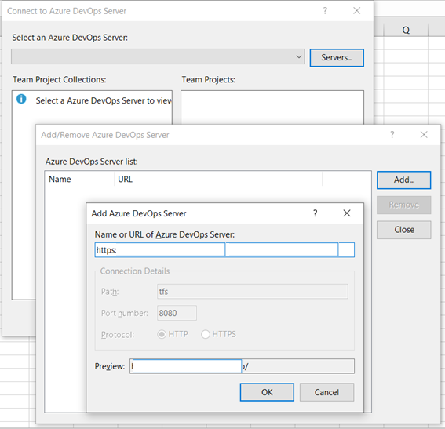
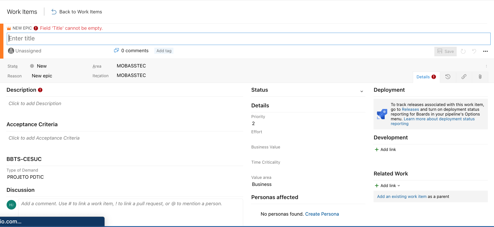
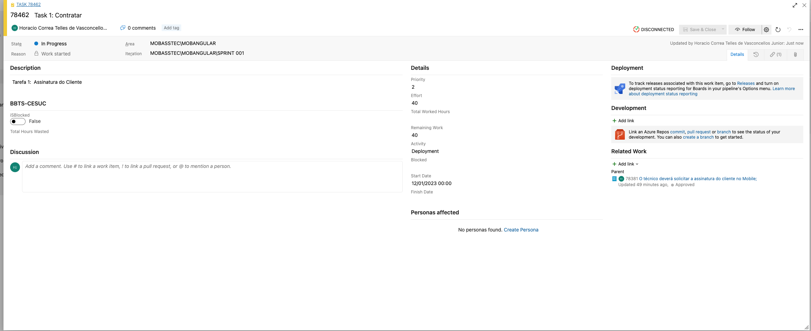

Existem ferramentas de migração da própria microsoft [Ferramentas de migração para Azure DevOps](https://marketplace.visualstudio.com/items?itemName=nkdagility.vsts-sync-migration) ou [OPSHUB](https://www.opshub.com/products/opshub-azure-devops-migrator/).


???+ tip "Estruturação"

    === "Fluxo de valor"
    
        | Referência  | Entenda      |
        | -----       | ----         |
        | Estratégia para portfólio | Análise da demanda de serviços, criação de roteiros de serviços e atividades como estabelecimento de padrões e políticas. |
        | Requisito                 | As atividades típicas de criação de serviços, planejamento, análise de requisitos, design, desenvolvimento, teste e implantação. Estrutura para criar/fornecer novos serviços ou modificar aqueles que já existem. |
        | Solicitação                | Estrutura que conecta os vários consumidores (usuários empresariais, profissionais de TI ou clientes finais) com bens e serviços que são usados para satisfazer necessidades de produtividade e inovação.          |
        | Detectar para corrigir       | Atividades são detecção de eventos, alarmes, diagnóstico para determinar as causas raízes, determinação do impacto nos negócios em caso de problemas e resolução de incidentes.                                    |

    === "Maneira de Trabalhar"

        Discuta com o TIME a melhor forma de trabalhar antes de iniciar o PROJETO.

        - [x] No Azure-DEVOPS os Projetos são caracterizados por TIMES e o PROJETO na URL refere-se ao PRODUTO. O TIME descreve um ou mais requisitos;
              - [x] Sprints quinzenais;
              - [x] As estimativas deverão considerar a criação dos Teste Unitários, Testes UAT?
              - [x] Como serão realizadas os lançamento no Azure-Devops?
              - [x] Como se dará o Fluxo no KanBan Board (DoR/DoD)? 
              - [x] O que fazer com os itens que estão em **IMPEDIMENTO**? Bloquear mantendo o PBI ou tira do lugar?
        - [x] Ferramentas de comunicação e bate-papo: 
              - [x] Utilize o Microsoft Teams;
              - [x] Utilize preferencialmente um número limitado de opções para informar as equipes; utilize os CANAIS do TEAMS;
        - [x] Faça uma classificação dos tipos de informação a serem propagadas;
              - [x] Propague DATAS/MARCOS importantes;
              - [x] Férias ou Abonos do Jogador do TIME;
              - [x] Transmita as notificações ao DONO DO PRODUTO;
        - [x] Quais as ferramentas que serão utilizadas no Projeto? 
        - [x] Quais os plug-ins instalados em seus ambientes de desenvolvimento para auxiliar o processo de desenvolvimento?
              - [x] Estilos de Codificação, Regras e Nomenclaturas a serem utilizadas.
              - [x] Gerenciadores de Pacotes: maven, pip, compose, gradle;
              - [x] Responsável pelo **Gerenciamento de Configuração**  
         - [x] Commit 
              - [x] Um commit é criado por um desenvolvedor e implementa um item de trabalho.
              - [x] Utilize as convenções de Commit;
        - [x] Quem é o reponsável pela "quebra" de uma build?      
        - [x] Solicitação pull
              - [x] Defina as Templates do Pull Request e como será a revisão. 
              - [x] A solicitação pull refere-se a um item de trabalho, para que o desenvolvedor saiba qual commit estava envolvido e qual código do aplicativo ele tem que revisar;                 
              - [x] Adicione os modelos com os nomes das branches em `<repository root>/.azuredevops/pull_request_template/branches/branch_name.md`;
        - [x] Reuniões
              - [x] Qual a melhor data/horário para a realização das reuniões? Qual o público alvo? 
        - [x] Quantos repositórios serão criados? (Doc, QA, Front-End, Back-End)       
        - [x] Estratégia de ramificação (Use uma estratégia de ramificação simples: Fluxo de trabalho baseado em tronco ou a um fluxo de trabalho de **ramificaçãode recursos**);
              - [x] Quais as Templates serão necessárias e o que deverá ter em cada uma delas?
              - [x] Mantenha as ramificações de recursos de curta duração.
              - [x] Sincronize as branches regularmente;
              - [x] Caso trabalhe de forma Offline ou sem acesso a Internet, sincronize o trabalho em um pendrive;

    === "Objetos"

        | Definição              | Entenda                       |
        | ---------              | -------------------           |
        | Pipeline               | É composto por uma ou mais etapas. Ele pode ser pensado como um fluxo de trabalho que define como as etapas de teste, construção e implantação são executadas. |
        | Task                   | É uma script ou procedimento empacotado que foi abstraído com um conjunto de entradas. |
        | Agente                 | É uma infraestrutura de computação com software de agente instalado que executa uma tarefa por vez. |
        | Artefato               | É uma coleção de arquivos ou pacotes publicados por uma execução.                                   |
        | Job                    | Representa um limite de execução de um conjunto de etapas. Todas as etapas são executadas juntas no mesmo agente. |
        | Azure Artifacts        | Permite que os desenvolvedores compartilhem seu código com eficiência e gerenciem todos os seus pacotes em um só lugar. |
        | Azure Key Vault        | É um serviço em nuvem para armazenar e acessar segredos com segurança. |
        | Azure Repos            | É um conjunto de ferramentas de controle de versão que você pode usar para gerenciar seu código. |

    === "Papéis"
 
        | Definição              | Entenda                       |
        | ---------              | -------------------           |
       
    === "Estratégia"

        | Definição              | Entenda                       |
        | ---------              | -------------------           |
        | Build                  | Um build usa código de aplicativo para criar artefatos. |
        | Artefato               | um artefato é criado por uma compilação e implantado por uma versão. O artefato é executado em ambientes de teste e/ou produção. |
        | Release                | Um release implanta um ou mais artefatos para ambientes de teste e/ou produção e gera um nota de lançamento. |
        | Ambiente (produção + teste) | Um ambiente de teste e produção ambiente executa um artefato, que é implantado por um liberar. |
        | Execução de teste      | Uuma execução de teste é executada em um ou mais ambientes. |
        | Especificação de teste | uma especificação de teste cobre um requisito e é executada por uma execução de teste. |
        | Estratégia de implantação de produção (estratégia de “recriação de implantação” ou uma estratégia de “implantação Blue/Green ou A/B”?). |

    === "Segurança"

        - [x] Use um cofre para armazenar tokens, chaves, segredos e senhas.
        - [x] Refine o acesso definindo permissões para um usuário ou grupo.
        - [x] Execute uma análise de vulnerabilidade em bibliotecas de terceiros.
        - [x] Verifique bibliotecas de terceiros em busca de malware ou vírus.
        - [x] Os testes de segurança são automatizados. Além do DAST, pode ser executado um teste de penetração (pentest);
        - [x] Armazene binários (artefatos e dependências) em um repositório de artefatos;
              - [x] Repository Management: Azure-Artifacts será criado para o 60pportunities-Java e 60pportunities-PHP;
        - [x] Não recupere bibliotecas ou recursos externos diretamente de um local na Internet;
        - [x] Código de pipeline, código de automação e orquestração, scripts e designs de pipeline são todos armazenados no repositório do PRODUTO , portanto,são versionados.
        - [x] Todas as alterações são rastreáveis.
              - [x] Somente artefatos construídos por um pipeline podem ser implantado em produção; O ambiente de produção aceita apenas artefatos assinados. As implantações manuais devem ser evitadas; O controle de acesso deve ser configurado de forma que apenas os servidores nos quais as ferramentas CI/CD estão instaladas possam se conectar ao ambiente de destino.
        - [x] Use apenas bibliotecas externas autenticadas e programas autorizados pela Arquitetura ou que estão no Artifact.
        - [x] Os recursos associados a uma versão não podem ser excluídos, isso significa que se uma versão for criada e implementada em um ambiente de produção,o código no repositório de código, o artefato, o item de trabalho, as solicitações pull e todos os outros recursos relacionados não poderão ser excluídos.
        - [x] Todo o código é revisado por pares. O código é verificado por um colega antes de ser incorporado a branch main.

    === "Problemas"  

        - [x] Gerenciamento de problemas: Todos os problemas devem ser registrados como **Bug** na ferramenta Azure-DEVOPS;
        - [x] Ferramenta de design colaborativo para modelagem de ameaças e arquitetura: Não possuimos [iriusrisk](https://www.iriusrisk.com/iriusrisk-on-demand-demo-v2).

    === "Operação e Monitoramento"

        === "Operação"
        
            - [x] Acompanhamento de incidentes, alterações e problemas oriundos do ambiente agora modificado. 
                  - [x] Performance Monitoring (APM).
                  - [x] Registro de Incidentes: SysAid;
                  - [x] Application Performance Monitoring: AppDynamics, DataDog, Dynatrace, Application Insights(M$),Zenoss e etc. (SEM DEFINIÇÃO)
    
        === "Observabilidade"        
                        
            - [x] Monitoramento de desempenho de aplicativos e servidores. A observabilidade contínua é um recurso fundamental para equipes de DevOps e para tal há a   necessidade de definição de métricas transacionais, monitoramento do tempo de crescimento de execução de APIs (Constante, logarítmica,Linear, quadrática e Exponencial).

            - [x] Os quatro sinais de ouro de monitoramento são latência, tráfego, erros e saturação. Se você só pode medir quatro métricas de seu sistema voltado para o usuário, concentre-se nessas quatro.

            === "Latência"
        
                O tempo que leva para atender a uma solicitação. É importante distinguir entre a latência de solicitações bem-sucedidas e a latência de solicitações com falha. 
                
                Por exemplo, um erro HTTP 500 disparado devido à perda de conexão com um banco de dados ou outro back-end crítico pode ser atendido muito rapidamente; no entanto, como um erro HTTP 500 indica uma falha na solicitação, fatorar 500s em sua latência geral pode resultar em cálculos enganosos. 
                
                Por outro lado, um erro lento é ainda pior do que um erro rápido! Portanto, é importante rastrear a latência do erro, em vez de apenas filtrar os erros.
        
            === "Tráfego"

                Uma medida de quanta demanda está sendo colocada em seu sistema, medida em uma métrica específica do sistema de alto nível. Para um serviço da web, essa medida geralmente é de solicitações HTTP por segundo, talvez divididas pela natureza das solicitações (por exemplo, conteúdo estático versus conteúdo dinâmico). 
        
                Para um sistema de streaming de áudio, esta medição pode se concentrar na taxa de E / S da rede ou sessões simultâneas. 
        
                Para um sistema de armazenamento de valor-chave, essa medida pode ser transações e recuperações por segundo.

            === "Erros"

                A taxa de solicitações que falham, seja explicitamente (por exemplo, HTTP 500s), implicitamente (por exemplo, uma resposta de sucesso HTTP 200, mas associada ao conteúdo errado) ou por política (por exemplo, "Se você se comprometeu com um segundo tempos de resposta, qualquer solicitação acima de um segundo é um erro "). 
         
                Quando os códigos de resposta do protocolo são insuficientes para expressar todas as condições de falha, protocolos secundários (internos) podem ser necessários para rastrear os modos de falha parcial. 
         
                O monitoramento desses casos pode ser drasticamente diferente: capturar HTTP 500s em seu balanceador de carga pode fazer um trabalho decente de capturar todas as solicitações com falha completa, enquanto apenas testes de sistema de ponta a ponta podem detectar que você está servindo o conteúdo errado.

            === "Saturação"

                O quão "completo" o seu serviço é. Uma medida da fração do seu sistema, enfatizando os recursos que são mais restritos (por exemplo, em um sistema com  restrição de memória, mostrar memória; em um sistema com restrição de E/S, mostrar E/S). 
                
                Observe que muitos sistemas degradam o desempenho antes de atingirem 100% de utilização, portanto, ter uma meta de utilização é essencial.
        
                Em sistemas complexos, a saturação pode ser complementada com medição de carga de nível mais alto: seu serviço pode lidar adequadamente com o dobro do  tráfego, lidar com apenas 10% mais tráfego ou lidar com ainda menos tráfego do que recebe atualmente? 
                
                Para serviços muito simples que não têm parâmetros que alteram a complexidade da solicitação (por exemplo, "Dê-me um nonce" ou "Eu preciso de um número inteiro monotônico exclusivo global") que raramente mudam de configuração, um valor estático de um teste de carga pode ser adequado. 
                
                Conforme discutido no parágrafo anterior, no entanto, a maioria dos serviços precisa usar sinais indiretos, como utilização da CPU ou largura de banda da rede, que têm um limite superior conhecido. 
                
                Os aumentos de latência costumam ser um indicador importante de saturação. Medir o seu tempo de resposta do 99º percentil em uma pequena janela (por exemplo,  um minuto) pode dar um sinal muito precoce de saturação.
        
                Por fim, a saturação também se preocupa com as previsões de saturação iminente, como "Parece que seu banco de dados encherá o disco rígido em 4 horas". Se   você medir todos os quatro sinais dourados e chamar um humano quando um sinal for problemático (ou, no caso de saturação, quase problemático), seu serviço  será pelo menos decentemente coberto pelo monitoramento.

???+ tip "Padronização Corporativa"

    

    === "Plataforma de Desenvolvimento"

        Azure DevOps é uma plataforma DevOps completa baseada na plataforma de nuvem Microsoft Azure, com o controle de versão sob o serviço Azure Repos no pacote DevOps. 

    === "Gerenciamento de Password e Conexão"

        A Microsoft possui soluções, mas você deve usar soluções independentes de provedor de nuvem se tiver várias nuvens ou nuvens híbridas instaladas.
        Instale um aplicativo de gerenciador de senhas que, de preferência, também tenha suporte a two factor authentication.
        
        - [x] Azure Key Vault
        - [x] KeePass

    === "[SAST Teste Estático de Segurança de Aplicativos](https://owasp.org/www-community/Source_Code_Analysis_Tools)"

        Trata da verificação do código-fonte (quando o aplicativo não está em execução).
       
        - [x] [HuskyCI](https://github.com/globocom/huskyCI)

    === "Source Composition Analysis (SCA)"

        Analisam as bibliotecas que você usa em seu projeto e sinalizam aquelas com vulnerabilidades conhecidas.

        - [x] [PHP Security Checker]()
        - [x] [ClearlyDefined](https://github.com/clearlydefined)

    === "[Dynamic Application Security Testing (DAST)](https://www.synopsys.com/glossary/what-is-sast.html)"

        É o primeiro a testar aplicativos em execução (não o código-fonte como SAST).

        - [x] [Trivy](https://aquasecurity.github.io/trivy/v0.17.2/)

    === "Infraestrutura segura como código(IaC)"

        Você precisa verificar as imagens do Docker baixadas de repositórios públicos, e ferramentas como o Clair destacarão quaisquer vulnerabilidades em potencial.

    === "Ferramentas de Monitoramento" 

        O monitoramento é uma parte crucial do manifesto DevOps. DevSecOps leva isso para o próximo nível e cobre não apenas coisas como tempo de inatividade, mas também ameaças à segurança.

        === "OpenTelemetria/OTLP"

            O uso de um coletor junto com seu serviço, pois ele permite que seu serviço descarregue dados rapidamente e o coletor pode cuidar de manipulações adicionais, como novas tentativas, lotes, criptografia ou até mesmo filtragem de dados confidenciais.

        === "Zabbix"


        === "SigNoz"

            Ferramenta de observabilidade de código aberto que ajuda a monitorar aplicativos.

        === "Prometheus"

           
    === "Ambiente Operativos"

        - [x] Qual será a arquitetura? On-Premisse vs Mono Clouds vs Multi-Clouds & Hybrid Clouds?
        - [x] Quais os ambientes operativos iremos trabalhar? 
              - [x] DEV — Development [Software developer];
              - [x] SIT — System Integration Test [Software developer and QA engineer];
              - [x] UAT — User Acceptance Test [Client];
              - [x] PRD — Production [Public user];
        - [x] Período de ressincronização dos ambientes operativos.

    === "Ambiente ORDS"

        - [x] Query - Todas as consultas(GET) deverão ser realizadas nos ambientes de StandBy;
        - [x] Comando - Todas as integrações (PUT, POST, DELETE) deverão utilizar APIs;

    === "Docker Image"

        Uma imagem de contêiner é um arquivo executável independente usado para criar um contêiner. 

        - [x] Todas as imagens deverão ser de **Docker Official Image**;

        === "Volumes Docker"

            

    === "Servidor de Aplicação"
    
        === "NGINX"

        === "Wildfly"

        === "Apache Servidor HTTP"

        === "Apache Tomcat"

        === "Oracle WebLogic"
    
    === "Bamco De Dados"

        === "MySQL/MariaDB"

        === "PostgreSQL"

        === "Oracle"
 
            

        === "MongoDB"

    === "IaM/Idm"

        === "Realms Keycloack"

            

    === "Linguagens"

        === "PL/SQL"
            
            Os desenvolvedores deverão seguir o modelo apresentado em [Padronização]

            * [Diretrizes de Codificação](https://trivadis.github.io/plsql-and-sql-coding-guidelines/v4.0/9-appendix/PLSQL-and-SQL-Coding-Guidelines.pdf)
            * [PL/SQL Cop for SQL Developer](https://github.com/Trivadis/plsql-cop-sqldev/releases)
            * [PL/SQL Cop v3.0.0](ttps://github.com/Trivadis/plsql-cop-cli/releases/download/v3.0.0/tvdcc-3.0.0.zip)
            * [Unwrapper](https://github.com/Trivadis/plsql-unwrapper-sqldev/releases/download/v1.0.0/Unwrapper_for_SQLDev_1.0.0.zip)

            === "db* CODECOP"

                O plugin analisa o código SQL e PL / SQL e calcula várias métricas e verifica o código para conformidade com as Diretrizes de Codificação Trivadis PL/SQL e SQL Versão 4.0. A análise de código faz parte de uma configuração de integração contínua, no final de um trabalho de construção Gitlab, Jenkins ou Hudson.

                O SonarQube armazena o resultado da análise em um banco de dados relacional, optamos em utilizar o Banco de Dados Oracle.
                
                Uma vez que cada análise é armazenada como um instantâneo no repositório SonarQube, a melhoria ou a diminuição da qualidade do código pode ser monitorada muito bem. 
                
                Use SonarQube e o plugin db*CODECOP se você se preocupa com a qualidade do código PL/SQL.

            === "Liquibase ou SQLci"


            === "Sonar-scanner"

                brew install sonar-scanner

                Acesse o sonarqube instalado e gere o seu token de autenticação para que possam executar análises ou invocar serviços da web sem acesso às credenciais reais do usuário.

        === "PHP"

        === "Java"

        === "Quarkus"

        === "GoLang"

        === "APEX"

        === "Angular"

        === "Biblioteca"

            Em algumas linguagens há a necessidade em se estabelecer as BIBLIOTECAS e VERSÕES que deverão ser utilizadas. Por isso é uma boa prática a inclusão destas BIBLIOTECAS em uma área comum, que neste caso será o Artifacts.

            Um gerenciador de repositório é um aplicativo de servidor dedicado projetado para gerenciar repositórios de componentes binários.

            === "60pportunities-Database"
             
                - Biblioteca 

            === "60pportunities-Library"

                - Biblioteca 

???+ tip "Pipeline"

    Um projeto de pipeline é uma especificação de como construir um pipeline. Um design de pipeline descreve a orquestração de um processo ou fluxo de trabalho e tem muitas semelhanças com a modelagem de processos de negócios. 
    
    

    

    |                              | Descricao      |
    | -----                        | ---------      |
    | Validar critérios de entrada | É acionado por um determinado evento que ocorre em outro sistema. |
    | Executar compilação          | O código associado a um determinado branch e determinado commit é verificado no Sistema SCM, as dependências são baixadas (por exemplo, bibliotecas Java do Maven Central) e o código é compilado. |
    | Testes Unitários             | São testes automatizados para garantir que os componentes de um serviço ou aplicativo se comportem conforme o esperado. |
    | Inspeção de Código           | Analisadores estáticos que garantem a qualidade do software. |
    | Artefato de pacote           | Empacotar um artefato envolve todas as atividades para entregar um artefato que pode ser implementado em um ambiente de teste ou produção. |
    | Publicar artefato            | Artefato significa que ele é armazenado em um repositório binário imutável, Azure DevOps Artifacts. |
    | Provisionar ambiente de teste | Os componentes de infraestrutura são criados dinamicamente usando infraestrutura como código (IaC). |
    | Implantar artefato para testar | Os testes de sistema, por exemplo, precisam de um ambiente de teste menor em comparação com ambientes de teste nos quais são executados testes de carga, estresse e desempenho. |
    | Realizar teste                 | Abrangem uma ampla gama de tipos, desde testes de contrato e testes de integração até testes de usabilidade e testes de aceitação de produção (pré-produção), exceto testes unitários, que são realizados em um estágio dedicado. |
    | Valide a conformidade da infraestrutura | O estágio Validar conformidade da infraestrutura envolve uma verificação dinâmica do ambiente de destino, do aplicativo em execução nesse ambiente, dos recursos usados pelo aplicativo e das configurações específicas do aplicativo. |
    | Validar critérios de saída | A validação dos critérios de saída pode ser considerada como uma porta que determina se o artefato pode ser implantado e instalado no ambiente de produção. |
    | Aprovador de Release | Ter um gerente de lançamento, um proprietário do produto ou uma pessoa designada (um delegado). |
    | Provisionar ambiente de produção | As únicas diferenças são o ambiente de destino e as propriedades e recursos específicos do ambiente (por exemplo, certificados). |
    | Implantar artefato na produção | O artefato é recuperado do repositório binário e instalado em um ambiente de produção. |

    === "Elaboração"

        

        - [x] Separation of concerns: Razões para decompor um único pipeline em vários pipelines, cada um com sua responsabilidade específica.
        - [x] Role separation: Separação de conhecimentos e funções também pode ser extrapolada para a separação de pipelines para áreas específicas de integração contínua, entrega contínua, garantia de qualidade e infraestrutura especializada gerenciada por outra equipe.
        - [x] Resource constraints: A dissociação do processo de CD do processo de CI poderia ajudar. Por exemplo, o pipeline de CD será iniciado de forma programada e não após cada envio de código.
        - [x] Arquitetura da aplicação: Um dos requisitos do capítulo anterior afirma que se o sistema consistir em múltiplos microsserviços, cada microsserviço deverá ter seus pipelines para garantir o isolamento do microsserviços.

    === "Delegação"

        - [x] Isolar o estágio de teste Perform , implementar o estágio em um pipeline separado e deixar o pipeline principal invocar esse pipeline de teste Perform. Isso significa que o pipeline principal inclui um estágio de teste Perform , mas a execução deste estágio é delegada.

???+ tip "Ferramentas Configuração"

    === "Git"

        === "Estrutura Centralizada"
         
            A centralização de alguns arquivo permite trabalhar de forma unica para todos os repositorios git.

            ```
             .
             ├── .gitconfig_60opt_scm
             ├── .gitconfig_gitlab
             ├── .gitignore_global
             ├── allowed_signers
             ├── core
             │   ├── .githound.yml
             │   └── .gitignore
             ├── hooks
             │   ├── commit-msg
             │   ├── post-checkout
             │   ├── post-commit
             │   ├── post-merge
             │   ├── pre-commit
             │   └── pre-push
             └── mensagem
                 └── .commitmensagem
            ```

        === "Assinatura"
                
            ```
            $ ssh-keygen -t rsa -b 4096 -f ~/.ssh/id_pub_azure -C "login@60portunities.com.br"
            $ ssh-add ~/.ssh/id_pub_azure
            $ Crie um arquivo em um diretório SEU ou crie um diretório: 
            $ mkdir -p  ~/gitconfig/signatarios
            $ Este arquivo signatário, deverá conter, a conta de e-mail "login@60portunities.com.br" e a chave rsa, como exemplo:
            horacio@60portunities.com.br ssh-rsa AAAAB3NzaC1yc2Exxxxxxxxx( Não se esqueça são 4096 bits)
             
            Feito isso, inicie o processo de configuração do git:
             
            $ git config --global gpg.format ssh           # Formato da assinatura (* Reveja pois o antigo estava com GPG)
            $ git config --global commit.gpgsign true      # Assina o COMMIT
            $ git config --global tag.gpgsign true         # Assina o TAG
            $ git config --global push.gpgSign true        # Assina o Push
            $ git config --global user.signingkey ~/.ssh/id_pub_azure.pub
             
            Como verificar se o que fiz esta correto? Simples. Veja como é o seu commit (git log --show-signature)
            ```

        === "Backup Pendrive"

            ```
             Em seu repositório CLONADO do repositório CENTRAL.

             $ git clone --bare .  /Volumes/SAMSUNG_T3/clone/projeto_pendrive.git
             $ git remote add pendrive /Volumes/SAMSUNG_T3/clone/projeto_pendrive.git
             $ git push pendrive main
            ```

        === "Mensagem"

            Uma especificação para dar um significado legível às mensagens de commit para humanos e máquinas.

            - [x] [Commitzen](https://commitizen-tools.github.io/commitizen/)
            - [x] [gitmoji](https://gitmoji.dev/)
            - [x] git config --global core.editor "code --wait"
            - [x] git config --global commit.template "c:/Users/horaciovasconcellos/.commitmensagem"
            - [x] git config --global core.excludesfile "c:/Users/horaciovasconcellos/.gitignore_global"

        === "Manutenção"

            Fornece uma interface unificada para executar tarefas relacionadas à manutenção e melhorias de desempenho. A primeira é adicionar as seguintes configurações à configuração Git local do seu projeto:
           
            - [x] git maintenance register / git maintenance unregister
            - [x] git maintenance start / git maintenance stop
            - [x] git maintenance run --task=[commit-graph|gc|incremental-repack|loose-objects|pack-refs|prefetch
            ```
            .git\config
            [maintenance]
             auto = false
             strategy = incremental

             A estratégia incremental é uma abreviação para o seguinte:
                * gc: desabilitado.
                * commit-graph: de hora em hora.
                * prefetch: de hora em hora.
                * loose-objects: diário.
                * incremental-repack: diário.
            ```            


        === "Extensões"
             
            | Definição              | Entenda                       |
            | ---------              | -------------------           |
            | git-hound              | Plugin que ajuda a evitar que dados confidenciais sejam confirmados em um repositório. |
            | git-secrets            | Impede que você comprometa senhas e outras informações confidenciais em um repositório git. |
            | git-lfs                | Substitui arquivos grandes, como amostras de áudio, vídeos, conjuntos de dados e gráficos, por ponteiros de texto dentro do Git. |
            |                        | git lfs install, git lfs track "*.psd",git lfs track "*.jpg" "*.png"  |
            | gitmoji                | Iniciativa para padronizar e explicar o uso de emojis nas mensagens de commit do GitHub. |
            | git-flow               | brew install git-flow git flow init |
            | git-flow feature       | git flow feature start MYFEATURE, git flow feature publish MYFEATURE, git flow feature pull origin MYFEATURE, git flow feature track MYFEATURE,  git flow feature finish MYFEATURE |
            | git-flow release       | git flow release start RELEASE [BASE],git flow release publish RELEASE,git flow release track RELEASE,git flow release finish RELEASE e git push origin --tags |
            | git flow hotfix        | git flow hotfix start VERSION [BASENAME] e git flow hotfix finish VERSION |

    === "Maven (colecionador/acumulador de conhecimento)"

        O Maven é construído em torno do conceito de um ciclo de vida de compilação, que define a ordem de execução para as metas. O ciclo de vida padrão do Maven consiste em 8 fases principais: Validar, Compile, Testar, Pacote, Teste de Integração, Verificar, Instalar e Implantar.
        Baseada no POM (Project Object Model), esta ferramenta tornou a vida dos desenvolvedores Java livre de estresse durante o desenvolvimento de relatórios, o exame minucioso de construções e o teste de configurações de automação. 

        

        Um Project Object Model ou POM é um bloco de construção no maven, é um arquivo XML que contém informações sobre o projeto e detalhes de configuração usados ​​pelo maven para construir um projeto. Quando tendemos a executar uma tarefa, o Maven procura o POM no diretório atual.

    === "VS Code"
      
        Visual Studio Code é um editor de código-fonte desenvolvido pela Microsoft para Windows, Linux e macOS.

        === "Extensões"

            - [x] Auto Close Tag
            - [x] C4 DSL Extension
            - [x] Conventional Commits
            - [x] Cucumber
            - [x] MarkdownLint
            - [x] Docker
            - [x] Dracula Official
            - [x] Git Blame
            - [x] Git Extension Pack
            - [x] Git History
            - [x] git-squash-all
            - [x] GitLens - Git supercharged
            - [x] Go
            - [x] Go Doc
            - [x] Golang Tools
            - [x] JSon Formatter
            - [x] Markmap
            - [x] Peacock
            - [x] Prettier
            - [x] TrunkFlow
            - [x] Yaml
            - [x] XML Formatter

            ```
             code --list-extensions | sed -e 's/^/code --install-extension /' > my_vscode_extensions.sh
            ```

    === "[Documentação](https://www.writethedocs.org/guide/docs-as-code/)"

        Discuta com o TIME como será o padrão de Documentação.

        - [x] Documentation as a Code
              
        - [x] Implementam/Modificam configurações básicas;
              - [x] Mantém a documentação da configuração do Produto;
              - [x] Automatizam atualizações e possíveis evoluções analisando os impactos no Projeto;
        - [x] Estratégia para a elaboração do Portifólio do Produto;
              - [x] Descrição do Produto;
        - [x] Requisitos;
              - [x] Representação dos diferentes elementos e fluxos de um processo de negócios.
              - [x] Funcionalidade
        - [x] Conhecimentos
              - [x] Product Owner / Ponto Focal
              - [x] Conhecimento Técnico
              - [x] Ambientes Tecnologico
              - [x] Tipos de Ambientes, Servidores de Aplicação, Banco de Dados, Cache, Segurança, Linguagens Instaladas e etc.
        - [x] Getão dos Dados
              - [x] OpenData
              - [x] Matriz RACI, Acessibilidade, Formatos Interoperáveis, Atualização Regular,Metadados Descritivos, REGEX, Domínio e etc.
        - [x] Getão de Códigos  
              - [x] Repositório de Objetos
              - [x] SCM (Codigo, Documentação e Qualidade), xxxDoc (PHPDoc, PLDoc, JavaDoc, GoDoc), Swagger, Allure Report e etc
              - [x] Bibliotecas
        - [x] Instalação
              - [x] Instale o  [Python](http://python.org)
              - [x] Instale o MkDocs (pip install mkdocs)
              - [x] Instale o MKDocs Material (pip install mkdocs-material)

        === "MKDocs"

            MkDocs é um gerador de sites estáticos rápido , simples e absolutamente lindo, voltado para a construção de documentação de projetos.

             - [x] [MkDocs](https://www.mkdocs.org/)
             - [x] [MkDocs-Material](https://squidfunk.github.io/mkdocs-material/)
             - [x] Outras Extensões
                   * mike
                   * mkdocs-git-authors-plugin
                   * mkdocs-git-revision-date-localized-plugin
                   * mkdocs-glightbox
                   * mkdocs-material-extensions
                   * mkdocs-mermaid2-plugin
                   * mkdocs-minify-plugin
                   * mkdocs-pdf-export-plugin
                   * mkdocs-print-site-plugin
                   * mkdocs-puml-mod
                   * mkdocs-render-swagger-plugin
                   * mkdocs-static-i18n
                   * mkdocs-swagger-ui-tag
                   * mkdocs-table-reader-plugin
                   * mkdocs-with-pdf
                   * mkpdfs2-mkdocs
                   * mktestdocs
             - [x] Versionamento usando mike
                   ```
                   mike deploy --push --update-aliases "v01.00.00" latest
                   mike set-default --push latest
                   ```
             
        === "Portifólio"

            === "JavaDoc"

                javadoc -d docs --add-stylesheet escuro.css Horacio.java

                ```
                escuro.css
                :root {
                    --body-text-color: #e0e0e3;
                    --block-text-color: #e6e7ef;
                    --body-background-color: #404040;
                    --section-background-color: #484848;
                    --detail-background-color: #404040;
                    --navbar-background-color: #505076;
                    --navbar-text-color: #ffffff;
                    --subnav-background-color: #303030;
                    --selected-background-color: #f8981d;
                    --selected-text-color: #253441;
                    --selected-link-color: #1f389c;
                    --even-row-color: #484848;
                    --odd-row-color: #383838;
                    --title-color: #ffffff;
                    --link-color: #a0c0f8;
                    --link-color-active: #ffb863;
                    --snippet-background-color: #383838;
                    --snippet-text-color: var(--block-text-color);
                    --snippet-highlight-color: #f7c590;
                    --border-color: #383838;
                    --table-border-color: #000000;
                    --search-input-background-color: #000000;
                    --search-input-text-color: #ffffff;
                    --search-input-placeholder-color: #909090;
                    --search-tag-highlight-color: #ffff00;
                    --copy-icon-brightness: 250%;
                    --copy-button-background-color-active: rgba(168, 168, 176, 0.3);
                    --invalid-tag-background-color: #ffe6e6;
                    --invalid-tag-text-color: #000000;
                }
                ```

            === "PL/SQLDoc"

                ```
                pldoc.sh -doctitle \"SISLOC\" -inputencoding ISO-8859-15 -d "${DESTINO}" -keywordsuppercase -savesourcecode -driver oracle.jdbc.OracleDriver -url "${DB_CONNECTION}" -user SISLOC -password "${DB_PASSWD}" -verbose -types "CLUSTER,CONTEXT,DIRECTORY,FUNCTION,INDEX,INDEX,JOB,PACKAGE,PACKAGE_BODY,PROCEDURE,QUEUE,RULE,SCHEDULE,SEQUENCE,SYNONYM,TABLE,TRIGGER,TYPE,VIEW" -sql %
                ```

            === "GoDoc"

                ```
                go mod init godoc
                mkdir godoc
                cd godo
                godoc -http :8080
                ```

            === "PHP Doc"

                ```
                phpdoc --directory="/Users/horaciovasconcellos/desenvolvimento/design-pattern-strategy-na-pratica/src/" --target="/Users/horaciovasconcellos/desenvolvimento/docs/api/"
                ```

            === "Swagger"

                === "GO Swagger"

                === "ORDS Swagger"

        === "Wiki2MkDocs"

            *Existe uma script em shell que transforma o repositório Wiki em uma documentação no PORTIFÓLIO*.

    === "Integrated Development Environment"

        === "SQLDeveloper Configuração"

    === "Branches"

        Discuta com o TIME como será o padrão de Documentação.

        

    === "Teste" 
 
        É um plano detalhado que define como os testes serão conduzidos para garantir a qualidade de um produto ou sistema. Aqui estão algumas etapas importantes para criar uma estratégia de teste eficaz:

        - [x] Estratégia de Teste:
              - [x] Testes unitários, 
                   - [x] PHPUnit, Junit, utPLSQL;
              - [x] Testes de integração, 
              - [x] Testes funcionais, 
              - [x] Testes de regressão, 
              - [x] Testes de carga, testes de estresse,
              - [x] Testes manuais,  
              - [x] Testes de desempenho, 
              - [x] Testes de interrupção
              - [x] Testes de pré-produção/preparação  
             - [x] Automatize a criação de teste ambientes efêmeros (O ambiente de teste é criado dinamicamente e automaticamente destruído novamente quando não for mais usado);
             - [x] Execute testes manuais **somente se necessário**, definindo assim em quais circunstancias, como por exemplo:
                  - [x] O teste automatizado de um recurso recentemente desenvolvido ainda não está integrado ao conjunto de testes automatizados;
                  - [x] A equipe de QA tem um backlog e esta convertendo testes manuais em testes automatizados;
                  - [x] Alguns testes são muito específicos, por isso não podem ser automatizado, por exemplo: Teste de Usabilidade.
            - [x] Não recrie ambientes de teste em cada execução de pipeline.  
            - [x] Estratégia de lançamento (define a cadência para liberar artefatos e implantá-los na produção);
                  - [x] Diariamente;
                  - [x] Ao final da Sprint;
                  - [x] A cada duas Sprints;
            - [x] Item de trabalho (épico, história ou tarefa): um item de trabalho é referido por um requisito e referido por uma solicitação pull;
            - [x] O código do aplicativo deve atender a uma determinada qualidade de código. A varredura de código estático é executada no código do aplicativo para validar bugs, padrões de codificação, complexidade, bugs, código sem desempenho, etc.
            - [x] O código da infraestrutura deve ser verificado quanto à qualidade do código.
            - [x] Use o mesmo sistema operacional no pipeline que o sistema operacional do ambiente de tempo de execução.
            - [x] Todos os desenvolvedores possuem acesso a ferramentas SAST da 60pportunities?
        - [x] Os dados de teste são anônimos
              - [x] Anonimizar os dados: Anonimização de dados, também conhecido como ofuscação de dados ou mascaramento de dados, envolve a remoção de  informações de identificação pessoal ou a alteração de dados (de produção) para que não possam ser rastreados até uma pessoa.
              - [x] Defina QUAIS os dados sensíveis de sua aplicação e que necessitam de Autorização de Acesso do Dono do Produto;
        - [x] Ferramentas
              - [x] Apache JMeter
              - [x] K6
              - [x] Selenium
              - [x] Appium
              - [x] EMMA
              - [x] SimpleTest
              - [x] Gatling.io
              - [x] Cypress e Allure
              - [x] Arquillian Core: fornece ao JUnit a capacidade de subir servidores para que eu possa executar meus testes.
                    - [x] Arquillian Tomcat: um módulo que permite que eu suba um Tomcat a cada execução dos meus testes.
                    - [x] ShrinkWrap: permite que eu empacote, programaticamente, meu código fonte para execução dos testes com o Arquillian.
                    - [x] Selenium WebDriver: permite que eu inicie um Navegador e programe instruções de interação com as telas da minha aplicação.
                    - [x] PhantomJS: permite que eu integre com as minhas telas sem necessidade de uma janela de Browser (importante quando eu rodo meus testes em servidor sem pacote gráfico).
                    - [x] PhantomJSDriver: possibilita ao Selenium WebDriver interagir com o PhantomJS.
                    - [x] Failsafe: plugin do Maven que permite a execução dos testes de integração (por padrão as classes devem terminar com IT, Integration Test)

???+ tip "Integração Excel"

    === "Configuração Básica"

        Permite agilizar o processo de integração do Azure-Devops, corrigindo informações em massa.
        Na configuração do usuário habilite TODOS os **PREVIEW FEATURES**.

        === "Instalação"

            Este tópico irá ensinar como efetuar a CARGA de informações através do Excel para o Azure. Caso considere desnecessário salte, este tópico.

            

            O Excel dá suporte à adição/atualização de itens de trabalho, adição de links ao projeto, sem ter que efetuar de forma MANUAL ou via Tela do Azure. Para que este processo seja fluido, há a necessidade em observar os **pré-requisitos**:

            - Versão Microsoft Excel 2010 ou posterior instalada, incluindo o Microsoft Office Excel 365;
            - Instalado o Azure DevOps Office Integration 2019;
            - Ser um membro do Produto/Projeto.

        === "Plugin"

            Após instalado o Plugin necessário e com sua conta do Azure-Devops, acesse o Excel.

            Caso seja a sua primeira vez, efetue a configuração

            

            
       
            

            

        === "Projeto"

            

            

            

            

        === "Formato"

            Para itens NOVOS, utilizo na caixa de diálogo Nova Lista, Input List, que me permite trabalhar de duas formas diferentes e com muita celeridade. Para itens a serem atualizados, efetuo uma query com as colunas necessárias e utilizo esta.
            O que tenho realizado, para atualizações simples de itens já cadastrados e/ou trabalhados, List Type - Flat e caso queira efetuar a inserção em massa, List Type = Tree, colocando os níveis necessários, tais como: Épic, Feature, PBI e Task ou Bug e Task.
            Esta parte, adotaremos que estamos iniciando sem informações e colocarei em multiplos níveis ou Tree.
            Sua planilha agora está associada ao seu projeto como uma lista de entrada.

            
       
            ou

            

            

            

            

        === "Publicando"
       
            
       
            

            Observação: 

              - Como esta entrada é GENÉRICA, possivelmente existirão regras que irão impedir a sua PUBLICAÇÃO, deven o mesmo ajustar possiveis erros e reprocessar.
              - Caso algum campo NÃO tenha sido escolhido na QUERY ou no Input List,você pode adicionar colunas usando as Colunas Escolher na faixa de opções da Equipe, no entanto, suas adições não modificam a consulta realizada.
              - Para mover ou remover um campo, escolha o campo e selecione os ícones ou < os > ícones.
              - Escolha uma identidade ou um campo nomeado por pessoa para ativar o recurso Selecionar Usuário na faixa de opções da Equipe.
              - Para vincular um item de trabalho a outros itens de trabalho, escolha o item de trabalho e escolha Links e Anexos. Na guia Links, escolha Vincular e escolha o tipo de link e os itens de trabalho aos quais você deseja vincular.

???+ tip "Configuração"

    === "Configuração Básica"

        A configuração do projeto deverá ser realizada de forma manual ou por script. A script NÃO efetuará TODOS os ajustes necessários.

        

        

        

        

        

    === "Boards"
    
        Limite a WIP para NUMERO DE ELEMENTOS DO TIME X 3.

        

        

        

        

        

        

        

        

        

        

        

    === "Times"

        Adicione os Stakeholders, Product Owner e o membros do Time de Desenvolvimento.

        

        

    === "Work Items"

         Os items de trabalho deverão ser utilizados seguindo o seguinte critério:
         
        === "Épicos"

            

            - Os campos adicionais, devem ser preenchidos: Type of Demand: Informar se BUG encontrado é oriundo de OTRS, SysAid, Demanda Gerencial, Auditoria e etc.
            - Os campos obrigatórios são: Priority e Value area.
            - Os campos obrigatórios CUSTOM:  Não há campos regras.

        === "Feature"

            

            - Os campos adicionais, devem ser preenchidos: Não há campos adicionais.
            - Os campos obrigatórios são: Description, Priority, Business Value e Value area.
            - Os campos obrigatórios CUSTOM:  Não há campos regras.

        === "PBI"

            

            - Os campos adicionais, devem ser preenchidos:
                - Ticket Number : Informar o numero do ticket aberto no sistema SysAid, OTRS e/ou Supravizio;
                - Type of Demand: Informar se BUG encontrado é oriundo de OTRS, SysAid, Demanda Gerencial, Auditoria e etc.
                - Delivery Rating: Informar como esta sendo realizada a entrega inicial.
            - Os campos obrigatórios são: Priority e Value area.
            - Os campos obrigatórios CUSTOM:  Há regras de MOVIMENTAÇÃO e de Obrigatoriedade.

        === "Task"

            

            - Os campos adicionais, devem ser preenchidos:
                - Os campos obrigatórios CUSTOM:  Effort, Total Hours Wasted, Total Worked Hours, Finish Date, Activity.

        === "Bug"

            

            - Os campos adicionais, devem ser preenchidos:
                - Ticket Number : Informar o numero do ticket aberto no sistema SysAid, OTRS e/ou Supravizio;
                - Type of Demand: Informar se BUG encontrado é oriundo de OTRS, SysAid, Demanda Gerencial, Auditoria e etc.
            - Os campos obrigatórios Azure são: Priority, Repro Steps, Severity,Activity (Testing, Deployment, Developer e etc.)
            - Os campos obrigatórios CUSTOM: Severity, Activity e Remaining Work.
        
        === "Spike"

            

???+ tip "Business Value"

    === "Configuração Básica"
    
        É constantemente descrito como o valor percebido, ou requerido, por clientes, patrocinadores, stakeholders do projeto.

        === "Análise WIT"

            O Product Owner pode ter dúvida quanto ao Business Value dos Work Itens.
            Como **sugestão**, o Scrum Master, pode elaborar uma query, com as **Features** e/ou **Product Backlog Item** e efetuar a configuração em **ESTIMATE** e criar uma sessão, para estabelecer o Valor de Cada item.

            

            

            

            

            Observação: 

            - Ao final da sessão atribua o valor apurado ou crie uma regra de calculo para os itens apurados.
            - Você pode estabelecer os critérios para os demais work items e sempre retorno ao valor default da apuração.

        === "Query"

            Refaça a query ordenando por Business Value e leve para o Time estimar o item inferior, neste caso o PBI.

            

            

        === "Retorno"

            Utilize os PBI, trocando o T-Shirt pelo valor a ser atribuido ao Product Backlog. Em função do valor, estabeleca com o TIME o comprometimento e associe ao item a SPRINT.

            

            O time deverá estabelecer os itens que poderão ser entregues na SPRINT, atribuir ao membro do Time, Informara a data de Início e trocar o Status do Item para Aprovado.

            

???+ tip "Sprint"

    === "Configuração Básica"   

        NÃO COMECE A SPRINT SEM O BUSINESS VALUE DEFINIDOS.

        O Scrum Master poderá efetuar a atribuição dos PBIs a SPRINT em questão e preencher/atribuir a cada um do TIME DE DESENVOLVIMENTO, sua atribuição na SPRINT e o tempo que irá trabalhar na mesma.

        === "Preocupação"
        
            | Conceito | Descrição |
            | ------ | ------ |
            | Work in Progress | É o número de itens de trabalho em andamento no sistema no momento atual |
            | Lead Time | É o período que decorre entre o item de trabalho ser adicionado e ele sair do sistema.|
            | Throughput | É a vazão, ou quantidade por tempo, dos itens de trabalho passando pelo sistema. |

        === "Sprint"

            O SCRUM Master deverá preencher qual a capacidade do TIME para aquela SPRINT e verificar com os mesmos se haverá ausências.

            

            
       
        === "Dividir"

            O membro do Time Developer, deverá subdividir o PBI em tarefas/subtarefas para desenvolver suas atividades.

            

            

            O desenvolvedor deverá a cada atividade, movimentar os itens.
       
            

            

            

        === "Acompanhamento"

            O Desenvolvedor deverá efetuar a apresentação do ARTEFATO e caso seja aprovado aprovado. Efetuar a atualização dos documentos, apresentar os testes que foram realizados e etc.

            

        === "Retrospectiva"

            A retrospectiva é um dos principais pilares do Scrum. Este evento é uma atividade essencial que oferece à equipe a oportunidade de planejar individual e coletivamente maneiras de aumentar a qualidade e a eficácia. Cada membro da equipe pode adicionar suas ideias, votar no que considera mais importante e tomar medidas para facilitar a melhoria imediata.
            Como sugestão iremos utilizar o modelo 4Ls (Reflita sobre o que sua Equipe gostou, aprendeu, faltou e desejou.). 

            === "Criar Nova Retrospectiva"

                Crie uma nova retrospectiva usando o botão 'Create Board'. Se esta for sua primeira retrospectiva para a equipe selecionada, pressione o botão "Criar quadro" no centro da tela.
                Ao selecionar New Board ou Create new retrospective, você verá caixa de diálogo, e informe: 

                * Título da Retrospectiva : Título da Retrospectiva (Dê o nome da Sprint x - Por exemplo: Retroscpectiva SPRINT 001).
                * Máximo de Votos por Usuário : O número máximo de votos que um participante deve usar na Fase de "Voto".
                * Incluir avaliação da equipe : inclua um link de avaliação da equipe na parte superior do quadro.
                * Oculte o feedback dos outros até depois da fase de coleta : quando selecionado, os usuários não podem ver a entrada de outros usuários até que tenham passado para outra fase. O feedback de outros usuários será desfocado.
                * Mostrar 'Primeira Diretriz Retrospectiva' : Inclua um link para a 'Primeira Diretriz' na parte superior do quadro.
                * Não exibir nomes no feedback : quando marcada, torna anônimo quem cria itens de feedback individuais.
                * Configurações de colunas : você pode aplicar a partir de um modelo pré-preenchido ou selecionar e configurar colunas individualmente.

                Depois que o título for informado,Salve a retrospectiva usando o botão Save.

                Depois de criar uma nova retrospectiva, você pode compartilhar um link para ela com todos os participantes. 

                Os usuários podem acessar esse link para participar da retrospectiva.(Copy Retroscpective Link)

                Fases da Retrospectiva Padrão: 

                A Primeira Diretriz: "Independentemente do que descobrimos, entendemos e realmente acreditamos que todos fizeram o melhor trabalho que puderam, considerando o que sabiam na época, suas habilidades, os recursos disponíveis e a situação em questão."
        
                Coletar: Os usuários podem adicionar feedback em qualquer uma das colunas usando o botão 'Adicionar novo cartão' ou clicando duas vezes no espaço vazio do plano de fundo da coluna.Depois que o feedback de todos os usuários for coletado, passe para a próxima fase do Grupo.
 
                Grupo: qualquer feedback semelhante pode ser agrupado abaixo de um "cabeçalho".  Se você achar que 2 itens de feedback são semelhantes, arraste um sobre o outro para agrupá-los. Arrastar qualquer item para um grupo adicionará itens a esse grupo. Depois que todos os itens semelhantes estiverem agrupados, passe para a próxima fase da Votação.

                Voto: os participantes passarão individualmente por todos os itens de feedback e votarão naqueles que julgarem importantes, clicando no ícone 'Upvote'. Os usuários podem reduzir o número de votos em um item específico clicando no ícone 'Downvote'. Observe que os votos máximos por usuário definidos pelo criador do quadro são exibidos como o denominador em uma proporção de "votos usados". Os votos usados pelo usuário são atualizados em tempo real conforme o usuário clica nos ícones 'Upvote' e 'Downvote'. Depois que todos terminarem de votar, passe para a próxima fase do Ato .


                Agir: Clique no botão 'Adicionar item de ação' em um cartão de feedback e selecione o tipo de item de trabalho que precisa ser criado no Azure DevOps. Isso abrirá o formulário de criação de itens de trabalho padrão do Azure DevOps. Insira os detalhes do item de trabalho e salve. Isso criará o item de trabalho em sua conta do Azure DevOps e também o associará ao item de feedback.
                      
                A Avaliação da Equipe: Opcionalmente, você pode incluir uma "Avaliação da equipe" que coleta comentários anonimamente dos participantes. Para obter o formulário de feedback, você pode clicar no link "Avaliação da equipe" na parte superior do quadro.

                * Clareza: Eu entendo claramente o que é esperado de mim nesta equipe;

                * Energia: Eu me senti animado para trabalhar todos os dias no último sprint

                * Segurança Psicológica: Sinto-me seguro e não tenho medo de errar, levantar questões difíceis, correr riscos ou pedir ajuda

                * Equilíbrio entre vida pessoal e profissional: Minha carga de trabalho típica me permite atingir um nível aceitável de equilíbrio entre vida pessoal e profissional

                * Confiança: Estou confiante de que nossa equipe terá sucesso

                * Eficiência: Ferramentas/recursos/processos/procedimentos me permitem atender com eficácia às necessidades de meus clientes


???+ tip "Preocupações"
    
    Aconselhamos a utilização do Oracle DataModeler e SQL Developer para manipulação de Banco de Dados.
    Aconselhamos a utilização de JMeter, Selenium, Cypress para testes.

    === "Requisitos"

        === "Waterfall"

            As atividades de desenvolvimento de software são divididas em diferentes fases e cada fase é composta por uma série de tarefas e possui objetivos distintos.

            | Nome da Fase | Atividades | Entregáveis/Saída |
            | -----------  | ---------  | ----------------- |
            | Análise de Requisitos | Capture todos os requisitos, brainstorming e um passo a passo para entender os requisitos e teste de viabilidade dos requisitos para garantir que os requisitos sejam testáveis ou não. | Documento de Entendimento de Requisitos |
            | Projeto de sistema | De acordo com os requisitos, crie o design,Capture os requisitos de hardware/software e Documente os projetos | documento de design de baixo/alto nível |
            | Implementação | Codificação, Teste de unidade do código | Casos de teste de unidade e resultados |
            | Teste do Sistema | Execute todas as atividades de teste (funcionais e não funcionais) para garantir que o sistema atenda aos requisitos | Relatórios de teste e  defeitos |
            | Implantação do sistema | Implante o aplicativo no respectivo ambiente. Execute uma verificação de sanidade no ambiente após a implementação do aplicativo para garantir que o aplicativo não seja interrompido.| Manual do usuário, Definição/especificação do ambiente |
            | Manutenção de sistema | No caso de encontro e defeito do usuário, certifique-se de anotar e corrigir os problemas enfrentados. | Lista de tickets de produção. Manual do Usuário, Lista de novas funcionalidades implementadas. |

        === "Modelo Espiral"

            O modelo espiral é uma combinação de modelos sequenciais e protótipos.
            Existem atividades específicas que são feitas em uma iteração (espiral) onde a saída é um pequeno protótipo do grande software. As mesmas atividades são então repetidas para todas as espirais até que todo o software seja construído.
          
            | Nome da Fase | Atividades | Entregáveis/Saída |
            | -----------  | ---------  | ----------------- |
            | Planejamento | Requisitos são estudados e reunidos. | Documento de entendimento de requisitos Lista finalizada de requisitos. |
            |              | Estudo de viabilidade                |                                                                         |
            |              | Revisões e orientações para agilizar os requisitos |                                                           |
            | Análise de risco | Requisitos são estudados e sessões de brainstorming são feitas para identificar os riscos potenciais | Documento que destaca todos os riscos e seus planos de mitigação. |
            |                  | Estratégia de mitigação de riscos é planejada e finalizada. |           |
            | Engenharia       | Desenvolvimento e teste reais se o software ocorrer nesta fase | Codificação, Casos de teste e resultados de teste, relatório de resumo de teste e relatório de defeito. |
            | Avaliação        | Os clientes avaliam o software e fornecem feedback e aprovação | Documento de recursos implementados |

        === "Estrutural"
            

        === "Cebola"

            

        === "Modelagem de eventos"

            Memória Humana: Contar histórias é algo que permite ao ser humano passar conhecimento para as gerações subsequentes e depende muito de como armazenamos memórias - sejam lógicas, visuais, auditivas ou outras. Especificações são uma maneira de mostrar como algo deve funcionar. Isso pode ser visto em práticas bem-sucedidas em software, como o Behavior Driven Development.

            | Nome da Fase | Atividades | Entregáveis/Saída |
            | -----------  | ---------  | ----------------- |
            | Eventos      | Podemos fingir que já temos o sistema e nos perguntar quais fatos foram armazenados à medida que avançamos no tempo. Podemos mostrar quais eventos, ou fatos, estão armazenados em uma linha do tempo do ano naquele negócio. |  - |
            | Wireframes ou maquetes de páginas | Estes podem ser organizados em raias para mostrar pessoas diferentes (ou às vezes sistemas) interagindo com nosso sistema. Também mostramos qualquer automação aqui com um símbolo como engrenagens para ilustrar que o sistema está fazendo algo. Isso tem um conjunto fácil de entender de mecânica de uma lista de tarefas que um processo vai e faz e marca os itens como concluídos.  |
            | 

            

    === "Diagramas"

        === "Lógico"
               
            O modelo lógico é criado para realizar a descrição de como os dados serão armazenados no sistema. Ele explora os conceitos de domínio. Nesse modelo, descrevemos as entidades, os atributos, as chaves primárias e estrangeiras e os seus relacionamentos.

            

            

        === "Físico"

            O modelo físico também é criado para descrever as tabelas, suas colunas e os relacionamentos.
    
            

        === "Nomenclaturando"

            Os objetos deverão seguir a TAB-670 e deverão possuir as informacões em Comments in RDBMS.
   
            

    === "Testes"
        Os dias de teste manual estão limitados à medida que mais e mais empresas estão mudando para testes automatizados, significando que todos os QAs de teste manual precisam aprender novas habilidades de automação de teste, como Selenium, Cucumber, JUnit, Mockito, Cypress ou TestNG.
        O mundo atual de desenvolvimento de software usa práticas TDD ( Desenvolvimento orientado a testes ) e BDD ( Desenvolvimento orientado a negócios ) e requer integração contínua e implantação contínua usando Jenkins e Maven.
        
        
        === "Funcional"
      
            --- Teste Funcional

        === "Integridade"

            --- Integridade do Banco de Ddaos e dos Dados

        === "Ciclo de Negócio"

            --- Ciclo de Negócio

        === "Segurança"

            --- Ciclo de Negócio

        === "Carga"

            --- Ciclo de Negócio

        === "Ferramentas"

            === "Cypress vs Selenium"

                O Cypress é uma ferramenta de teste completa (6.3.0). Ele fornece uma estrutura de teste (Mocha), uma Assertion Library (Chai), bem como outras ferramentas (JQuery, Test Runner, Recorder, Locator Playground), então tudo que você precisa para começar é um IDE (como o Microsoft Visual Studio Code) e NodeJS instalado.
                
                O Selenium, por outro lado, oferece muitos vínculos de linguagem (Java, JS, Ruby, Python, C#), mas depois disso depende de você qual framework deseja usar (NUnit, XUnit, JUnit, frameworks BDD como Cucumber, SpecFlow, Mocha, estruturas TDD etc.), quais bibliotecas Assertion (NUnit, Chai, Hamcrest etc.), quais drivers de navegador você precisa e um IDE (IntelliJ, Eclipse, VS Code, Visual Dev Studio etc.). 

            === "JMeter, Locust ou Gatling"
 
                JMeter , uma ferramenta de teste de carga de software livre e que possui um elemento que permite usar conjuntos de dados externos em formato CSV. 
                Criar um novo plano de teste e dentro de um plano de teste, criamos um novo "Thread Group" coloquemos o nome da API. 
                
                Como a nossa API, necessita de diversos usuários, podemos iniciar o processo de configuração utilizando uma planilha de usuários.
                Em, Thread Group, adicione Config Element,  CSV Data Set Config.
                
                 

    === "Reatividade ou Proatividade"

          O advento da transformação digital, o papel do setor de TI dentro das empresas está passando por uma grande mudança. 
          A partir do momento em que as soluções tecnológicas se tornaram a espinha dorsal das empresas, o modelo de trabalho da equipe de TI teve que ser revisto.
          Logs, métricas e rastreamentos oferecem suas perspectivas individuais sobre o desempenho do sistema.
          
        === "Reatividade"

            A observabilidade é cultural..
            Trata-se de monitoramento e observabilidade mais tradicionais: onde precisamos primeiro instrumentar o sistema e adicionar logs, métricas, etc. para cobrir as informações que precisaríamos, pois investigaremos o problema posteriormente.
            Uma vez que temos uma planilha cheia de falhas potenciais, precisamos mapear as falhas para a observabilidade que gostaríamos de ter para cada falha potencial. 
            Nada pode ser lançado sem observabilidade no primeiro dia. Ele deve ser gravado no processo de revisão de código e deve estar de acordo com os requisitos de cobertura de teste.

        === "Reatividade Métricas"

            - Telemetria com disparo de Alertas;
            - Política de Plantão ou Plantonista;
            - Preparação para Desastres e Plano de recuperação;
            - As estruturas de resposta a incidentes têm três objetivos comuns, os três Cs (3Cs):
                 - Coordenar o esforço de resposta;
                 - Comunicar-se entre os socorristas de incidentes, dentro da organização e com o mundo exterior;
                 - Mantenha o controle sobre a resposta a incidentes;
            - Considere o seguinte conjunto de recomendações e práticas recomendadas para responder a incidentes:
            - Priorizar: Corrija problemas que ocorrem com frequência, coloque o serviço em funcionamento novamente e mantenha as evidências para análise de causa raiz.
            - Preparar: Com antecedência, desenvolva e documente seus procedimentos de gerenciamento de incidentes em consulta com os participantes do incidente.
            - Confiar: Forneça a todos os participantes do incidente total autonomia dentro de suas funções e responsabilidades alocadas.

        === "Proatividade"

            - Lessons Learned;
            - Post-Mortem/Root-Cause Analysis/Blameless Post-Mortem(Post-Mortem /Análise de Causa Raiz/Post-Mortem sem Culpa)
            - É um documento pós-incidente que ajuda as equipes a descobrir por que um incidente aconteceu, o que deu certo, o que deu errado e debater como evitar que esses problemas se repitam.
        
             [](https://mermaid.live/edit#pako:eNqllEtqwzAQhq8itE4gknZeFErdRaGPQB8bOwtVGjcDtmX0KJSQ03RR2mv4YpXbRb1w4qDOSoiZb_75B2lHldFAM0pG8WJltyUPedmOb2-vnq5Xq-KuAyv7j_7dEG3I2hodvNkQslye_aaw4tHJZ6xRSw2bNAYvLkxb4X8xorisUGH_1SqUUwxGpuNvGBaVNKFFJT2-HtQyz-HFuQLn8NhEfI7CWbG2oNDFkdMAP8Y6dP6wJ_MQMXjS1eDD9BxijiDYeDHD8nJ0nXEYPTZpxFP8Zeww5ab_9DZu2U3V8bQ6ntiPp_YTaXUiUac4RSdd0AZsI1HHX2Y3UErqt9BASbN41FDJUPuSlu0-psr4gu_fWkUzbwMsaOi09JCjjH9SQ7NK1g7231bjKFE)

             [](https://mermaid.live/edit#pako:eNqllk9rwjAYxr9KyVlhTapCD4MxPQg6xMkuqYesedVAm5b8EYb4aXYY29foF1t0h3lQo01OpX2f35s-z0vIDuUVB5Si6GStFas30WKYydO3L-O3SfxA57AVuvmsIl5FM1Vxa6ql-9rtPv5VxK7CavYuCsEZh2UrCKZTJq0B2Xy5qnYMQmeVMoEbSegC9HVIHJ1f_47EdKYgP_ZpB8B0pI2yxip20RA_hdDnSoZsI6FjyaEGyZsfB2IRh2godF1pYcS2JbRHJ7AWYQb36ZMLjoPOlQgwaEDnzPkMV-PGPgyOb0jLT8HX0yI-AIkdoKwLMPb8j_gJ-P68Ex80ucUdPwUfp8aI8mJOfga5Je5LY3PATEcLOm2-jRI502fFOERMQsRJiLgXIu6HiAcBYhwSFQ6JioR0JiGdk5DOSVDnO8YTdVAJqmSCu5vG7gDLkNlACRlK3SOHFbOFyVAm966UubP89UPmKHXnBHSQrTkzMBTM3UtKlK5YoWH_C6U2G-8)


        === "Single Point of Failure (en:SPOF)"

            Um ponto único de falha (SPOF) é um risco potencial representado por uma falha no projeto, implementação ou configuração de um circuito ou sistema. 
            SPOF refere-se a uma falha ou mau funcionamento que pode fazer com que um sistema inteiro pare de operar.
            Logo, não pense que mudar do On-premise para xAAS, resolverá o seu problema, pense antes de tomar uma decisão:

            * Availability Zones;
            * Multi-Region;
            * Multi-Account;
            * Multi-Cloud;

        === "Métricas"

            As métricas são medidas quantificáveis que refletem a integridade e o desempenho de aplicativos ou infraestrutura. As métricas do aplicativo podem rastrear quantas transações o aplicativo processa por segundo, enquanto as métricas de infraestrutura medem quantos recursos de CPU ou memória são consumidos em um servidor.
            As métricas são um tipo específico de dados de telemetria. Eles representam um instantâneo do estado atual de um conjunto de dados. Eles são distintos de logs ou eventos, que se concentram em registros ou informações sobre eventos individuais.

        === "Séries Temporais"
    
            As séries temporais são um registro de informações que mudam ao longo do tempo.

            As métricas DEVEM conter uma lista de um ou mais MetricPoints.

        === "Tipos de Métricas"
                   
            * Medidor - Os medidores são medidas atuais, como bytes de memória usados atualmente ou o número de itens em uma fila. Para medidores, o valor absoluto é o que interessa ao usuário.
            
            * Contador - Os contadores medem eventos discretos. Exemplos comuns são o número de solicitações HTTP recebidas, segundos de CPU gastos ou bytes enviados. Para os contadores, a rapidez com que eles estão aumentando ao longo do tempo é o que interessa ao usuário.
            
            * Informações - Métricas de informação são usadas para expor informações textuais que NÃO DEVEM mudar durante a vida útil do processo. Exemplos comuns são a versão de um aplicativo, confirmação de controle de revisão e a versão de um compilador.

        === "Traces"
            
            O rastreamento é um conjunto de eventos relacionados acionados por uma entrada, como um usuário clicando em um botão ou uma solicitação feita por um sistema externo. Um rastreamento individual compreende vários intervalos e cada intervalo representa uma operação executada devido à solicitação inicial.
            
            Rastreamento, ou mais especificamente rastreamento distribuído ou rastreamento de solicitação distribuída, é a capacidade de seguir uma solicitação por meio de um sistema, juntando os pontos entre todas as chamadas de sistema individuais necessárias para atender a uma solicitação específica.
            
            Embora os logs de rastreamento existam há algum tempo, a tendência de arquiteturas distribuídas, microsserviços e conteinerização elevou-o do status de bom para uma peça essencial do quebra-cabeça da observabilidade. 
            
            Os rastreamentos conectam os pontos entre as operações para que você possa detalhar a origem do problema e aprimorar os logs de rastreamento que fornecerão os detalhes adicionais necessários para depurar o problema.

        === "Logs"

            Log de dados é uma expressão utilizada para descrever o processo de registro de eventos relevantes num sistema computacional. Os logs do sistema operacional fornecem muitas informações de diagnóstico sobre o os equipamentos servidores/computadores.

            Por que o registro é importante?
        
            Desenvolvedores: O registro de log de aplicativo fornece informações mais detalhadas sobre o que o aplicativo está fazendo, ajudam a solucionar e corrigir os problemas que estão causando os problemas.

                - Em PL/SQL temos a rotina PG_60pportunities_UTILITARIO_ERRO

            SysAdmin: Ajudar a identificar a causa raiz do problema, no servidor e/ou identificar se eles estão funcionando bem.

                - Em PL/SQL temos a rotina PG_60pportunities_UTILITARIO_ERRO;
                - DBMS_ERRLOG

            Equipe de Segurança:  Detecte e alerte qualquer atividade anormal ou intrusão na rede, comprometimento inicial dos ativos de TI, atividade de malware e acesso não autorizado aos ativos críticos, análise forense dos dados anteriores.

???+ tip  "Tech Lead"

    === "Azure-Devops"

        O Tech Lead deverá manter as branches main ou master **bloqueadas** enquanto não houver a liberação do Scrum Master e criar uma branch develop.         

        

        O Tech Lead deverá iniciar o processo de configuração do repositório assim que receber o aval do Scrum Master.

        

        

        O Tech Lead deverá adicionar os revisores definidos no início do projeto, bem como ao final de cada SPRINT.

        

    === "Estratégias"

        A sprint backlog contém as histórias que representam o trabalho a ser feito no escopo do SPRINT. Ao final do SPRINT, o Product Owner (PO) decidirá se o incremento de produto proposto, será aceito ou não. 

    === "Branches"

        O desenvolvimento começará a partir do seu branch de referência, que normalmente é a `main`, devendo ser o que reflete o nível de código aprovado pelo PO como estando pronto para a produção ou a ultima versão de produção.

        Neste ponto o *Scrum Master* após o Planejamento da Sprint, informará que estará criando a *SPRINT-N*, ou seja, que tem como objetivo conter os commits das histórias concluídas, aquelas que serão apresentadas ao PO durante a revisão da sprint. 
       
        Esta ramificação pode ser vista como a ramificação *pronta para demonstração*.

        No início de cada novo sprint, uma ramificação de SPRINT deve ser criada a partir da ramificação escolhida.

        Uma ramificação dedicada para cada HISTÓRIA deverá ser criada a partir da SPRINT-N, seguindo uma convenção de nomenclatura que deve ser decidida.

        Pode ser da forma NOME/TIPO-N, onde TIPO poderá ser o acrônimo do elemento PBI e/ou BUG.

        A única observação a fazer, é que os COMMITS, enviados para o branch remoto da história devem ser *relevantes, atômicos e limpos*, pois quanto mais limpos os commits estiverem na ramificação da história, melhor será o histórico do código. 

        Observação:

        * Evitem palavrões, sei que na hora da raiva, vale tudo.
        * Evitem jargões;
        * Utilizem um português formal.

        O desenvolvedor efetuará inúmeros commits durante o dia no seu trabalho, criando pontos na história que esta desenvolvendo e testando, porem quando for enviar para a branch remota,  não esqueça de `amassá-los`, torna-los atômicos e relevantes.

        A equipe de desenvolvimento pode concordar com o [formato da mensagem de confirmação](https://www.conventionalcommits.org/pt-br/v1.0.0/), como: “feat: permitir que o objeto de configuração fornecido estenda outras configurações, issue #299. ”, onde 299 seria o ID da história no backlog do produto, seguido por uma descrição significativa. Somente quando esta operação é concluída, o(s) commit(s) pode(m) ser enviado(s).

        O desenvolvedor deve após o envio de uma História ao repositório central, este deve criar um merge-request para o branch sprint, facilitando a revisão do código.

        Não há necessidade de esperar que a história seja concluída para realizar a merge-request: a revisão de código pode começar antes que as outras partes da história sejam implementadas.

        Mas é claro que a história NÃO será mesclada para a ramificação da SPRINT-N antes que a implementação seja concluída. 

        A fase de revisão de código pode gerar commits adicionais que não poderão ser compactados.

        Quando a história finalmente atende aos critérios concluídos e a revisão de código é concluída, ela pode ser mesclada na ramificação do SPRINT-N.

        Todos os testes (testes de unidade e testes de integração) devem ser executados novamente nesta fase. 

        O nível de código da SPRINT-N é aquele que será apresentado ao PO durante SPRINT REVIEW. 

        Durante a SPRINT REVIEW o PO deverá revisar todas as histórias do backlog do sprint. 

        Se todas as histórias tiverem passado, o sprint pode ser mesclado de volta ao branch escolhido e poderemos criar uma tag, de entrega da SPRINT-N.

    === "Problemas"

        Foram identificados alguns processos da falha, que iremos evidencia-las. Elas NÃO se encerram neste item, sendo muito maiores.

    === "Falha"

         BUG/SPRINT-N. A equipe de desenvolvimento corrigirá a branch SPRINT-N e executará novamente todos os testes.

    === "Remover"

        Um novo ramo de sprint é criado a partir do original (como 'review/SPRINT-N), identificado pela tag criada no início do sprint. Todas as ramificações de histórias aprovadas são mescladas nesta nova ramificação.

        ou
        
        Uma nova ramificação é criada localmente a partir da ramificação 'SPRINT-N' (como 'selecao/SPRINT-N') e  apenas as histórias aceitas são escolhidas e não há chance de esquecer nenhum commit relevante.

    === "Alterações"

        Crie um pull/merge request para fazer sugestões e colaborar nas alterações de um repositório. 

        Essas alterações são propostas em um branch, que garante que o branch-padrão só contém trabalho concluído e aprovado. Mas antes de enviar, você deve certificar-se de que:

        * Você testou suas alterações localmente;
        * Que sua ramificação local local foi baseada na ramificação main atual.

    === "Patches"

        Os patches formatados são muito semelhantes aos diffs de arquivo gerados por outras ferramentas, contendo muito mais informações, incluindo seu nome e endereço de e-mail, e para cada commit, o carimbo de data/hora do commit, a mensagem, o autor e etc. 
         
        Eles permitem que qualquer pessoa importe os *changesets* incluídos diretamente no Git, onde todas as informações de commit são preservadas.

        - [ ] `$ git format-patch --binary --stdout origin/master..HEAD > feature_branch.patch` 

        Após gerar o arquivo de patch, você pode anexá-lo ao um relatório de ISSUE. Os desenvolvedores ou outros usuários podem importar esse conjunto de patches para seus repositórios locais usando o seguinte comando, substituindo novamente o nome de arquivo apropriado:

        - [ ] `$ git am --signoff feature_branch.patch`

???+ tip  "Integrações"

    === "Queries"

        Um conjunto de queries foram criadas e podem ser importadaas para qualquer projeto.

    === "Configure o TEAMS"

        O Microsoft Teams é um hub de colaboração e comunicação online. Está disponível para todos e permite a realização de chamadas, conversas, vídeos, a organização de documentos, fotos, entre outros arquivos, e a configuração de um espaço de trabalho para a equipe com os aplicativos necessários.

        Ao lado esquerdo do Teams, clique em Equipes, escolha a Equipe 60pportunities - Operações, escolha um canal ou adicione um canal específico. 

        Apos o Canal adicionado, escolha Connectores e posteriormente Azure DevOps.

        Efetue a configuração do Azure-DevOps, associando a um Projeto, Time e etc.
        Na parte superior do Canal, escolha o sinal de +.

    === "Visão do PowerBI"

        Iremos adicionar a Guia Azure DevOps e Power BI

        Adicione o Power BI, escolhendo Gestão de Atendimento 60pportunities.

???+ tip "Implantação"

    A implementação é praticamente a etapa final do desenvolvimento de um projeto. É através dela que os desenvolvedores e o cliente descobrem o sucesso do sistema ou se o mesmo ainda precisa de ajustes. 

    === "Release Strategy"

         - [x] A estratégia de implantação define como o artefato é implantado em produção.
         - [x] A estratégia de lançamento trata principalmente do momento em que ocorre a implantação na produção.
         - [x] Release Strategy
               - [x] Road Map–Based Release: O proprietário do produto traça recursos de negócios em um roteiro que está vinculado a um calendário de lançamento;
               - [x] Timeboxed Release: os recursos são adicionados até que o final do limite de tempo seja atingido e a implantação na produção seja executada.
               - [x] Regular Release: cada recurso de negócios comprometido com a linha principal é implantado em produção o mais rápido possível;
               - [x] Feature Management–Based Release; O gerenciamento de recursos envolve ocultar funcionalidades de negócios usando alternadores de recursos.

    === "Orquestração"

        - [x] Às vezes é necessário que determinados componentes sejam implantados em uma ordem específica ou que determinadas tarefas precisem ser concluídas antes que um componente possa ser implantado.

    === "Implantação em produção"

        - [x] A versão mais simples de implantação consiste apenas em sobrescrever os arquivos existentes e reiniciar o aplicativo. (Tempo de Inatividade)
        - [x] Ter duas versões dessa funcionalidade na produção e medir e comparar o desempenho das duas também impõe requisitos extras, resultando em umaestratégia de implantação diferente.
        - [x] Qual escolher? 
              - [x] Blue Green Deployments : Você tem dois ambientes idênticos (infraestrutura) com o ambiente “verde” hospedando os aplicativos de produção atuais e implanta no Azul. O balanceador de carga alterna instantaneamente da infraestrutura Verde para Azul, roteando o tráfego para a nova versão. 
              - [x] A/B Testing : Igual a Blue/Green apenas para UI.
              - [x] Canary releases : é semelhante, com a diferença de que, com uma implantação canário, uma pequena porcentagem dos usuários é roteada para a nova versão do aplicativo, enquanto a maioria dos usuários continua usando a versão antiga.

    === "Nossa"

        [](https://mermaid.live/edit#pako:eNplUctOwzAQ_BXLJypV4h4hpND20AuqyuOUyybehpVsb2SvEVD1YxAHPoBPyI_hJqVF7cn2zOzO7HqrGzaoC-3IGwdd5ZUKzHJ1VXaWGui_-y-eTPawUos3bJJAUDN2HdmRPKMeMQqqJ0_SfwY6Z5c-djiU3VzX4dagmvU_htpzXdkGbPN5R7UlFmxgFKxSvU-VBUFwA3KoG01XgV8pEntw6OXoULqa8htH6dJ1FrxctFgjWPr4G2DEnjNkMrSIEpKkcAhRxkg-w2vMdscNnNzD0XKIoMwQzaR_6zqlQHdB3rPQZphyzp6V4VEhrKfaYXBAJn_Ydi-utLygw0oX-WryOMlKpSu_y1LIFQ_vvtFFTo9TnToDgnOCNoDTxQZsxN0v3Zu4rg)

???+ tip "Parte Prática"

    
    === "Trabalhando com o git flow"

        - [x] Inicializa o diretório com o git: git init
        - [x] Inicializa o diretório com o git: gitmoji -i
        - [x] Inicializa o git flow: git flow init
              ```
              No branches exist yet. Base branches must be created now.
              Branch name for production releases: [master] main
              Branch name for "next release" development: [develop]
              
              How to name your supporting branch prefixes?
              Feature branches? [feature/]
              Bugfix branches? [bugfix/]
              Release branches? [release/]
              Hotfix branches? [hotfix/]
              Support branches? [support/]
              Version tag prefix? [] v
              Hooks and filters directory? [/Users/horaciovasconcellos/gitconfig/hooks]
              ```
        - [x] <wip-999999>/<resumo-da-feature>
              ```
              > git flow feature start "wip-999999/tela-login"
                Switched to a new branch 'feature/wip-999999/tela-login'
                
                Summary of actions:
                - A new branch 'feature/wip-999999/tela-login' was created, based on 'develop'
                - You are now on branch 'feature/wip-999999/tela-login'
                
                Now, start committing on your feature. When done, use:
                
                     git flow feature finish wip-999999/tela-login
                
                ~/repositorios/exemplo feature/wip-999999/tela-login .
              ```
        - [x] Criei um arquivo X, por exemploL: horacio.txt e irei commita-lo.
              ```
              > gitmoji -c
                ✔ Gitmojis fetched successfully, these are the new emojis:
                ? Choose a gitmoji: (Use arrow keys or type to search)
                ❯ 🎨  - Improve structure / format of the code.
                  ⚡️  - Improve performance.
                  🔥  - Remove code or files.
                  🐛  - Fix a bug.
                  🚑️  - Critical hotfix.
                  ✨  - Introduce new features.
                  📝  - Add or update documentation.
                (Move up and down to reveal more choice
              ```
        - [x] Posso enviar a minha branch de recurso para o repositório central se NÃO houver acabado.
        - [x] Posso  renomear a minha branch se houver terminado. 
              ```
               git branch -m "feature/wit-999999/tela-login"
              ```
        - [x] Caso tenha terminado posso por fim terminar a minha feature.
              ```
              git flow feature finish "wit-999999/tela-login"
              Switched to branch 'develop'
              Updating edda4db..3ad7c69
              Fast-forward
               horacio.txt | 26 ++++++++++++++++++++++++++
               1 file changed, 26 insertions(+)
               create mode 100644 horacio.txt
              Deleted branch feature/wit-999999/tela-login (was 3ad7c69).
             ```
        - [x] git checkout main
        - [x] git rebase develop       

???+ tip "Aplicações xOTS (Modificable/Commercial Off The Shelf)"

    === "Defina as Estratégia"

        - [x] Desenvolva uma pipeline automatizado para aplicações xOTS. Mesmo no caso de pacotes de fornecedores (comerciais/modificaveis prontos para uso).
