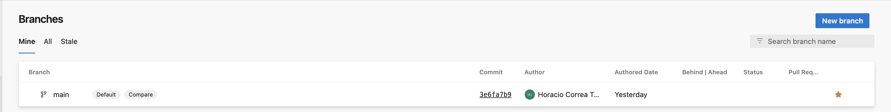
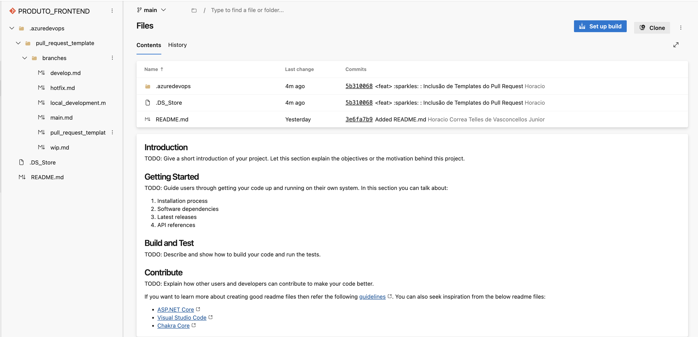
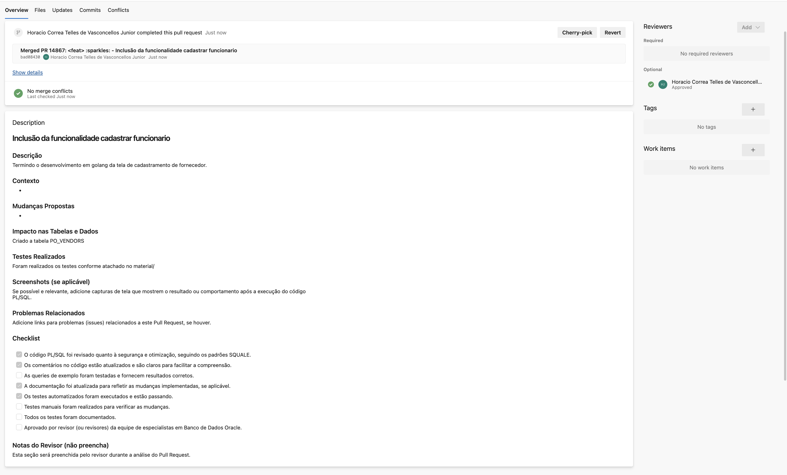
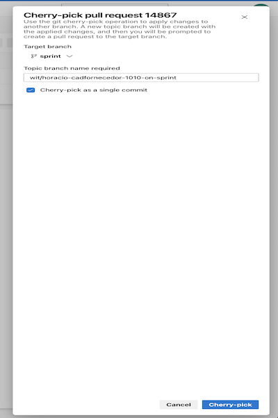
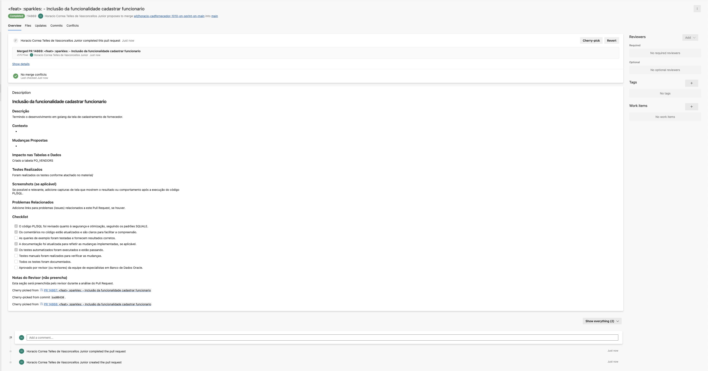
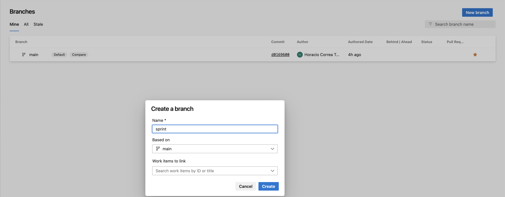
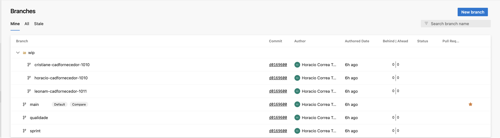
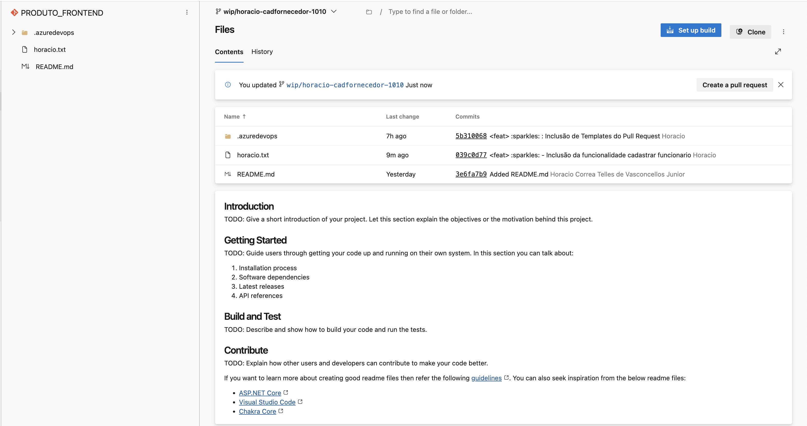
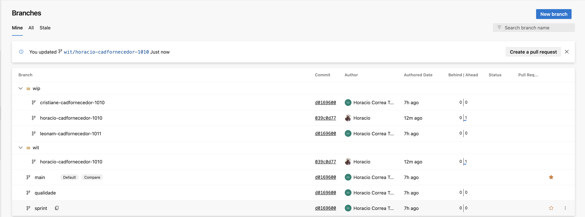
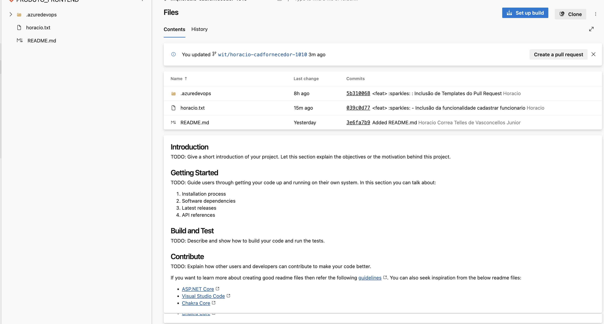

<p align="justify">A realização de pipelines requer uma abordagem estruturada, semelhante a projetar, desenvolver, testar e implementar aplicações, mas não há muitas informações disponíveis que possam ajudá-lo nessa jornada.</p>

<p align="justify">Como faço para projetar um pipeline caso a equipe use estratégia de ramificação X, estratégia de teste Y e estratégia de lançamento Z? Com a introdução da infraestrutura como código (IaC), o pipeline deve tratar o código da infraestrutura de forma semelhante ao código da aplicação. O código da infraestrutura deve ser validado de acordo com as políticas de segurança e diretrizes da organização.</p>

<p align="justify">Ao começar, é melhor manter as coisas simples e, portanto, inicialmente o GitHub Flow ou o desenvolvimento baseado em Trunk podem funcionar melhor. Eles também são ideais para equipes menores que exigem a manutenção de apenas uma única versão de um lançamento.</p>

| Tipo de produto e seu método de lançamento                                   | Equipe                          | Maturidade                       | Modo de filial                                  |
| -------------                                                                | -----                           | -------------                    | -------------                                   |
| Todos                                                                        | Equipe pequena	                 | Alto	                            | Trunk-Based Development (TBD)                   |
| Produtos que suportam implantação e lançamento contínuos, como produtos SaaS | Meio	                           | Moderado	                        | GitHub-Flow e TBD                               |
| Produtos com uma janela de lançamento definida e uma cadência periódica      | Meio	                           | Moderado	                        | Git-Flow and GitLab-Flow com release branch     |
| Produtos que exigem qualidade e suportam implantação e lançamento contínuos, | Meio	                           | Moderado	                        | GitLab-Flow                                     |
| Produtos que exigem qualidade e longo ciclo de manutenção                    |	Grande                         | Moderado	                        | Git-Flow                                        |

Não existe estratégia perfeita. A estratégia que você escolher dependerá da sua equipe e da natureza e complexidade do seu projeto e por isso deve ser avaliada caso a caso.
## Estruturas de Repositório Git
<p align="justify">Quando iniciamos um projeto, podemos seguir algumas práticas recomendadas para organizar o repositório para uma melhor contribuição da equipe e uma estrutura de projeto mais elegante. Utilizamos para a criação dos repositórios GIT, conforme configuração dos servidores, que são mantidos pelo 60portunities.</p>

!!! Definições

    === "Monorepo"
        É um único repositório que armazena todo o seu código e recursos para cada projeto;
        O repositório contém mais de um projeto lógico (por exemplo, um cliente iOS, Android e um aplicativo da Web);
        Esses projetos provavelmente **não estão relacionados**, estão conectados livremente ou podem ser conectados por outros meios (por exemplo, via dependência ferramentas de gerenciamento).
        O repositório é grande de várias maneiras:
        
        - [x] Número de commits;
        - [x] Número de ramificações e/ou tags;
        - [x] Número de arquivos rastreados;
        - [x] Tamanho do conteúdo rastreado (conforme medido observando o diretório .git do repositório);
        - [x] Empresas usam monorepo, porque ele tem bons benefícios relacionados à manutenção de código, integração, reutilização de código, refatoração e mudanças em larga escala.
        - [x] Código compartilhado: Reutilize código de validação, componentes de interface do usuário e tipos na base de código. Reutilize o código entre o back-end e o front-end.
        - [x] Revisões de código mais eficaz: A maioria dos desenvolvedores agora entende a plataforma de ponta a ponta, levando a que mais bugs sejam identificados e corrigidos no estágio de revisão do código.
        - [x] Mudanças atômicas: Mude a API de um servidor e modifique os clientes que consomem essa API no mesmo commit. Você pode alterar um componente de botão em uma biblioteca  compartilhada e os aplicativos que usam esse componente no mesmo commit. Isso evita o incômodo de tentar coordenar confirmações em vários repositórios.
        - [x] Compartilhamento de componentes comuns. Os desenvolvedores têm uma visão do que está acontecendo em todos os serviços e podem efetivamente criar componentes comuns.

        === "Ferramentas Monorepo"

            |  Tool | Entenda                 |
            | ----- | --------------          |
            | [Bazel](https://bazel.build/?hl=pt-br)  | Se destaca em repositórios grandes e multilíngues com processos de construção complexos. |
            | Gradle Build Tool                       | É particularmente adequado para linguagens JVM e fornece suporte nativo para caches de construção locais, o que pode acelerar significativamente o tempo de construção. |
            | Lerna |   otimiza o fluxo de trabalho de gerenciamento de repositórios de vários pacotes com git e npm.  |
            | Nx    | completo de ferramentas de desenvolvimento que oferece uma gama impressionante de recursos, como orquestração avançada de tarefas, execução distribuída de tarefas e cache de construção inteligente. |
            | Pants Build | Sistema de construção projetado para grandes monorepos que podem conter múltiplas linguagens e frameworks.      |
            | Rush        | orquestrador de construção escalonável para monorepos, que pode gerenciar projetos JavaScript e não JavaScript. |
            | Turborepo   | Alto desempenho para bases de código JavaScript e TypeScript.  |
            | Bit         | Ferramenta de gerenciamento de monorepo, mas oferece uma experiência tão excelente que pode resolver todas as “dificuldades” de monorepo com o novo fluxo de trabalho que fornece. |

    === "Multi-repos ou Polyrepo" 
        Refere-se à organização de seus projetos, cada um em seus próprios repositórios separados.
        Esta é a arquitetura **mais comum em uso** e pode ser vista em grandes empresas e possui algumas vantagens:
       
        - [x] Propriedade: Como a base de código imita a arquitetura, uma pequena equipe pode possuir e desenvolver e implantar de forma independente a pilha completa de um microsserviço.
        - [x] Melhor escala: Bases de código menores são mais fáceis de gerenciar e levam a menos instâncias de ""Ninguém gosta de um conflito de mesclagem. (merge hell)"".
        - [x] Clones pequenos: A maioria dos SCMs, incluindo git, não oferece suporte à clonagem de partes de um repositório. Para grandes bases de código, clones, pulls e pushs levam   uito tempo, o que é ineficiente.
        - [x] Controle de acesso: Pode ser aplicado no nível do projeto, pois cada funcionário tem acesso a uma pequena seção de projetos.
   
    === "Estratégia 60portunities - Nomenclatura do Repositório"
        Por padrão iremos impedir que certos caracteres sejam incluídos no nome do repositório.
        Embora não haja uma maneira errada de nomear um repositório, alguns nomes são melhores que outros.
        O comprimento   do repositório não deve conter mais de 64 caracteres Unicode e não pode ser idêntico a nenhum outro nome de repositório Git no projeto.
        Todas essas sugestões estão sendo seguidas pelo criador automático.
        Usando isso como diretriz, dividimos o repositório em 3(três) seções separadas por underscore. Esse formato consiste em seções que definem:
        
        * PRODUTO, FINALIDADE e ESTRUTURA DA LINGUAGEM.
        
        | Definição  | Conceito                                                                                                   |
        | ----       | ------                                                                                                     |
        | PRODUTO    | Informe a SIGLA do Sistema.                                                                                |
        | FINALIDADE | Utilizado para aplicações monolíticas (MONO),BACK_END, FRONT_END, MOBILE e LIB (Biblioteca de Documentos). |
        | ESTRUTURA  | Linguagem(PHP,JAVA,Python),Sistema |Operacional(IOS,Android),DOC(Documentaçao).                            |
        
        Deve se perceber as seguintes características:  descritivo, legibilidade, consistência, contextual, extensibilidade, reuzabilidade e sucinto.
        
        | ----          | SEÇÃO 01      | ----               | SEÇÃO 02            | SEÇÃO 03   |
        | ----          | ----          | ----               | ----                | ----       |
        | PROJETO       | SIGLA         | FINALIDADE         | SIGLA               | LINGUAGEM  |
        | ----          | -----         | ------             | -----               | --------   |
        | Linux         | LNX           | RESTAPI            | RESTAPI             | JAVA       |
        | Linux         | LNX           | BACK-END           | BACK                | PHP        |
        | Linux         | LNX           | FRONT-END          | FRONT               | NODE       |
        | PEOPLESOFT    | PSFT          | SCRIPT             | SCRIPT              | SHELL      |
        | Linux         | PO            | MOBILE             | MOBILE              | IOS       |
        | CONTRATO      | GESCON        | LIB                | DOCUMENTACAO        | DOC        |
            
        | SEÇÃO 01      | SEÇÃO 02      | SEÇÃO 03           | SIGLA               |            |
        | ----          | ----          | ----               | ----                |            |
        | LNX           | RESTAPI       | JAVA               | LNX_RESTAPI_JAVA    |            |
        | LNX           | BACK          | PHP                | LNX_BACK_PHP        |            |
        | LNX           | LIB           | DOC                | LNX_LIB_DOC         |            |
        | GESCON        | LIB           | DOC                | GESCON_LIB_DOC      |            | 

!!! Estratégias

    === "Branch"
        <p align="justify">As ramificações do Git permitem que os desenvolvedores diverjam da ramificação principal criando ramificações separadas para isolar alterações de código. O branch padrão no Git é o branch `main`. A maior vantagem de um branch Git é que ele é 'leve', o que significa que os dados consistem em uma série de snapshots, portanto, a cada commit que você faz, o Git tira uma foto da aparência dos seus arquivos naquele momento e armazena uma referência para esse snapshot. Isso significa que essas ramificações não são apenas cópias do sistema de arquivos, mas simplesmente um ponteiro para o commit mais recente. Um branch é essencialmente uma referência ou um ponteiro para o último commit em um determinado contexto. À medida que você cria novos commits no novo branch, o Git cria novos ponteiros para rastrear as alterações. As ramificações do Git, então, podem ser vistas como um ponteiro para um instantâneo de suas alterações.</p>

        | Nome           | Descrição da Branch                                                                                                                                  | SVN    | Gitflow | GitHubFlow | TBD  |
        | -------------- | ------------------                                                                                                                                   | :----: | :----:  | :----:     | :----: |
        | main           | É a ramificação que estará com o código da versão do ambiente de produção. Uma versão já testada e validada.                                                   | - | X | X | X |
        | develop        | Tem objetivo de manter os desenvolvimentos realizados pela equipe. Podemos chamar de branch de integração, pois nela a equipe centralizam os desenvolvimentos. | - | X | X | - |
        | sprint         | Tem objetivo de manter os desenvolvimentos realizados pela equipe. Podemos chamar de branch de integração, pois nela a equipe centralizam os desenvolvimentos. | - | X | X | - |
        | trunk          | Esta área representa o desenvolvimento do trabalho em andamento em uma solução.                                                                                | X | - | - | - |
        | branch         | Normalmente criada a partir do Tronco, esta área representa as versões testadas e aprovadas dos objetos pós-desenvolvimento.                                   | X | - | - | - |
        | hotfix         | É uma branch de emergência para correções de bug diagnosticado do ambiente de produção.                                                                        | - | X | X | - |
        | feature        | Cada funcionalidade desenvolvida é uma branch feature criada.                                                                                                  | - | X | X | - |
        | release        | É a branch antes de levar a versão para o ambiente de produção (ou para a branch main). Em outras palavras, podemos considerar como a versão do ambiente de homologação.| - | X | X | - |
        | wip/usuario-feature-nnnn | São conhecidos como branches de tópico. Os branches de recursos isolam o trabalho em andamento do trabalho concluído no branch principal.                     | - | - | - | X |
        | wit/usuario-feature-nnnn | São conhecidos como branches de tópico. Os branches de recursos isolam o trabalho em andamento do trabalho concluído no branch principal.                     | - | - | - | X |
        | tags           | Esta é uma maneira conveniente de declarar um instantâneo no tempo de um projeto no tronco ou em uma ramificação. Eles são úteis para marcos no desenvolvimento do seu projeto, permitindo que você tenha um registro do estado de um projeto em um momento importante. | X | - | - | - |
        | qualidade      | Pré-Produção, qualidade processo de homologação independente da pipeline.                                                                             | - | X | X | X |

    === "Gitando"

        | Id   | emoji	     | Tipo      | Descricao                                        |
        | --   | -----       | -----     | ------------------------                         |
        | ✨    | :sparkles: | feat	    | Introduzir novos recursos                        |
        | 🐛    | :bug:	     | bug	     | Corrigir bug                                     |
        | 🚑    | :ambulance:| hotfix	   | Correção crítica                                 |
        | 📝    | :memo:	   | docs      | Adicionar ou atualizar documentação              |
        | 🌀    | :cyclone:  | refactor  | Refatorar código                                 |
        | ⏪	   | :rewind:   | revert    | Reverter alterações                              |
        | 🔨    | :hammer:   | script	   | Adicione ou atualize scripts de desenvolvimento  |
        | 🔖    | :bookmark: | release   | Tags de lançamento/versão                        |
        | 🚮    | :trash:    | deadcode  | Remover código morto                             |
        | 🔇    | :mute:	   | rmlog	   | Remover registros                                |

    === "Segurança"
        Imaginemos que tenhamos um repositório em: URL_REPOSITORIO, e gostaria de alem de ter um backup no repositório central, pudesse ficar com um repositório fora do meu hd/ssd? Efetuo a clonagem do meu repositório remoto, para um disco local de trabalho.
        
        * git clone URL_REPOSITORIO ou git clone --branch "master" URL_REPOSITORIO

        Criado o repositório local, vou para o diretório criado e efetuo o clone para um outro diretório, de preferencia um pendrive ou um hd/ssd externo.
        
        * cd casa
        * git clone --bare . /Volumes/SAMSUNG_T3/backupgit/casa.git
        
        Informo ao repositório, que existirão dois remotos: O origin que será o meu remoto do repositório central e um local, que será o meu backup local.
        
        * git remote add local /Volumes/SAMSUNG_T3/backupgit/casa.git
        * git remote -v
        
        ```
        local	/Volumes/SAMSUNG_T3/backupgit/casa.git (fetch)
        local	/Volumes/SAMSUNG_T3/backupgit/casa.git (push)
        origin	URL_REPOSITORIO (fetch)
        origin	URL_REPOSITORIO (push)
        ```
        Agora vamos construir uma aplicaçõa e verificar se esta tudo de acordo, como imaginávamos. Criaremos um arquivo unico chamado 60portunities.txt e efetuaremos os passos normais.
        
        ```
        > vi 60portunities.txt
        > ls -al
        drwxr-xr-x⠀staff⠀224 ⠀Feb  1 08:37:12⠀ﱮ⠀.
        drwxr-xr-x⠀staff⠀1536⠀Feb  1 08:14:00⠀ﱮ⠀..
        drwxr-xr-x⠀staff⠀384 ⠀Feb  1 08:27:06⠀⠀.git/
        -rw-r--r--⠀staff⠀394 ⠀Feb  1 08:14:00⠀⠀.gitignore
        -rw-r--r--⠀staff⠀1077⠀Feb  1 08:14:00⠀⠀LICENSE
        -rw-r--r--⠀staff⠀13  ⠀Feb  1 08:14:00⠀⠀README.md
        
        > git add 60portunities.txt
        > git status
        On branch master
        Your branch is up to date with 'origin/master'.
        
        Changes to be committed:
          (use "git restore --staged <file>..." to unstage)
        	new file:   60portunities.txt
        
        > git commit -m "<doc>(ptb) Inclusão do arquivo 60portunities.txt"
        [master 193b33b] <doc>(ptb) Inclusão do arquivo 60portunities.txt
         1 file changed, 3 insertions(+)
         create mode 100644 60portunities.txt
        
        > git push (irá sempre mandar para o origin)
        Enumerating objects: 5, done.
        Counting objects: 100% (5/5), done.
        Delta compression using up to 10 threads
        Compressing objects: 100% (2/2), done.
        Writing objects: 100% (3/3), 970 bytes | 970.00 KiB/s, done.
        Total 3 (delta 1), reused 0 (delta 0), pack-reused 0
        To URL_REPOSITORIO
           193b33b..be3129f  master -> master
        
        > git push local
        Enumerating objects: 5, done.
        Counting objects: 100% (5/5), done.
        Delta compression using up to 10 threads
        Compressing objects: 100% (2/2), done.
        Writing objects: 100% (3/3), 970 bytes | 970.00 KiB/s, done.
        Total 3 (delta 1), reused 0 (delta 0), pack-reused 0
        To /Volumes/SAMSUNG_T3/backupgit/casa.git
           193b33b..be3129f  master -> master
        ```

         === "Recuperando o repositório perdido"
             Aqui é outro chopp, mas vamos iniciar explicando o que é o Ngrok. Ngrok é uma ferramenta que te permite a criação de um túnel seguro, atrás de NATs(Network Address Translation) e Firewalls, que expõem serviços locais para a Internet.

         === "Compartilhando o diretório com outras pessoas"
             Entre no diretório `/Volumes/SAMSUNG_T3/backupgit/60portunities/.git` e execute o comando `git --bare update-server-info` e depois "mv hooks/post-update.sample hooks/post-update".

    === "Solicitações Pull Request"
        <p align="justify">Escrever boas descrições de solicitações pull request é uma ótima maneira de ajudar os revisores a saber o que esperar ao revisar o código e documentações obrigatórias. Um modelo de solicitação pull é um arquivo contendo texto Markdown que é adicionado à descrição da solicitação pull quando a solicitação pull é criada. O Azure Repos permite criar diversos tipos de templates, porem iremos utilizar Modelos de pull request para específicas branches.Os modelos de solicitação pull específicos de ramificação podem ser configurados para solicitações pull direcionadas a uma ramificação específica, ```<repositoryroot>/.azuredevops/pull_request_template/branches/```, como exemplo foram criados:</p>

        | Arquivo                  | Branch    | Entenda                                                                                               |
        | -------                  | ------    | -------                                                                                               |
        | develop.md               | develop   | Este é normalmente o modelo padrão, mas pode ser substituido pelo modelo específico - nome da branch. |
        | additional.md            | -         | Este é um modelo adicional.                                                                           |
        | main.md                  | main      | Este é o modelo específico do branch main.                                                            |
        | wip.md                   | wip/xxxxx | Work in Progress acordado.                                                                            |
        | wit.md                   | wit/xxxxx | Item de trabalho finalizado.                                                                          |

!!! Exemplo

    === "Template de Documentos"
        Verifique se já há no repositório(s) os templates criados para as branches `<repository root>/.azuredevops/pull_request_template/branches/`.

        

        - [x] Efetue a criação dos templates do Pull Request:
              - [x] `git add . `
              - [x] `git commit -m "<feat> :sparkles: : Inclusão de Templates do Pull Request"`

        

    === "Exemplo de Template"

        ``` 
        #  Inclusão da funcionalidade cadastrar funcionario
        
        ## Descrição
        Termindo o desenvolvimento em golang da tela de cadastramento de fornecedor.
        
        ## Contexto
        -
        
        ## Mudanças Propostas
        -
        
        ## Impacto nas Tabelas e Dados
        Criado a tabela PO_VENDORS
        
        ## Testes Realizados
        Foram realizados os testes conforme atachado no material/
        
        ## Screenshots (se aplicável)
        Se possível e relevante, adicione capturas de tela que mostrem o resultado ou comportamento após a execução do código PL/SQL.
        
        ## Problemas Relacionados
        Adicione links para problemas (issues) relacionados a este Pull Request, se houver.
        
        ## Checklist
        - [X] O código PL/SQL foi revisado quanto à segurança e otimização, seguindo os padrões SQUALE.
        - [X] Os comentários no código estão atualizados e são claros para facilitar a compreensão.
        - [ ] As queries de exemplo foram testadas e fornecem resultados corretos.
        - [X] A documentação foi atualizada para refletir as mudanças implementadas, se aplicável.
        - [X] Os testes automatizados foram executados e estão passando.
        - [ ] Testes manuais foram realizados para verificar as mudanças.
        - [ ] Todos os testes foram documentados.
        - [ ] Aprovado por revisor (ou revisores) da equipe de especialistas em Banco de Dados Oracle.
        
        ## Notas do Revisor (não preencha)
        Esta seção será preenchida pelo revisor durante a análise do Pull Request.
        ```

        
        
        * Após a validação do pessoal de Qualidade, este deverá efetuar um cherry-pick, da branch de Qualidade para a Sprint.
        
        
        
        * Após a validação do pessoal de Qualidade, este deverá efetuar um cherry-pick, da branch de Sprint para a main.
        
        
        
        Em resumo: 
        
        * Durante o sprint, todas as alterações de código são enviadas para esse branch.
        * E sempre que o código quiser ser testado no ambiente de desenvolvimento, basta criar Pull Request para o branch qualidade;

    === "Branches"
        - [x] Quando o sprint começar, crie um conjunto de branches, que serão aqui discutidas.
               - [x] sprint (Inicial e que deverá ser atualizado no término da Sprint)
               - [x] O Tech Leader deverá efetuar a criação das branches diretamente da main;
        - [x] wit|wip/ (Static Application Security Testing (SAST) e Unit Test devem ser realizados.)
               - [x] wip (Working in progress): O desenvolvedor esta efetuando a criação de um objeto.
               - [x] wit (Working Item): Work Item liberado para o pessoal de qualidade.         
        - [x] qualidade (Processo de qualidade, onde os testes: PlanTest, CyPress e Security Test (IAST(Interactive Application Security Testing), MAST(Mobile Application Security Test), DAST(Dynamic Application Security Testing)), RAST (Re Application Security Testing);

        

        

        O desenvolvedor deverá efetuar o clone do repositório criado :  `git clone --branch <branchname> --single-branch <remote-repo-url>`

        ```
        * git clone --branch <branchname> --single-branch <remote-repo-url>
        * git clone --branch "wip/60portunities-cadfornecedor-1010" URL_REPOSITORIO
        * git branch -a
            * wip/60portunities-cadfornecedor-1010
              remotes/origin/HEAD -> origin/main
              remotes/origin/main
              remotes/origin/qualidade
              remotes/origin/sprint
              remotes/origin/wip/cristiane-cadfornecedor-1010
              remotes/origin/wip/60portunities-cadfornecedor-1010
              remotes/origin/wip/leonam-cadfornecedor-1011
        * git fetch
        * git pull 
        ```
        * Ao terminar o desenvolvimento, o desenvolvedor deverá renomear a branch `wip` e torna-la `wit`, indicando que o mesmo foi finalizado.
        ```
        * vi 60portunities.txt
        * git add 60portunities.txt
        * git commit -m "<feat> :sparkles: - Inclusão da funcionalidade cadastrar funcionario"
        * git push origin main
        ```

        

        * Continuei as atividades até completa-la, efetuando os Testes Unitários e de validação. (Não demonstrarei o SAST);
        * Como nós terminamos o trabalho, precisamos renomear a branch

        ```
        * git branch -m "wit/60portunities-cadfornecedor-1010"
        * git push origin -u "wit/60portunities-cadfornecedor-1010"
        ```
        
        
        
        * Repare que ao subir a nova branch, a antiga branch, ficou lá também, por isso há a necessidade de exclui-la do repositório.
        
        * `git push origin --delete "wip/60portunities-cadfornecedor-1010"`
        
        * Deleta a branch de trabalho, podemos agora solicitar um Pull Request para informar ao pessoal de Qualidade, que o processo, finalizou e agora há a necessidade de validação por esta equipe. O pessoal de qualidade, acatará o recebimento do Pull Request.

        
        
        Observação: Eu esqueci de efetuar o arquivo Markdown, Qualidade e Sprint. Como NÃO havia sido criado, podemos optar em utilizar o template pull_request_template.md
        
        

!!! Exemplo

    === "Modifiable off-the-shelf Software (MOTS)"

        {width="960" height="840" style="display: block; margin: 0 auto"}

    === "Documentation as Code (DaC)"
        Usar um repositório de sistema de controle de versão de gerenciamento de documentação unificada. A ideia deste repositório é simular um monorepo significa usar um repositório, em vez de vários repositórios.
        Este repositório contem um diretório de `documentacao` para os outros repositórios de documentação.
        Como efetuar esta configuração:
        
        - [x] git clone URL_REPOSITORIO
        - [x] cd PORTIFOLIO/
        - [x] cd documentacao/
        - [x] git submodule add --name NOME_DO_DIRETORIO URL_REPOSITORIO NOME_DO_DIRETORIO
        - [x] git submodule update --remote
        
        {width="960" height="840" style="display: block; margin: 0 auto"}
 