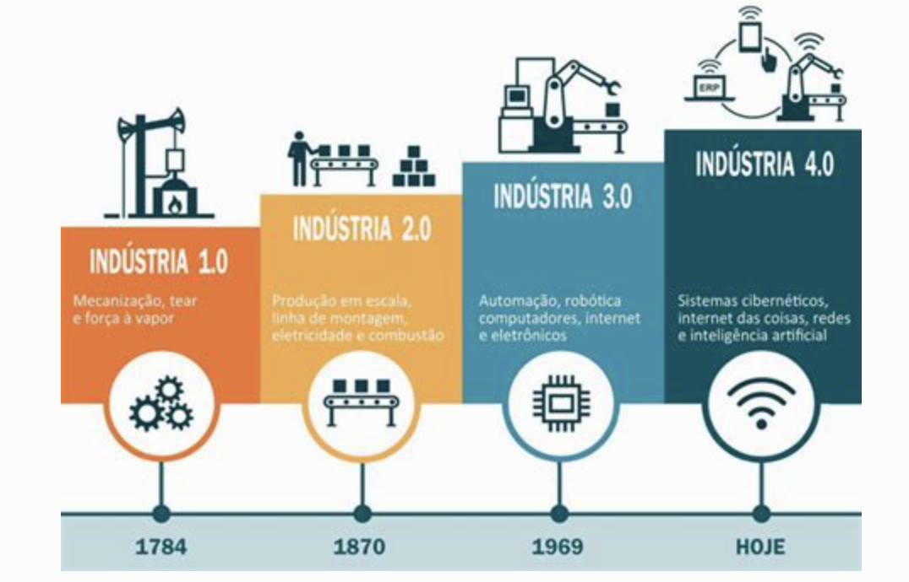
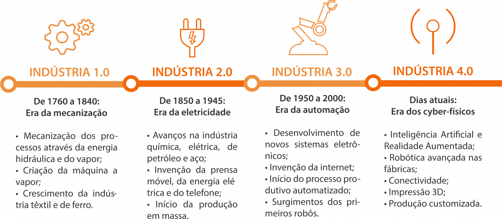
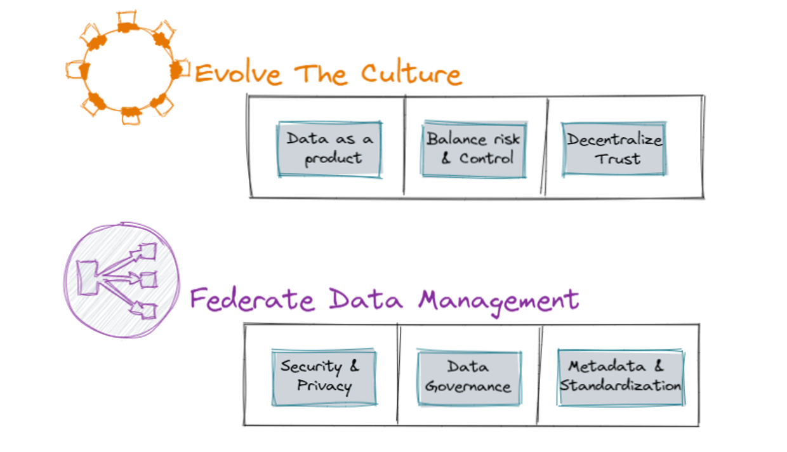
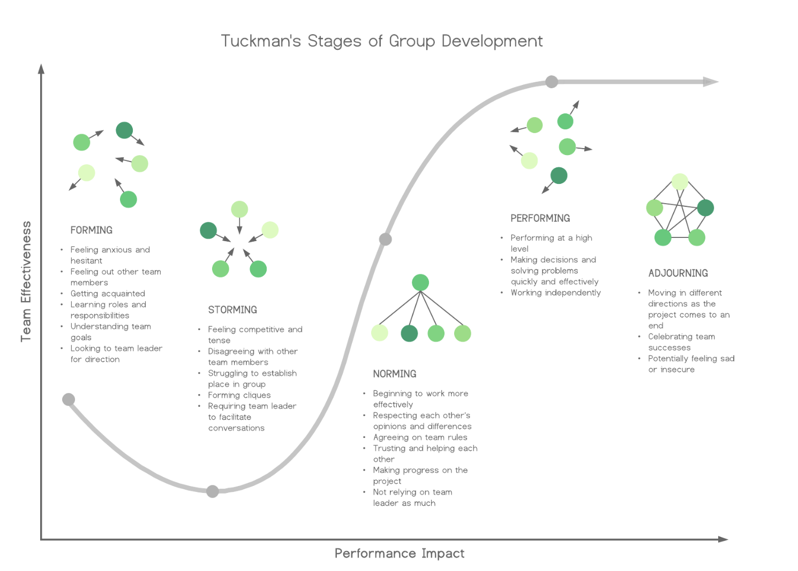
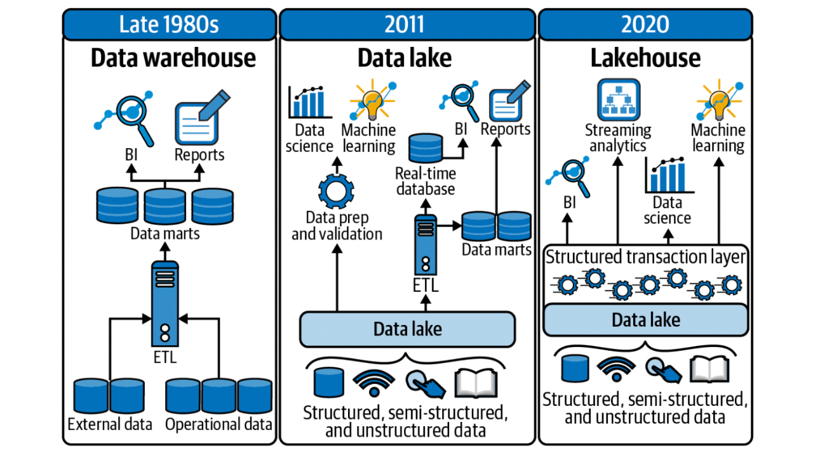
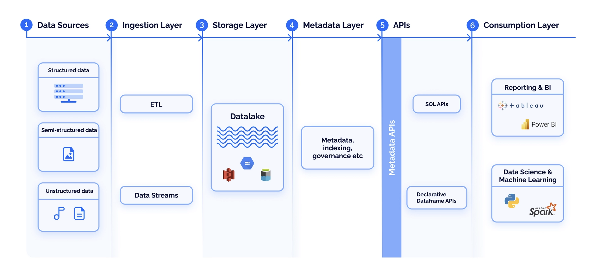
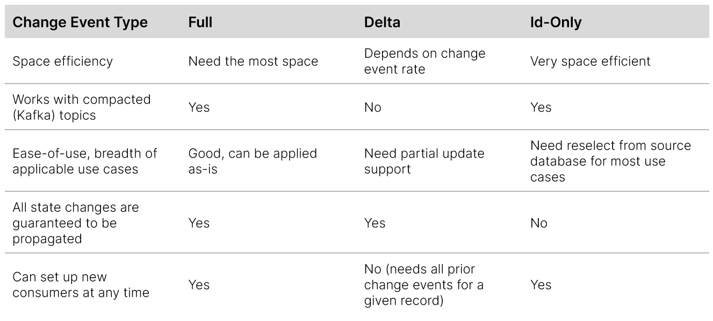

## Revolução Industrial

{width="600" height="450" style="display: block; margin: 0 auto" }
 
| Revolução Industrial          | Motivo            | Resumo |
| --------                      | -------------     | ------ |
| Primeira  | Novas relações de trabalho, energia produzida pelo homem por energias como a vapor, eólica e hidráulica; | Mecanização |
| Segunda   | Aumentaram ainda mais a produtividade e, consequentemente, os lucros das indústrias, Uso do petróleo como fonte de energia, utilizado na nova invenção: o motor à combustão, eletricidade. | Escalação  |
| Terceira  | Desenvolvimento de infraestrutura das telecomunicações e transporte; integração entre economia e política; | Automatização | 
| Quarta    | Tecnologias para automação e troca de dados – ela se caracteriza, por um conjunto de tecnologias que permitem a fusão do mundo físico, digital e biológico. | Personalizando a Produção |

{width="600" height="450" style="display: block; margin: 0 auto" }

“Com cada revolução industrial, houve uma revolução de aprendizagem correspondente que, na época, parecia proibitivamente cara. No entanto, o custo de manter o status quo no passado era o custo da oportunidade perdida que, em muitos casos, era uma fortuna.” — Jesse Martin

## Negócio e suas queixas

- [x] Times de Dados vs Times de Negócio
- [x] Dificuldade na obtenção de informações
- [x] Dados descentralizados
- [x] Negócio e suas queixas
- [x] Demora nas entregas da TI

## Times de Dados e suas queixas

- [x] Falta de clareza nas definições
- [x] Falta de engajamento das áreas
- [x] Falta de governança nas Pontas
- [x] Falta mindset analítico nas ponta

## Dado é o novo Petróleo

- [x] A famosa frase do matemático britânico Clive Humby: "Dados são o novo petróleo" (Data is the new oil).
      - [x] Mas, se não for refinado, não pode ser usado, portanto, os dados devem ser divididos, analisados para que tenham valor", ou seja, assim como o petróleo deve ser refinado, os dados precisam receber um tratamento correto para estarem prontos para sua utilização em seu total potencial.
      - [x] Podemos lembrar do Pré-sal
- [x]  A publicação da The Economist: "O recurso mais valioso do mundo não é mais o petróleo, mas dados" (The world’s most valuable resource is no longer oil, but data) tem sido muito citadas pelo mercado e executivos mundo afora, apontando que aqueles que possuírem dados terão um recurso muito valioso e mãos.

| Definição   | Entenda |
| -----       | ------  |
| Upstream    | Atividades de busca, identificação e localização das fontes de óleo, e ainda o transporte deste óleo extraído até as refinarias, onde será processado. Resumindo, são as atividades de exploração, perfuração e produção. | Coleta e geração de dados. Isso inclui a captura de dados de várias fontes, como sensores, dispositivos IoT, transações de clientes, redes sociais, etc. |
| Midstream   | São as matérias-primas (hidrocarbonetos) são transformadas em produtos prontos para uso específico (gasolina, diesel, querosene, GLP, nafta, óleo lubrificante, …). São as atividades de refino. | Transporte, armazenamento e processamento inicial. Isso pode incluir a transferência de dados para data centers, armazenamento em nuvem, e o processamento inicial para limpeza e organização dos dados. |
| Downstream  | O transporte dos produtos da refinaria até os locais de consumo. Resume-se no transporte, distribuição e comercialização dos derivados do petróleo. | Análise, refino e distribuição dos dados. Isso inclui a análise de dados para obter insights, a criação de relatórios, dashboards, e a distribuição desses insights para as partes interessadas para tomada de decisão.|

Um dos maiores desafios no caso do Petróleo, é localizar as boas reservas naturais que são subterrâneas, com dados é diferente, o desafio é qualificar e cruzar informações criando visões de cenários específicos para a realidade das empresas, a partir de uma grande massa de dados disponível através da utilização de sistemas de gestão empresarial.

- [x] Quanto mais dados mais disperdícios e este é um processo Lean.
- [x] Combustível é refinado - O petróleo é o DADO.. A informação é o COMBUSTÍVEL
- [x] Petista parece vidente com  Alzheimer, sabe tudo que irá acontecer no futuro, mas esquece tudo que fez no governo passado;

**Precisamos parar um minuto e pensar em como essa arquitetura terá sucesso quando tantas outras estratégias de dados caras e bem pensadas, como o warehouse e o lake, falharam?**

O termo Data Lake (DL) surgiu em 2011 do fornecedor de dados Pentaho (agora Hitachi) como uma forma de reduzir silos de dados que estavam se formando em ecossistemas baseados em Data Warehouse. 

## Arquitetura Orientada a Domínio Distribuído, Design de Plataforma de Autoatendimento e Pensamento de Produto com Dados.


# Algumas Definicoes
Plataformas de dados baseadas na arquitetura de data lake têm modos de falha comuns que levam a promessas não cumpridas em escala. Precisamos mudar para um paradigma que se inspire na arquitetura distribuída moderna: considerar domínios como a preocupação de primeira classe, aplicar o pensamento de plataforma para criar infraestrutura de dados self-service e tratar dados como um produto.

- [x] Gerenciamento e orquestração de recursos. Um gerenciador de recursos permite que o data lake execute tarefas consistentemente alocando a quantidade certa de dados, recursos e poder de computação aos locais certos.
- [x] Data Swamp ocorre quando usuários sem instrução manuseiam dados de forma errada, por isso a importância de termos um alinhamento entre todas as equipes que utilizam o Data Lake, como principal ferramenta para armazenamento e controle dos dados da organização.
- [x] Data Lake é um repositório centralizado que ingere e armazena grandes volumes de dados em sua forma original. Os dados podem ser processados e usados como base para uma variedade de necessidades analíticas.
- [x] Classificação de dados. A criação de perfil de dados, a catalogação e o arquivamento ajudam as organizações a controlar o conteúdo, a qualidade, a localização e o histórico de dados.
- [x] Processo de ELT (extração, carregamento e transformação). ELT refere-se aos processos pelos quais os dados são extraídos de várias fontes e carregados na zona bruta do data lake e, em seguida, limpos e transformados após a extração para que os aplicativos possam usá-los prontamente.
- [x] Governança e administração. Para que a plataforma de data lake seja executada da maneira mais tranquila possível, os usuários devem ser instruídos sobre sua configuração de arquitetura, bem como práticas recomendadas para gerenciamento de dados e operações.

|  	              | Data lake 	                                                     | Data warehouse                                                 |  Data lakehouse  |
| -----------     | ----------                                                       | --------                                                       |  ------------    |
| Tipo 	          | Estruturado, semiestruturado, não estruturado                    | Estruturado                                                    | Estruturado, semiestruturado, não estruturado | 
|   	            | Relacional, não relacional 	                                     | Relacional                                                     | Relacional, não relacional |
| Esquema         | Esquema na leitura 	                                             | Esquema na gravação                                            | Esquema na leitura, esquema na gravação  |
| Formato         | Brutos, não filtrados 	                                         | Processado, examinado                                          |  Arquivos de formato delta brutos, não filtrados, processados, coletados  |
| Fontes          | Big Data, IoT, mídia social, dados de streaming                  | Aplicativo, negócios, dados transacionais, relatórios em lotes | Big Data, IoT, mídia social, dados de streaming, aplicativo, negócios, dados transacionais, relatórios em lotes  |
| Escalabilidade  | Fácil de escalar a baixo custo 	                                 | Difícil e caro de escalar                                      | Fácil de escalar a baixo custo |
| Usuários 	      | Cientistas de dados, engenheiros de dados 	                     | Profissionais de data warehouse, analistas de negócios         |  Analistas de negócios, engenheiros de dados, cientistas de dados  |
| Casos de uso 	  | Aprendizado de máquina, análise preditiva, análise em tempo real | Relatórios principais, BI                                      | Relatórios principais, BI, aprendizado de máquina, análise preditiva  |

# Arquitetura de dados centralizada vs descentralizada
Uma arquitetura de dados centralizada significa que os dados de cada domínio/assunto são copiados para um local (ou seja, um data lake em uma conta de armazenamento) e que os dados de vários domínios/assuntos são combinados para criar modelos de dados centralizados e visualizações unificadas.

Uma arquitetura de dados distribuída descentralizada significa que os dados de cada domínio não são copiados, mas sim mantidos dentro do domínio (cada domínio/assunto tem seu próprio data lake sob uma conta de armazenamento) e cada domínio tem seus próprios modelos de dados. Isso também significa propriedade distribuída dos dados, com cada domínio tendo seu próprio proprietário.

## Virtualização/Federação de dados
Para habilitar a virtualização/federação de dados, existem produtos de software de virtualização proprietários completos, como [Denoto](https://www.denodo.com/en) , [Dremio](https://www.dremio.com/) , [Starburst](https://www.starburst.io/) e [Fraxses](https://nfiniti3.com/fraxses) , que podem consultar muitos tipos diferentes de armazenamentos de dados.




# DMP (Data Management Platform) 
Uma plataforma de dados, é um sistema que permite coletar, armazenar, processar e analisar grandes volumes de dados de diferentes fontes e formatos.

Nos processos legados, os dados estavam sendo orientados a aplicação, gerando replicação, ausencia de donos, padrão.
Ou seja, não estávamos conseguindo extrair valor e quando se consegue o custo é muito alto.

PRODUTO TEM QUE ATENDER UMA NECESSIDADE DE NEGÓCIO, TEM QUE ENDEREÇAR UM PROBLEMA.

Algumas das tendências em tecnologias que elevaram a necessidade de uma data mesh como solução incluem:

- [x] 70-80% das transformações digitais não são bem-sucedidas, porque NÃO pensam em DADOS.
- [x] Os custos operacionais com falta de dados estão crescendo
- [x] As cláusulas de fidelidade para a nuvem são reais e podem ficar cada vez mais caras
- [x] Os data lakes raramente são bem-sucedidos e estão focados apenas nas análises
- [x] O aumento dos dados distribuídos está forçando uma arquitetura mais eficaz, eficiente e econômica
- [x] Os silos organizacionais pioram os problemas de compartilhamento de dados
- [x] Os dados são um catalisador para a vantagem competitiva, além de ser crucial para seu bom gerenciamento

# No final
- [x] Não tenha pressa, mas tenha rumo. Demorar é diferente de se perder.
- [x] Não julgue os dias pelas colheitas que você faz, mas pela semante que você planta.
- [x] É preciso ser protagonista. Não da para ficar ouvindo a banda passar,temos que ser parte da banda.
- [x] Coisas tem preço, pessoas tem valor.
- [x] A unica pessoa que voce precisa superar todos os dias, é você mesmo.
- [x] Nao tenha medo de falar...
- [x] Não é o cargo que faz o lider, é a postura.
- [x] As abelhas não perdem tempo explicando as moscas que mel é melhor do que merda.
- [x] Ninguem questiona o preço, quando entende o valor.

Em 2019, Zhamak Dehghani definia o conceito de data mesh, uma nova abordagem que visa descentralizar a arquitetura de dados, dando a responsabilidade para as áreas corporativas organizadas por domínios. 

Queremos mudar o resultado, sem mudar a materia prima. (O DADO)

- [x] Quem se preocupa com o Metadados? 
- [x] Orientação por domínio, plataforma de dados (democratização), governança federada, 
- [x] Trazer o pessoal de dados para o Desenvolvimento para os PO.
- [x] Tecnologia tem que ser regras MACROS.. Regras de Convívio.
- [x] Não somos uma google, m$ ou oracle.

## Lei de Conway
A forma como uma empresa é organizada – seus processos, sua comunicação, e sua divisão de equipes – influencia diretamente a arquitetura do software produzido. 

## Leis de Lehman
Formuladas na década de 70 pelos professores Meir Lehman e László Bélády, é uma série de princípios que ajudam a entender a evolução de sistemas de software.  Entre as oito leis de Lehman, duas são particularmente cruciais: a lei da “Mudança Contínua” e a lei da “Complexidade Crescente”. 

### Lei da Mudança Contínua
Um sistema de software precisa ser constantemente adaptado para se manter relevante e satisfatório.  

### Lei da Complexidade Crescente 
À medida que o software é adaptado e expande suas funcionalidades, ele se torna internamente mais complexo.  

## Estágios de desenvolvimento de grupo de Tuckman
* Formação: Os membros da equipe primeiro se reúnem, aprendem suas funções e responsabilidades e são cautelosos com seu comportamento enquanto tentam se integrar ao grupo.
* Tempestade: As tensões aumentam à medida que os membros da equipe começam a falar o que pensam e solidificar seus lugares dentro do grupo.
* Normalização: os conflitos começam a ser resolvidos, os membros da equipe apreciam os pontos fortes uns dos outros e o respeito pela autoridade cresce.
* Desempenho: O grupo funciona junto como uma unidade coesa e sem muita orientação do líder da equipe.
* Encerramento:  As metas originais da equipe foram concluídas e todos podem seguir para novos projetos.

{width="600" height="450" style="display: block; margin: 0 auto" }

## Muda a estratégia...

- [x] Dados foram negligenciados...
- [x] Esse paradoxo parte da ideia de que a liberdade total leva a supressão do fraco pelo forte.
- [x] Se você tem muita liberdade de escolha, você pode até parar.
- [x] O ser humano seria muito mais produtivo se aprendesse a lidar com este paradoxo. 
- [x] Isso pode ser desanimador para alguns, mas há liberdade em fazer o que precisa ser feito. 
- [x] Isso vale para todas as áreas da vida, mas principalmente na área profissional. 
- [x] Só alcança uma Carreira Meteórica quem cumpre com seus deveres.
- [x] Ter uma Carreira Meteórica significa ter uma boa empregabilidade, trocar de emprego sempre que achar necessário e estar em constante crescimento. 
- [x] Sempre focado no produto. 
- [x] O proprio Lean fala em disperdício  (Os dados são o novo petróleo - o Dado é a materia Prima da 4 Revolução Industrial)
      - [x] Ciencia de Dados
      - [x] Inteligencia Artificial
      - [x] Cybersecurity
- [x] MCKINSENSY FALA DE 5 ARQUÉTIPOS DE PRODUTO
      - [x]  API (CONSUMO - PICHE) DADO MAIS BRUTO
      - [x]  REPORT (ETL --> CONSOLIDAÇÃO)
      - [x]  COMPARTILHA ISSO DE FORMA MONETIZADO
      - [x]  SANDBOX (INSIGHT)
      - [x]  PRODUTO ANALYTICOS -

- [x] À medida que o ecossistema de dados ganhou impulso nos últimos dez anos, mais e mais empresas investiram em se tornarem “orientadas por dados” depois que os primeiros adeptos demonstraram quanto valor os dados poderiam gerar. Essa onda permitiu o desenvolvimento de todas as tecnologias/padrões/serviços de Big Data e Cloud que conhecemos e usamos muito bem hoje.
- [x] Essa “ corrida do ouro por dados ” se concentrou em abrir silos e centralizar dados em plataformas, lagos, avançando cada vez mais rápido em direção a arquiteturas distribuídas, nuvens híbridas, até mesmo na transição de IaaS para PaaS para SaaS. Mas faltou atenção a aspectos como propriedade de dados, garantia de qualidade de dados, governança escalável, usabilidade, confiança, disponibilidade e capacidade de descoberta de dados , que são os principais fatores que permitem que os consumidores encontrem, entendam e consumam dados com segurança para fornecer valor comercial.
- [x] Data Mesh é uma mudança de paradigma que surgiu como uma necessidade dos “campos” do mundo real de data lakes/plataformas monolíticos. É um padrão organizacional e arquitetônico que alavanca o design orientado a domínio, que é a capacidade de projetar domínios de dados que são muito mais orientados a negócios em vez de serem orientados a tecnologia . Podemos ver essa mudança de paradigma em dados como análoga a quando os serviços da web monolíticos fizeram a transição para microsserviços projetados orientados a domínio.

# Modernização de dados com propósito estratégico
“Modernizando dados com propósito estratégico” é um relatório do MIT Technology Review Insights patrocinado pela Thoughtworks. Os dados se tornaram um componente cada vez mais crítico para o sucesso dos negócios. 

Com todos esses elementos implementados, as organizações podem garantir que serão sempre capazes de gerar valor a partir dos dados com velocidade e escala, independentemente da evolução dos seus requisitos de governança e demandas de dados.

## Diversos benefícios para o negócio

- [ ] Prover dados relevantes e confiáveis para o negócio;
- [ ] Construir uma Base única de verdade;
- [ ] Melhorar o COMPLIANCE da Organização;
- [ ] Apoiar o desenvolvimento de modelos de IA está entre os principais motivos pelos quais as organizações incluídas na nossa investigação procuram modernizar as suas capacidades de dados.

# Problemas Diversos

- [ ] Chamados negados e sem transparencia para o Cliente (Ocorre principalmente no início de cada mes);
     ```
     Problema na identificacao da Instancia do Bem do CONTRATO: 00206/2019 e AGENCIA/SAG: 0008.08. NAO localizado instancia válida com parametros:
     system_id = 17021 LOCATION_ID= 69729 ATTRIBUTE_VALUE(valor_parceiros)= Alarme INSTANCE_NUMBRER= INSTANCIA GENERICA. GERED,
     Favor, cadastrar/corrigir a instancia no modulo IB do EBS.
    ```
- [ ] Notas Fiscais Denegadas;
    ```
    A Inscrição Estadual do CAT-RIO foi desativada pela SEFAZ (Ditri atuando para regularização), não podemos emitir NFe do CAT-RIO e contra o CAT-RIO, são todas denegadas.
    ```
- [ ] Mckinsey & Company Inc do Brasil Consultoria;
    ```
    Necessidade em se Padronizar a Descrição de Material
    Necessidade em se adotar critérios para o cadastramento de NCM
    ```
- [ ] Erros logísticos e/ou financeiros (pesos indevidos, endereços desatualizados);
- [ ] Autuação Fiscal;
- [ ] Calculo Incorreto de Impostos.

## Prevenção de Perda de Dados (DLP Data Loss Prevention)
As organizações hoje criam, coletam, armazenam e trocam enormes quantidades de informações. Proteger dados regulamentados e críticos para os negócios, como registros de clientes, informações financeiras e propriedade intelectual, é essencial para o sucesso de toda a organização.

No entanto, é importante entender que DLP é um processo, não uma tecnologia que pode ser implantada para resolver instantaneamente seus problemas de segurança de dados. 

O DLP ajuda as organizações a identificar e mitigar riscos relacionados a informações, garantindo que informações confidenciais sejam identificadas e controles adequados aos riscos sejam implantados, com impacto mínimo nos processos de negócios.

Em vez disso, especialistas em segurança recomendam uma mentalidade de “assumir violação”: aceite que sua rede será inevitavelmente violada de fora e atacada de dentro, então você deve construir uma estratégia de defesa em camadas que ajude você a minimizar sua superfície de ataque e detectar comportamento suspeito a tempo de responder efetivamente.

## Personally-Identifiable Information ou Intellectual Property
Com a quantidade e a variedade de dados explodindo ao redor do mundo, as organizações estão enfrentando uma proliferação de dados sem precedentes — os dados são armazenados em cada canto e fenda da infraestrutura de TI empresarial, e ninguém sabe quais arquivos contêm informações de identificação pessoal (PII), informações sobre projetos específicos, propriedade intelectual (IP) ou outro conteúdo valioso ou regulamentado. 

Como resultado, elas lutam para proteger as informações adequadamente, cumprir legislações, eliminar dados duplicados e redundantes e capacitar os colaboradores a encontrar o conteúdo de que precisam para fazer seus trabalhos.

 O framework de segurança cibernética (CSF) do NIST identifica cinco componentes principais de uma estratégia de segurança de dados:

 | Identificar  | Proteger | Detectar  | Responder  | Recuperar |
 | ----         | ----     | ----      | ----       | ----      |
 | Entenda seus recursos atuais e os riscos associados aos seus dados, sistemas e pessoas. | Concentre-se nos riscos mais altos e nos ativos mais críticos e implemente controles apropriados
para remediar esses riscos. | Garanta que você possa descobrir prontamente atividades suspeitas. | Ser capaz de investigar e responder rapidamente a incidentes de segurança para minimizar seu impacto. | Garanta que você possa restaurar rapidamente todos os dados e serviços para manter a continuidade
dos negócios e garantir a integridade, disponibilidade e confidencialidade dos dados. |

* Qual é sua estratégia de segurança de dados?
* Quais dados a organização tem e quem os possui? 
* Onde residem dados sensíveis e outros dados valiosos? 
* Quem tem acesso a quais dados?

Sem respostas a essas perguntas, uma solução DLP não pode interpretar incidentes de forma eficaz e responder apropriadamente bloqueando transferências de dados impróprias, criptografando fluxos de dados confidenciais ou notificando administradores de segurança sobre prováveis tentativas de exfiltração.

É impossível e desnecessário proteger todos os dados da mesma forma, então o primeiro passo na prevenção de perda de dados é inventariar e classificar os dados em todos os seus silos de dados, incluindo dados estruturados e não estruturados, estejam eles no local ou na nuvem. 

As organizações precisam estar constantemente atentas a informações confidenciais que são expostas a um grande número de usuários sem necessidade comercial ou que são armazenadas em um local inseguro, para que possam remediar esses riscos imediatamente.

## Modelo de Privilégio Mínimo
É uma prática recomendada de segurança que exige que as permissões de acesso sejam concedidas estritamente com base na necessidade de saber. Com muita frequência, dados confidenciais são acessados por grandes grupos de usuários em clara violação do princípio do menor privilégio.

# Master Data (MD) ou Master Data Governance(MDG) ou Master Data Management (MDM) ou Padronização Descritiva de Materiais (PDM)

## Classificação dos Dados

- [ ] Dados Mestres (Master Data): Descrevem locais (estabelecimentos), entidades (pessoas (funcionários, parentescos, prestadores de serviço, temporários), clientes, fornecedores, instituição) e coisas que fazem parte de um contexto empresarial.

| Tipo            | Exemplo                                                    |
| -----           | ----------                                                 |
| Cliente         | Dados do Cliente                                           |
| Financeiro      | Grupos contábeis, Ativos, Hierarquias de contas            | 
| Governança      | Dados que dão suporte à privacidade, Regulamentações       |
| Instituição     | Dados da Instituição, estruturação                         |
| Funcionários    | Dados sobre o funcionário   , salários, funções e hierarquia. |      
| Produto         | Descrições de produtos, Part-Number e etc.                 |

- [ ] Dados de Referência (Reference Data): São um conjunto de valores ou esquemas de classificação que servem de apoio a um dado mestre. 

      - [ ] Dados de referência externos: APIs conectam os dados de referência a autoridades regulatórias externas, como agências governamentais ou conversores de moeda. Os dados recebidos são classificados e selecionados para se alinharem com os dados mestres estabelecidos. 
      - [ ] Dados de referência interna: As definições e categorias permanecem relevantes para os processos de negócios atuais e atendem às necessidades de todas as disciplinas de negócios. Garanta que os administradores de dados permaneçam consistentes na criação e no gerenciamento de dados de referência.

- [ ] Dados transacionais: São as informações operacionais cotidianas em seus bancos de dados de CRM, ERP e HCM. Como por exemplo: Notas Fiscais, Ordens de Compra, Lançamentos Financeiros e etc.

- [ ] Dados não estruturados: São dados de postagens em mídias sociais, e-mails, white papers ou chats de ajuda que são difíceis de categorizar. 

## Estilos de implementação do Master Data Management (MDM)

| Estilo       | Entenda                                                                                                           |
| ----         | -----                                                                                                             |
| **Centralizado** | Em um estilo centralizado, os ERPs/CRMs criam os dados mestres e os dissemina para outros sistemas ou aplicações. |
| Consolidação | Criação de um **golden records**, os sistemas de origem alimentam dados em um hub central para golden records.    |
| Coexistência | Cria um hub de dados consolidado que então alimenta registros atualizados de volta para as fontes.                |

## Por que achamos de suma importância?
Tem que ser um espécie de protocolo de comunicação que traz diversos benefícios e oportunidades, como seguem: 

- [x] Precisão na identificação do Gestor do Dado;
- [x] Organizar as informações cadastrais, documentação e contratos (formato, tipo e etc);
- [x] Minimizar erros operacionais e não conformidades;
- [x] Conter custos operacionais;
- [x] Viabilizar sistemas de resposta rápida;
- [x] Melhorar a acurácia das informações;
- [x] Unificar as empresas, sistemas e catálogos;
- [x] Auxiliar nas incorporações e consolidações de estoques;

Quando avaliamos a qualidade de nossos cadastros precisamos construir métricas, que permitam entender o atual cenário dos nossos dados. 

VALIDADE E CONFORMIDADE : A validade determina se o valor preenchido corresponde ao padrão do campo. Isto é, por exemplo, teremos, apenas, valores monetários no campo “Renda”.
DUPLICIDADE: Acontece quando dois ou mais registros apontam para a mesma entidade real.
COMPLETUDE : É um indicador, que pode ser expresso em percentual, e indica o quão nosso cadastro está completo para as nossas necessidades.
PRECISÃO E ACURÁCIA: Usamos acurácia, na avaliação de qualidade de dados, para determinar se aquele dado corresponde a uma entidade real

## Algumas definições

| Definição         | Entenda                       |
| -----             | -----                         |
| Elemento de Dados | É uma unidade de dados, que possui significado preciso ou semântica precisa. Por definição, um elemento de dados é indivisível. Número de conta, um nome, data de nascimento e etc. |
| Domínio de Dados  | Definido pelo usuário que representa o significado funcional de uma coluna com base nos dados da coluna ou no nome da coluna. Exemplos: número de Previdência Social, número do cartão de crédito e ID de e-mail. (Atributos, Relacionamento e Hirarquia).|
| Metadados         | São dados que fornecem informações sobre outros dados. |

## Pontos Chaves

- [ ] Modelo de Dados
- [ ] Qualidade dos Dados
- [ ] Integração
- [ ] Escalabilidade
- [ ] Auditoria
- [ ] Controle de Metadados
- [ ] Workflow

### Por exemplo: Codigo de Materiais
Definir as políticas e regras relacionadas à manutenção do cadastro de materiais. Centralização do cadastramento, abrangência, incorporações, homologação, saneamento dos estoques, gerenciamento de requisitos, processos para controle e auditoria, bem como responsabilidades funcionais. 

Em termos da identificação, o princípio mais importante que costumamos destacar no manual PDM é que “a finalidade do código é identificar, e não catalogar”, pois temos constatado que o equivoco mais usual é codificar os materiais por aplicação, no entanto aprendemos que “diferentes aplicações não determinam diferentes códigos”. 

Enfim, para identificar corretamente, o código deve possuir os seguintes atributos:

- [ ] Unicidade: Apenas um código para cada SKU (Stock Keeping Units, ou unidades distintas mantidas em estoque);
- [ ] Simplicidade: Deve ser fácil de compreender e utilizar;
- [ ] Formato: Deve ser estruturado, de preferência com uma numeração sequencial automatizada;
- [ ] Conciso: Deve ser sucinto e objetivo;
- [ ] Expansividade: Deve suportar o crescimento da empresa;
- [ ] Operacionalidade: Deve ser prático e robusto;
- [ ] Versatilidade: Deve prever suas diversas aplicações;
- [ ] Estabilidade: Deve ser perene;
- [ ] Confiabilidade: Deve assegurar a identificação esperada.

- [ ] Classificação UNSPSC (Universal Standard Products and Services Classification): Classifica os itens dentro de ramificações, seguindo uma hierarquia de importância numa árvore baseada na natureza dos materiais. 

- [ ] Classificação  NCM  (Nomenclatura  Comum  do  Mercosul):  Baseada  no  "Sistema Harmonizado de Designação e Codificação de Mercadorias" para facilitar as transações entre Brasil, Argentina, Paraguai e Uruguai, estabelecendo tarifas comuns. No Brasil a NCM está conjugada com a tabela de incidência de impostos sobre produtos industrializados (IPI). 

## Empresas

[klassmatt](https://klassmatt.com/governanca-de-dados/)

Group de Catálogo no e-Business Suite

- [ ] https://johanlouwers.blogspot.com/2009/04/oracle-r12-ebs-item-catalog-groups.html
- [ ] https://oracleebslearning.blogspot.com/2014/05/oracle-item-catalog.html

# Lakehouse: A convergência de data warehousing, Ciência de Dados e Governança de Dados
Os formatos de arquivo abertos subjacentes, como Parquet e Avro , e as estratégias de otimização de dados em data lakehouses podem fornecer às organizações uma vantagem competitiva em governança de dados, análise de dados e ciência de dados.

- [ ] Data Warehouse é projetado para armazenar dados refinados, estruturados e relacionais com um esquema projetado no início. Onde os  dados são armazenados em um formato estruturado.
- [ ] Data lake é projetada para armazenar dados não estruturados, não refinados e não relacionais com um esquema projetado no final. Usado principalmente para ciência de dados e análises avançadas para aprendizado de máquina e IA, pois permite a conexão de vários tipos de dados de diversas fontes.

{width="650" height="950" style="display: block; margin: 0 auto"}

Arquiteturas de data lakehouse podem atingir a conformidade com ACID ( atômica, consistente, isolamento e durabilidade ) na presença de leitores e escritores simultâneos, aproveitando formatos de arquivo como [ORC , Parquet e Avro](https://www.astera.com/pt/type/blog/avro-vs-parquet-is-one-better-than-the-other/).

ORC e ​​Parquet usam um formato de armazenamento em colunas, permitindo acesso e modificação eficientes de colunas específicas, mantendo a integridade dos dados por meio de arquivos de metadados.

Avro é um formato popular de serialização de dados que pode ser usado para definir a estrutura de dados armazenada em um formato em colunas , como Parquet ou ORC , permitindo armazenamento e recuperação de dados mais eficientes. 

Os data-frames oferecem uma abstração de tabela com vários operadores de transformação, muitos dos quais são mapeados para álgebra relacional. 

Os data lakehouse é sua conformidade com o ACID , que complementa a governança de dados e os regulamentos de privacidade (por exemplo, gerenciamento de dados mestres (MDM), GDPR) ao fornecer uma maneira confiável e eficiente de atualizações e exclusões em nível de registro.

A arquitetura do data lakehouse difere dos sistemas tradicionais de data lake e warehouse porque inclui metadados, cache e camadas de indexação sobre o armazenamento de dados. 

Da perspectiva comercial, Delta Lake, Iceberg e Hudi(Hadoop Upsert/Delete/Increment) são três tecnologias populares de data lakehouse que oferecem vários benefícios para armazenamento e processamento de dados. 

O Hive LLAP  ( Low Latency Analytical Processing ) também pode ser usado como um data lakehouse armazenando dados em um sistema de armazenamento baseado em nuvem ou Hadoop e criando tabelas no Hive que mapeiam os dados.



## Data Warehouse x Data Lake x Data Lakehouse: Visão Geral

| Tipo de solução	  |  Data warehouse 	| Data lake     | Data lakehouse        |
| -------             | -------             | -------       | -------               |
| Tipo de dados	      | Dados estruturados  | Estruturado, semiestruturado, não estruturado	| Estruturado, semiestruturado, não estruturado |
| Qualidade dos dados | Dados altamente selecionados e confiáveis, segurança de alto nível  | Dados brutos, baixa qualidade	| Dados brutos e  estruturados, alta qualidade e alto nível de segurança |
| Em processamento	  | ETL — extrair, carregar, transformar | ELT – extrair, transformar, carregar	|  Tanto ETL quanto ELT |
| Política de preços  | O armazenamento é caro	| O armazenamento é econômico e facilmente escalonável	| O armazenamento é econômico e facilmente escalonável |
| Conformidade com ACID	Compatível com ACID | Não compatível com ACID | Compatível com ACID |
| Análise | BI, relatórios | Análise avançada – aprendizado de máquina, análise de big data | Análise avançada, BI e outros tipos de fluxos de trabalho analíticos |
| Usuários	         | Equipes de BI, relatórios e dados | Cientistas de dados e engenheiros de dados | Cientistas de dados e engenheiros de dados |

# Change Data Capture (CDC)
Para tirar vantagem, as organizações de TI precisam primeiro reinventar a forma como movem, armazenam, processam e analisam dados.
E os desafios são reais.

Os trabalhos de replicação em lote e os procedimentos manuais de script de extração, transformação e carregamento (ETL) são lentos e ineficientes.

https://debezium.io/
As alterações feitas em um registro específico em um banco de dados e permitem que os consumidores de eventos tomem medidas com base nessas informações, permitindo uma ampla gama de casos de uso , como ETL em tempo real (propagando os dados atualizados em armazenamentos de dados downstream, como data warehouses, bancos de dados analíticos ou índices de pesquisa de texto completo), troca de dados de microsserviços ou registro de auditoria.

| Evento     | Entenda |
| ------     | ------- |
| Completos  | Sempre que algo muda em um registro em um armazenamento de dados de origem, esse evento de alteração conterá o estado completo desse registro. |
| Delta      | Eles não contêm o estado completo do registro representado, mas apenas aquelas colunas ou campos cujo valor realmente mudou, bem como o id do registro. |
| Somente de identificação | Eles apenas descrevem qual registro no banco de dados de origem foi afetado por uma alteração.  |

Observação: as ferramentas CDC emitem eventos de alteração de forma assíncrona, o que significa que, no momento em que você executa uma consulta para obter o estado completo da linha, essa linha pode já ter sido mutada novamente. 



## Metadados do Evento

* O tipo de uma alteração (inserir, atualizar, excluir)
* Carimbo de data e hora em que o evento ocorreu
* Nome do banco de dados, esquema e tabela de origem
* ID da transação
* Posição do evento no log de transações do banco de dados de origem
* A consulta que desencadeia uma alteração


# Plataforma de integração como serviço (iPaaS)

Ë um modelo de software baseado em nuvem para integrar dados de várias aplicações em uma única solução. Atualmente, a maioria das organizações tem diversas aplicações que lidam com vários aspectos dos processos de negócios e operações de TI. 

O objetivo da ferramenta é facilitar a comunicação entre as diversas soluções que uma empresa utiliza, com o fim de eliminar a necessidade de desenvolver códigos complexos ou contratar serviços especializados. 

Uma plataforma de integração pode servir para diversos propósitos, como: 

- [ ] Facilitar a interoperabilidade;
- [ ] Viabilizar a automatização de processos e fluxos de trabalho;
- [ ] Facilitar a transferência e sincronização de dados entre sistemas;
- [ ] Suportar a integração de aplicativos e serviços baseados em nuvem;
- [ ] Fornecer uma interface centralizada para gerenciar e monitorar as integrações;
- [ ] Conectar sistemas, aplicativos e serviços, independentemente de sua localização ou arquitetura tecnológica.

| Status | [apipass](https://apipass.com.br/?gad_source=1&gclid=EAIaIQobChMIgeP5s-b-hgMVhUFIAB3s2QJNEAAYASAAEgKu2_D_BwE) | [_zapier](https://zapier.com/)	| [make](https://www.make.com/en/product)	|  [n8n](https://n8n.io/) | [BuildShip](https://buildship.com/integrations)	| [IBM](https://www.ibm.com/br-pt/ipaas?utm_content=SRCWW&p1=Search&p4=43700079774631172&p5=p&p9=58700008688205171&gad_source=1&gclid=CjwKCAjwvvmzBhA2EiwAtHVrb9aMsF3VEnuYk5esv4CvLeU6ArLy64ssHx01l3qFMgpkOwfVx9-kTxoCKzQQAvD_BwE&gclsrc=aw.ds)	| [Softwareag](https://www.softwareag.com/pt_br/platform/integration-apis/application-integration.html) |
| -----                | ----- | ----- | ----- | ----- | ----- | ----- | ----- |
| Integrações Prontas  | ***   | ***   | **    | 	** | **    | ***   |       |
| Facilidade de Uso	   | ***   | ***   | **    | 	** | **	   |	   |       |
| Flexibilidade	       | ***   | *     | **    | ***   | **	   |	   |       |
| Valores	           | ***   | ***   | **    | **    | **	   |	   |       |

# Testes de Migração de Dados
É um esforço que garante uma transição perfeita de um sistema legado para um novo com interrupção mínima e sem perda ou corrupção de dados. Ele verifica se os dados atuais, bem como os novos dados, serão manipulados corretamente pelos aspectos funcionais e não funcionais do seu aplicativo. Portanto, você deve garantir que:

* Os dados existentes chegam à nova estrutura sem perda ou corrupção;
* Os aplicativos legados e novos estão funcionando corretamente em relação à "nova" estrutura do banco de dados (assumindo que os aplicativos legados estarão em uso na produção após a migração, o que é provável);
* Cumpra as leis aplicáveis ​​sobre privacidade e proteção de dados (GPDR/LGPD): Consulte seu gerente de produto ou stakeholders e, se necessário, a equipe DPO da organização para determinar se a migração de dados envolve quaisquer dados de usuário regulamentados e se etapas adicionais precisam ser tomadas.
* Os usuários devem conseguir acessar todos os recursos do software sem problemas após a conclusão da migração. 
* Você quer evitar qualquer inconveniência para os usuários do sistema, sejam eles clientes B2C ou funcionários de organizações que usam o sistema.

## Desafios da migração de dados

* Manipulando grandes conjuntos de dados
* Garantindo a consistência dos dados
* Abordando possíveis bugs que surgem durante a migração do sistema
* Dados em mais de um conjunto de caracteres
* Migrando dados e introduzindo novos recursos ao mesmo tempo
* Ofuscação adequada de dados de identificação pessoal do usuário 
* "Mobilidade" de um conjunto de dados que contém dados de usuário e IDs de usuário ofuscados

## Estratégia de teste de migração de dados

* Auditoria Pré-migração: **Examine** os dados em sistemas legados e tabelas de banco de dados para identificar problemas como inconsistências, duplicatas, corrupção ou incompletude. Isso pode evitar complicações durante a migração real na produção e ajuda a preparar dados de teste realistas.
* Teste de compatibilidade : **Garanta** a compatibilidade com dados e recursos existentes;
* Teste de reversão : **Valide** a capacidade de reverter para o banco de dados legado, se necessário;
* Validação de dados pós-migração : **Confirme** se todos os dados foram migrados, estão no formato esperado e funcionam conforme o esperado no novo ambiente;
    * Verifique se os recursos e sistemas funcionam com os dados migrados conforme o esperado.
    * Teste as interfaces entre os dados migrados em aplicativos e outros serviços com os quais eles interagem.
    * Teste o desempenho para garantir que ele esteja no mesmo nível (ou seja, mais rápido que) o do sistema legad
* **Execute** testes estáticos e funcionais em cada ambiente de teste;
* **Verifique** se os dados parecem bons, se tudo funciona e se não há travamentos em cada preparação separadamente.


# Taxonomia de eventos de alteração de dados

Eventos Completos

Eventos Delta

Eventos somente de identificação

