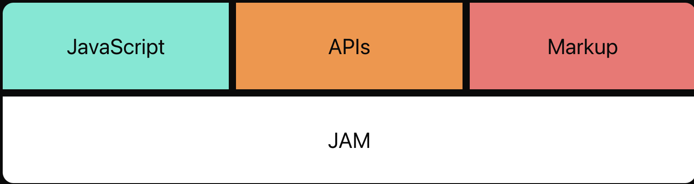
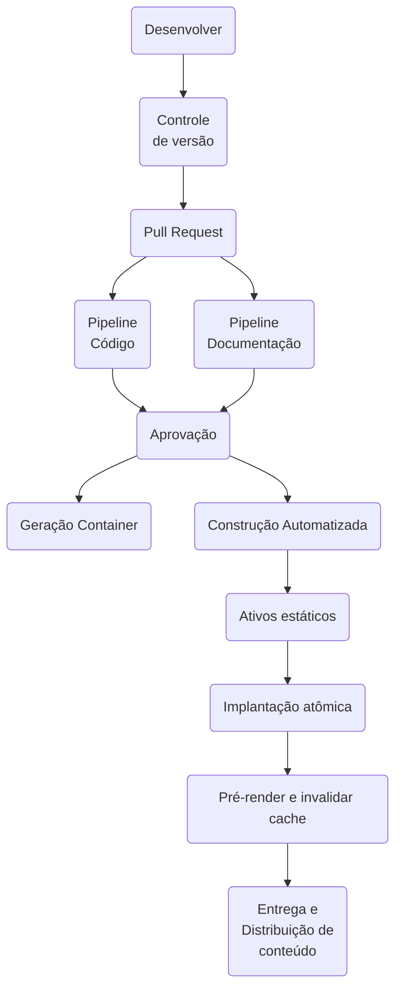

Todos os produtos de desenvolvimento de software, sejam eles criados por uma pequena equipe ou por uma grande corporação, exigem alguma documentação relacionada e os difetentes tipos de documentos são criados ao longo de todo o ciclo de vida de desenvolvimento de software (SDLC).

O método Agile não requerem documentações abrangentes no início - "Software funcional em vez de documentação abrangente”, logo aideia é produzir documentação com informações essenciais para avançar quando fizer mais sentido. 

Michael Nygard, em uma publicação de 2011, "Os métodos ágeis não se opõem à documentação, apenas à documentação sem valor. Documentos que auxiliam a própria equipe podem ter valor, mas somente se estiverem atualizados. Documentos grandes nunca são mantidos atualizados. Documentos pequenos e modulares têm pelo menos uma chance de serem atualizados."

## Estrutura do Diretório

{width="960" height="840" style="display: block; margin: 0 auto"}

## Escrita da Documentação
NÃO SE DEVE escrever as documentações nas ferrametas **Office-Microsoft**, DEVEmos escrever da mesma forma, que escrevemos CÓDIGO.

Ferramentas centradas no desenvolvedor para documentação são freqüentemente chamadas de **Docs-as-Code**. Tratar documentos como código geralmente significa fazer o seguinte:

* Trabalhar em arquivos de texto simples;
* Usar um gerador de site estático;
* Trabalhar com arquivos por meio de um editor de texto;
* Armazenamento de documentos em um repositório de controle de versão;
* Automatizar o processo de construção do site ou Portable Document Format (PDF) com entrega contínua;
* Com esta definição de documentação, nós podemos expressar alguns princípios:
    * Conhecimento que é de interesse por uma grandes período de Tempo DEVE ser documentado.
    * Conhecimento que é de interesse para um amplo número de pessoas  DEVE ser documentado.
    * Conhecimento que é valioso ou crítico DEVE ser documentado.
  

Em vez de criar a documentação em um sistema separado, os analistas de requisitos e desenvolvedores simplesmente adicionam o documento no mesmo projeto em repositórios diferentes ou no mesmo repositório do código, através do uso de markdown. Esse local garante que qualquer pessoa que esteja usando o código também possa encontrar a documentação.

Qualquer um pode ler a documentação diretamente no código-fonte do Markdown ou podem lê-la exibida em um navegador. Com a Documentação como Código, os desenvolvedores tratam a documentação como parte integrante do sistema, melhoram as mensagens de commit. A documentação, junto com o código, é construída e implantada como parte de um pipeline. 

Escrever documentação é entediante e chato, mas de suma importancia. Alguns até pensam que escrever documentação é um esforço infrutífero, visto que os desenvolvedores acham que seu código incrível é autodocumentado. Portanto, um software bem documentado é normalmente uma exceção.

Resumindo, tratar os documentos como código significa usar os mesmos sistemas, processos e fluxos de trabalho com os documentos que você faz com o código de programação.

## História da Wiki :heart:
Desde 2010-13, elaboramos a Media-Wiki na 60Oportunities-RJ, no grupo de desenvolvimento. Sabíamos que processos não documentados e conhecimento implícito, estavam impedindo a contribuição de novos colaboradores com os constantes concursos. 

Com a retirada da Wiki do Rio de Janeiro (2018), paramos de produzir conteúdo o que só retornou em 2020, porem gostaríamos de outros formatos. Em 2020, com a utilização do Gitlab, iniciamos a migração da Wiki para as Wikis de Projetos, porem faltava algo de unificação. 
O Gitlab permitia criar GRUPOS e deixar um grupo responsável pela documentação. Em maio de 2022, migramos para o Azure-Devops, o que nos permitiu efetuar um outro caminho, utilizando agora o conceito de "Jamstack", ou seja, uma arquitetura de desenvolvimento web baseada em JavaScript, APIs e Markdown. Criamos uma primeira versão que pode ser consultada em [Desenvolvedores Documentação].

Hoje, esta estrutura é utilizada  para se referir de forma mais ampla a uma abordagem arquitetônica para construção de sites.

* Não há necessidade de se preocupar com vulnerabilidades de servidores ou bancos de dados;
* A hospedagem de arquivos estáticos é barata;
* Cada implantação é um instantâneo completo do site. Isto ajuda a garantir um versão consistente do site globalmente.
* Seu texto reside em um sistema de controle de versão, como o Git.

Entre os diversos SSG(Static Site Generatos), foram escolhidos o HUGO e o MkDocs.  Como seria uma coisa muito simples, não requerendo conhecimento específico, escolhi o mkdocs por ser mais rápido, simples e gerador voltado para a construção de documentação de projetos. Orientei a TODOS os colaboradores que tivessem um repositório separado de documentação, o que facilitaria a automatização e unificação dos mesmos.

## [Documentação Técnica no Desenvolvimento de Software](https://www.altexsoft.com/blog/technical-documentation-in-software-development-types-best-practices-and-tools/#utm_source=MediumCom&utm_medium=referral)
É o termo genérico que abrange todos os documentos e materiais escritos que tratam do desenvolvimento de produtos de software. 

* A documentação de qualquer sistema/produto, consiste em:
    * Documentação do Produto
        * Sistema (Inclui documentos de requisitos, decisões de design, descrições de arquitetura, código-fonte do programa e perguntas frequentes.)
            * Requisitos (Informações sobre a funcionalidade do sistema.)
            * UX (Inclui pesquisa, prototipagem, testes de usabilidade e a própria parte do design, durante a qual são produzidos muitos documentos e resultados.)
            * Arquitetura
            * Qualidade/Teste
            * API
            * Ajuda
        * Usuário (Inclui tutoriais, guias do usuário, manuais de solução de problemas, instalação e manuais de referência.)
            * Usuário Final (Explicar da forma mais simples possível como o software pode ajudar a resolver seus problemas.)
            * System Admin (Documentos de administração cobrem a instalação e atualizações que ajudam o administrador do sistema na manutenção do produto.)
    * Documentação do Processo (Documentos produzidos durante o desenvolvimento e manutenção)
        * Roadmap de Produto(Sprint)
        * Estimativas
        * Agendas de Reuniões e Decisões

A melhor prática é escrever um documento de requisitos usando um modelo único e consistente que todos os membros da equipe aderem. 

Como regra, as documentações deveriam ser escritas em Markdown, as imagens/fluxos em [Mermaid](https://mermaid.js.org/intro/getting-started.html)
A documentação os arquivos de origem são escritos em Markdown e configurados com um único YAML arquivo de configuração. 

### Vantagens
Nosso manual é novo e mantê-lo relevante é uma parte importante do trabalho de todos. É uma parte vital de quem somos e de como nos comunicamos. Estabelecemos esses processos porque vimos estes benefícios:

* Equilíbrio entre nenhuma documentação e documentação excessiva;
* Ler é muito mais rápido do que ouvir.
* A leitura é assíncrona, você não precisa interromper alguém ou esperar que ele fique disponível.
* A retenção é melhor se as pessoas souberem no que estão se metendo antes de aderirem.
* A integração é mais fácil se você encontrar todas as informações relevantes explicadas.
* O trabalho em equipe será mais fácil se você puder ler como outras partes que trabalham.
* Discutir as mudanças é mais fácil se você puder ler qual é o processo atual.
* Comunicar a mudança é mais fácil se você puder apenas apontar para a diferença.
* Todos podem contribuir propondo uma mudança por meio de uma solicitação pull.

# Pensamento - “Foco não é nada, foco é tudo, (WoW - ways of working - Forma de Trabalhar)
Sou um defensor do foco no trabalho, na vida e na liderança. No entanto, o assunto tem uma nuance e profundidade que muitas pessoas não percebem. Para começar, a maioria das pessoas pensa que existe apenas um tipo de foco.

* Foco como substantivo: Geralmente se referem a ter um único objetivo. É algo estático, algo que você tem. 
* Foco como verbo      : não é apenas algo que você tem, é também algo que você faz. é um processo intenso, dinâmico, contínuo e iterativo.

Temos que desenvolver e valorizar ambos os tipos de foco. 

A estratégia deliberada, onde os líderes desenvolvem uma visão clara e a mapeiam para objetivos de longo, médio e curto prazo (foco como substantivo) e estratégia emergente, onde as pessoas respondem a problemas e oportunidades imprevistas (foco como verbo). 

Vamos ler? [Greg McKeown - Essentialism: The Disciplined Pursuit of Less](https://www.amazon.com/Essentialism-Disciplined-Pursuit-Greg-McKeown/dp/0804137382).

## Markdown

É uma linguagem de marcação leve que você pode usar para adicionar elementos de formatação a documentos de texto sem formatação. Pode ser usado para tudo, desenvolvedores usam para criar sites, documentos, notas, livros, apresentações , mensagens de e-mail e documentação técnica.
Arquivos contendo texto formatado em Markdown podem ser abertos usando virtualmente qualquer aplicativo. Se você decidir que não gosta do aplicativo Markdown que está usando no momento, pode importar seus arquivos Markdown para outro aplicativo Markdown.

Você pode criar texto formatado em Markdown em qualquer dispositivo que execute qualquer sistema operacional.Mesmo que o aplicativo que você esteja usando pare de funcionar em algum momento no futuro, você ainda poderá ler seu texto formatado em Markdown usando um aplicativo de edição de texto. Ou seja, markdown é uma maneira rápida e fácil de fazer anotações, criar conteúdo para um site e produzir documentos prontos para impressão.

* [Modern Technical Writing: An Introduction to Software Documentation](https://www.amazon.com/Modern-Technical-Writing-Introduction-Documentation-ebook/dp/B01A2QL9SS)
* [Docs Like Code: Collaborate and Automate to Improve Technical Documentation](https://www.amazon.com/Docs-Like-Code-Collaborate-Documentation-ebook/dp/B0BPN3YYSX/)
* [Veja a nossa documentação]

## Origem de Conhecimento

O conhecimento vem principalmente de conversas, durante o trabalho coletivo, como programação em pares, no máquina de café, por telefone ou por meio de bate-papo ou e-mails da empresa. O desenvolvimento de software tem tudo a ver com conhecimento e tomada de decisão.

**Conhecimento vem a partir de conversas com pessoas e experimentos com máquinas dentro a observável contexto**.

### Por que conhecimento é necessário?

* Que problema estamos tentando resolver? Todos deveriam saber disso a partir de agora?
* Falta de conhecimento manifesta dois custos:
    * Desperdiçado Tempo;
    * Decisões abaixo do ideal;

O termo documentação viva tornou-se popular pela primeira vez no livro [**Specification by Example de Gojko Adzic**](https://www.amazon.com.br/Specification-Example-Successful-Deliver-Software/dp/1617290084/ref=sr_1_5?qid=1702164016&refinements=p_27%3AGojko+Adzic&s=books&sr=1-5&ufe=app_do%3Aamzn1.fos.4bb5663b-6f7d-4772-84fa-7c7f565ec65b).  Vivendo documentação envolve uma definir de quatro princípios:

| Dica                         | Entenda                                                                                                                                 |
| -----                        | -------                                                                                                                                 |
| Confiável                    | A documentação viva é precisa e sincronizada com o software que esta sendo entregue. |
| Baixo esforço                | A documentação viva minimiza a quantidade de trabalho a ser feito na documentação, mesmo em caso de alterações, exclusões ou acréscimos. |
| Colaborativo                 | A documentação viva promove conversas e conhecimento compartilhamento entre todos envolvidos. |
| Perspicaz                    | Ao chamar a atenção para cada aspecto do trabalho, documentação ofertas oportunidades por comentários e encorajar Deeper pensamento. |

### Confiável
| Dica                         | Entenda                                                                                                                                 |
| -----                        | -------                                                                                                                                 |
| Explorando o conhecimento disponível|  A maioria do conhecimento já está presente nos artefatos do projeto, ele só precisa ser explorado, aumentado e curado por propósitos. |
| Precisão                    | Necessário garantir que o conhecimento é sempre mantido e sincronizado por bugs, modificações ou extensões. |

Uma documentação viva deve ser de baixo esforço para ser viável e sustentável.

| Dica                         | Entenda                                                                                                                                 |
| -----                        | -------                                                                                                                                 |
| Simplicidade                 | Apenas óbvio. |
| Documentação interna         | O conhecimento adicional sobre uma coisa é mais bem localizado em a coisa em si, ou como perto como possível.                           |
| Esqueci Disso                | Não se sinta mal sobre não manter um registro e todas as discussões. |
| Conhecimento Acessível       | É frequentemente declarados em artefatos técnicos em um sistema de controle. Portanto, tu deve fornecer ferramentas para tornar esse conhecimento acessível a todos os públicos sem esforço adicional. |
| Propriedade coletiva        | Não é porque todo o conhecimento está na fonte que os desenvolvedores o possuem. Os desenvolvedores não possuem a documentação; |

Em um projeto de software, a maior parte do conhecimento está presente de alguma forma em algum lugar nos artefatos.

| Dica                         | Entenda                                                                                                                                 |
| -----                        | -------                                                                                                                                 |
| Inacessível                  | O conhecimento armazenado no código-fonte e outros artefatos é não acessível para não técnico pessoas.                                  |
| Abundante                    | Grandes quantidades de conhecimento são armazenadas nos artigos do projeto. O que impossibilita o uso eficiente do conhecimento.        |
| Fragmentado                  | Há conhecimento que pensamos como uma peça única, mas que está de fato espalhado por vários lugares nos artefatos do projeto.           |
| Implícito                    | Muito conhecimento está presente de forma implícita nos artefatos existentes.                                                           |
| Irrecuperável                | Pode ser que o conhecimento esteja lá, mas não há como recuperá-lo porque está escondido no codigo fonte.                               |
| Não escrito                  | O conhecimento está apenas no cérebro das pessoas.                                                                                      |

## Fonte de Documentação

| Conceito | Conceito | Conceito | Conceito |
| -------- | -------- | -------- | -------- |
| [Markdown Guide](https://www.markdownguide.org/basic-syntax/) | [Mkdocs](https://www.mkdocs.org/) | [Mermaid Editor](https://mermaid.live/edit#pako:eNpVj81qw0AMhF9F6NRC_AI-BGK7zSXQQHLz5iBsObuk-8Naphjb7551fEl1EjPfiNGEjW8Zc7xHChqulXKQ5lCXOppeLPU3yLL9fGQB6x2PMxQfRw-99iEYd__c-GKFoJxOK8Yg2rjHslnlK__jeIaqPlEQH27vzvXPz_BVm7NO5_87OnJKfdcd5R1lDUUoKb4Q3KHlaMm0qfq0KgpFs2WFeVpb7mj4FYXKLQmlQfxldA3mEgfe4RBaEq4MpaftJi5PNtJU8w) | [Arquitetura de Projetos](https://c4model.com/) |

## Site Estático x Dinâmico

Um site estático é uma combinação de HTML e CSS, que são os estilos e layouts aplicados a essas páginas, e JavaScript, uma linguagem de programação que define seu comportamento.Essas páginas são armazenadas como arquivos simples, que são servidos por um servidor web.

Um site dinâmico é mais complicado do que isso. Além da marcação, dos estilos e do comportamento, eles fazem mais coisas que nossos navegadores podem identificar. Por exemplo, se você está comprando algo online, é fácil entender que os preços e a disponibilidade desse item são recuperados dinamicamente a partir de alguns dados, geralmente armazenados em bancos de dados. Este processo de recuperar dados e processá-los antes de responder aos nossos navegadores como páginas da web contendo essas informações, é chamado de processamento do lado do servidor. Com a crescente popularidade dos sites baseados no servidor, surgiram suas vulnerabilidades
.

## Quais são as vantagens de um sobre o outro?

Uma medida inteligente para evitar essas ameaças à segurança e, ao mesmo tempo, manter os benefícios dos sistemas de templates, foi a criação de Static Site Generators (SSGs), com eles, escrevemos dinamicamente e publicamos estaticamente.

{width="400" height="300" style="display: block; margin: 0 auto"}

## Repositório Específicos para a Documentação (LIB)
Como uma **BOA PRÁTICA**, devemos **ISOLAR** os códigos de documentos, pois com o passar do tempo, o processo de check-out, branch, fetch e clone do código, aumentarão drasticamente o tempo.
Lembre-se que documentação pode carregar imagens, gráficos,apresentações e pdfs que são importantes para o entendimento. 

# Treinamento em MkDocs
Fácil de instalar e usar, ótimos resultados com mínimo esforço,desenvolvidos ativo e de código aberto.

???+ tip "Configurando o MkDocs"

        Iniciando a configuração do SITE Estático.

    === "O que é [MkDocs](https://github.com/mkdocs/mkdocs)?"

        - [x] Gerador de site estático;
        - [x] As fontes de documentação são escritas no formato MarkDown;
        - [x] Um único arquivo YAML é usado para configuração: mkdocs.yml;
        - [x] Focado na construção de documentação de software;
        - [x] Implementado em Python;
        - [x] Um bom tutorial seria o [EasyBuild](https://tutorial.easybuild.io/2021-isc21/installation/)

    === "Instalando o Python"

        - [x] Efetue a abertura de um chamado técnico no Sysaid para efetuar a instalação do Python; Após a instalação, há a necessidade em configurar a variável de ambiente 
        - [x] Em pesquisar, digite : Editar as variáveis para sua conta
        - [x] Inclua o path: `c:\user\NOME_DO_USUARIO\AppData\Programs\Python\Python`o path pode variar de instalação, por isso procure o software pip, e coloque em sua ultima versão.
        - [x] Crie em seu computador local, a estrutura de repositórios, caso ele NÃO exista: `c:\Usuario\xxxx\repositorios`
        - [x] Acesse o diretório repositórios ou abra o VSCode no diretório especificado: `c:\Usuario\xxxx\repositorios` 

    === "Instalando o Mkdocs"

        - [x]  Instale MkDocs: `pip install mkdocs`
        - [x] Crie o seu primeiro Site. `mkdocs new NOME_DA_DOCUMENTACAO`
        - [x] Você poderá observar que um diretório NOME_DA_DOCUMENTACAO, será criado, com um arquivo mkdocs.yml e um diretório chamado `docs`, que conterão a página markdown.
        - [x] Você poderá neste momento acionar a página para a sua documentação através do comando: `mkdocs serve`
        - [x] Você também pode mandar o mkdocs construir as páginas em html, usando o comando `mkdocs build` e verá que um diretório site, será criado com uma página index.html.
        - [x] Você poderá também verificar antes da liberação de um site, se há links quebrados, informações ausentes, através do comando: `mkdocs build --strict`.
        - [x] O Mkdocs possui uma variedade de plugins, que podem ser instalados através do comando: `pip install nome-do-plugin`
        - [x] Instale o Plugin, mkdocs-material, através do comnando: `pip install mkdocs-material`

    === "Instalando o Portifólio"

        - [x] Para ter acesso localmente a documentação já produzida, efetue o clone do repositório `git clone URL_REPOSITORIO`
        - [x] Efetue a instalação dos Plugins utilizados na documentação : `pip install -r requirements.txt`
        - [x] Execute o mkdocs... mkdocs serve
               - [x] [Localhost](http://127.0.0.1:8000)
