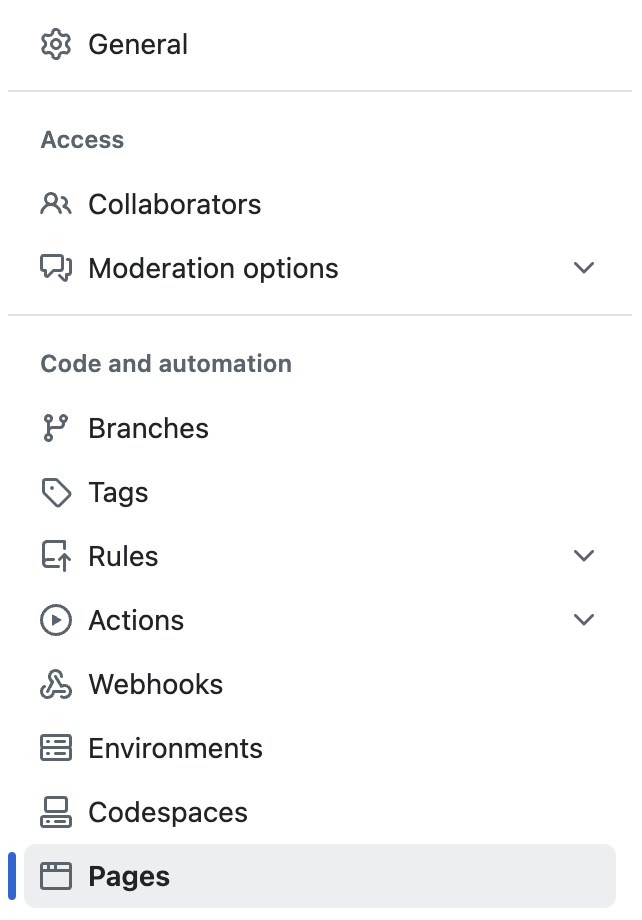
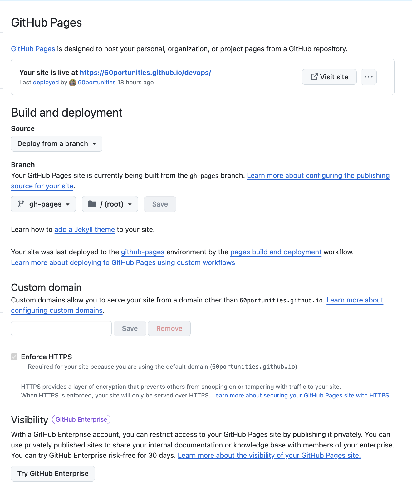
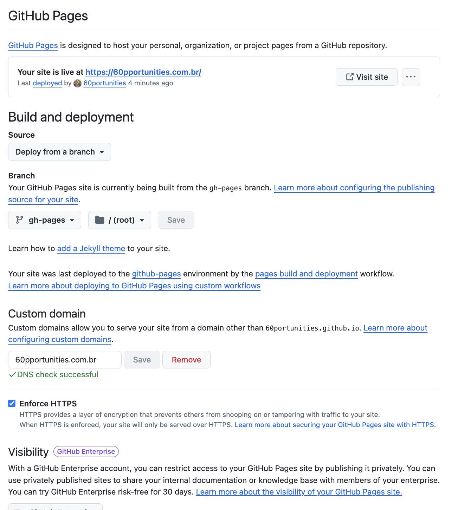

Para configurar o GitHub Pages e expor seu site no seu domínio registrado, siga os passos abaixo:

- [x] Crie ou escolha um repositório no GitHub: Se você ainda não tem um repositório, crie um novo.
- [x] Com o repositório escolhido, clique em `settings`.
{width="800" height="360" style="display: block; margin: 0 auto"}
- [x] Posteriormente, utilize a barra lateral para escolher: `Pages`.
{width="150" height="75" style="display: block; margin: 0 auto"}
      - [x] Build and deployment: Deploy from a branch.
      - [x] Branch: gh-pages /root
      - [x] Custom domain: seudominio.com.br
      - [x] Enforce HTTPS : enabled
- [x] O nome do repositório pode ser username.github.io/repositorio, onde username é seu nome de usuário no GitHub, ou um repositório qualquer se você preferir usar um domínio personalizado.
{width="600" height="300" style="display: block; margin: 0 auto"}
- [x] Configure agora `Custom domain`, colocando o seu domínio e salve. Aguarde o recebimento: `DNS check successful`
{width="600" height="300" style="display: block; margin: 0 auto"}
- [x] Aguarde o processo de liberação.