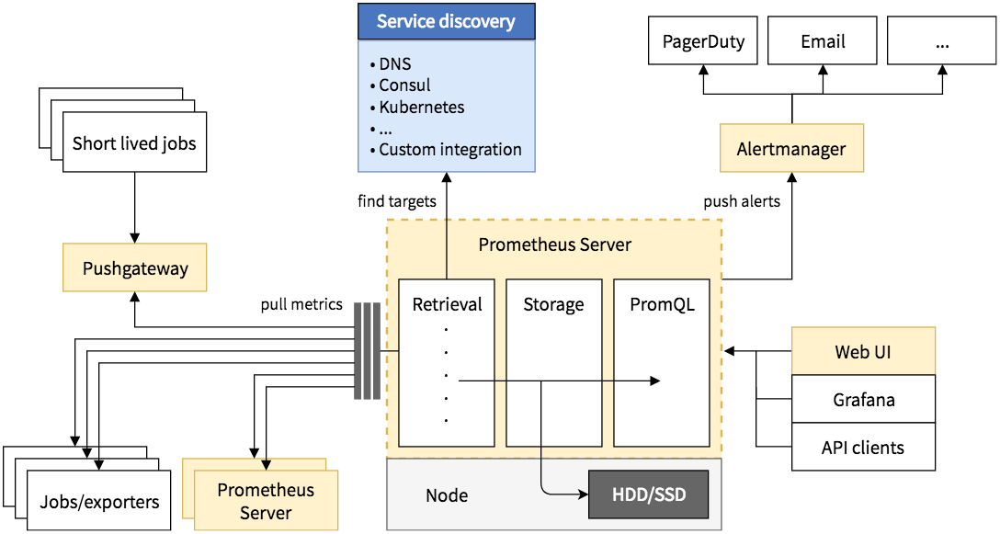

## Monitoramento


Prometheus é um sistema de código aberto para monitoramento e ferramenta de alerta. É desenvolvido na linguagem GO.

Prometheus coleta métricas de destinos configurados em intervalos dados, avalia expressões de regras, exibe os resultados e pode acionar alertas se alguma condição for observada como verdadeira. Tem dados simples, mas poderosos modelo e uma linguagem de consulta que permite analisar como seus aplicativos e infra estrutura estão funcionando.
O modelo de dados identifica cada série temporal não apenas com um nome, mas também com um conjunto não ordenado de pares de valores-chave chamados rótulos.
Um único servidor Prometheus pode ingerir milhões de amostras por segundo.


{width="600" height="300" style="display: block; margin: 0 auto"}

Prometeu foi construído para auxiliar no desenvolvimento de software,
operadores e administradores na operação de produção, como os aplicativos,  ferramentas, bancos de dados e redes que dão suporte a sites populares.

???+ tip "Monitoramento porque ?"

    === "Configuração Básica"

         Alerta: Nós queremos que o sistema de monitoramento **CHAME** uma pessoa para dar uma olhada;

         Depuração: Já que você veio, agora quem chegou, precisa investigar para determinar a causa raiz e resolver o incidente.

         Tendencias: Alimentam decisões de design e processos como planejamento de capacidade.

         Canalização: No fim de o dia em que todos os sistemas de monitoramento são canais de processamento de dados.

         | Tipo  | Definição |
         | ------ | ------ |
         | Registros de depuração | Eles são frequentemente usados apenas em situações de depuração muito restritas e tendem a criação de perfil devido ao seu volume de dados. |
         | Logs de aplicativos | Registros lidos por um Administrador TI (DBA),  deve-se **evitar** mais do que alguns por minuto em operações normais.|
         | Solicitar logs | Registros que podem ser processados para implementar recursos voltados para o usuário ou apenas para otimizações internas. |
         | Registros de transações | Eles são os registros críticos de negócios que você deve manter seguros a todo custo, provavelmente para sempre. |

        === "Monitoramento"

            A maior parte do monitoramento é sobre a mesma coisa: **eventos** e os eventos também têm **contexto**. 

            - Observar o comportamento [não funcional] das funções de negócios / aplicativos em tempo [quase] real;
            - Disponibilidade e saúde;
            - Atuação;
            - Acesso - quando e como deve ser para quem deve ser;
            - Equipa-se com:
            - Criação de perfil e depuração - contexto máximo para picos de atividade;
            - Rastreamento - rastreia os caminhos da aplicação [e plataforma e infra] pilha tecnológica;
            - Registro - por aplicativo ou saída de componente de plataforma para off-line em processamento;

        === "Definições"

            | Tipo | header |
            | ------ | ------ |
            | contador | São usados principalmente para rastrear a frequência com que um determinado caminho de código é executado |
            | Exceções de contagem | São usados principalmente para com a capacidade de contar exceções |
            | Tamanho de contagem | Utiliza números de ponto flutuante de 64 bits para valores, então você não está limitado a incrementando contadores em um. Você pode, de fato,             incrementar contadores por qualquer número negativo. |
            | Medidor | Os medidores são um instantâneo de algum estado atual. Os medidores têm três métodos principais que você pode usar: iinc, dec, and set. As métricas de contador             são sufixadas por _total. |
            | Exposicao | O processo de disponibilização de métricas. Normalmente você expõe métricas sob o caminho/metrics. |

            - Métricas como process_resident_memory_bytes são chamadas de medidores.
            - Os contadores rastreiam quantos eventos aconteceram ou o tamanho total de todos os eventos (prometheus_tsdb_head_samples_appended_total);
            - Observação: Vc poderá produze taxas ou medições temporais. **rate(prometheus_tsdb_head_samples_appended_total[1m])**


        ===  "O que é necessário para o monitoramento?"

             - Reúna a métrica operacional;
             - Disparar Alertas;
             - Disparar Agentes Automatizados de correção;
             - Para apoiar a resolução de questões (dados para análise da causa raiz);
             - Para analisar tendências + efeitos / impacto da mudança.

        === "Tipo de métrica"
            HELP é uma descrição do que é a métrica, e geralmente não deve
            mude de raspar paras a scrape to scrape. 
            TYPE é um de contador, medidor, resumo, histograma ou não tipado. sem tipo é usado quando você não sabe o tipo de métrica e é o padrão se nenhum tipo for especificado.
            
            - Métricas primárias;
            - Vinculado a indicadores de SLA;
            - Relevante - representante dos principais indicadores de desempenho;
            - Experiência do usuário final;
            - Rendimento da atividade de negócios.

    === "Métricas secundárias"
        
        - Métricas técnicas;
        - Fatores de Saúde - não diretamente ligados a indicadores específicos de negócios;
        - Temperatura, armazenamento, carga de rede e etc.
        - Paine

    === "Service Discovery"

        O Prometheus possui integrações com muitos mecanismos de descoberta de serviço comuns,como Kubernetes, EC2 e Consul, mas não foi o foco deste trabalho.

    === "Scraping"

        Prometheus faz isso enviando uma solicitação HTTP chamada de scrape. A resposta deste scraping é analisada e armazenada. Outras métricas úteis também são adicionadas, como se o scrape foi bem-sucedido e quanto tempo demorou.

???+ tip "Prometheus"

    === "Servidor Prometheus"

        Optei por uma instalação em /opt/prometheus, tando do server como dos exportadores.
        
        | Objetos | Propósitos | Serviço | Porta | Abrv | Padrão |
        | ------ | ------ |------ |------ |------ | :------: |
        | [Prometheus](http://192.168.56.120:9099/) | O sistema de monitoramento Prometheus e banco de dados de séries temporais. | prometheus.service | 9099 | srv | 9090 |
        
        Observação: Optei por uma instalação em /opt, em usuário prometheus.

        === "Arquitetura de Instalação"

            ```mermaid
            graph TD
                A[opt] -->B[prometheus]
                B --> C[prmt_abrv_versão]
                B --> D[latest_abrv]
                B --> E[conf]
                B --> F[data]
            ```

        === "Pushgateway"

            O Pushgateway permite que você envie métricas para empurrar o endpoint do gateway, então configuramos o prometheus para realizar scrape do  gateway de push para consumir as             métricas expostas no prometheus. Iremos utilizar para os Concurrents do e-Business.
            
            | Objetos | Propósitos | Serviço | Porta | Abrv |
            | ------ | ------ |------ |------ |------ |
            | [pushgateway](http://192.168.56.120:9197/metrics) | O Pushgateway é um cache de métricas para trabalhos em lote de nível de serviço. | pushgateway.service  | 9195 |             pushgt | 9091 |
            
            
            ```mermaid
            graph TD
            
               A[Concurrents] --> |Single push|C[Pushgateway]
               B[JOBs]        --> |Single push|C[Pushgateway]
               D[SFTPs]       --> |Single push|C[Pushgateway]
               E[FTPs]        --> |Single push|C[Pushgateway]
               C              --> |Regular Scrape|Prometheus
            ```

        === "Exportadores"

            Um Exportador é um software que você implanta ao lado do aplicativo que você deseja obter métricas, ou seja, ele reúne o os dados necessários do aplicativo, transforma-os no             formato correto e finalmente os retorna em uma resposta a Prometeu. Podemos pensar em um exportador como um pequeno proxy um para um, convertendo dados entre a interface de             métricas de um aplicativo e o formato de exposição do Prometheus.
            
            | Objetos | Propósitos | Serviço | Porta | Abrv |
            | ------ | ------ |------ |------ |------ |
            | [blackbox_exporter](http://192.168.56.120:9195/metrics) | Produz métricas derivadas de protocolos como HTTP e HTTPS para determinar a disponibilidade do endpoint, o tempo             de resposta e entre outros. | blackbox_exporter.service  | 9195 | blck | 
            | [memcached_exporter](http://192.168.56.120:9196/metrics) | Exporta métricas de servidores memcached para consumo pelo Prometheus. | memcached_exporter.service | 9196 |             mencach |
            | [node_exporter](http://192.168.56.120:9190/metrics) | Produz métricas sobre infraestrutura, incluindo a CPU atual, memória e uso de disco, bem como estatísticas de E / S e             rede, como o número de bytes lidos de um disco ou a carga média de um servidor. | node_exporter.service | 9190 | node |
            | windows_exporter | Um exportador da Prometheus para máquinas Windows. | - | |
            | gitlab-exporter        | - | - | - |
            | Elasticsearch exporter | - | - | - |
            | SNMP exporter          | - | - | - |
            | Apache exporter        | - | - | - |
            | Jenkins exporter       | - | - | - |
            | PostgreSQL exporter    | - | - | - |
            | Kafka Consumer Group exporter| - | - | - |
            
        === "Exportador Node"

             Este expõe métricas no nível do kernel e da máquina em sistemas Unix, como Linux. Ele fornece todas as métricas padrão, como CPU, memória, espaço em disco, disco E/S e              largura de banda da rede.
             
             Além disso, fornece uma infinidade de métricas adicionais exposta pelo kernel, da média de carga à temperatura da placa-mãe.
             
             Observação: Ele não expõe são métricas sobre processos individuais, nem
             métricas proxy de outros exportadores ou aplicativos. (rate(node_network_receive_bytes_total[1m]))

        === "Alertas"

        O Alertmanager recebe alertas dos servidores Prometheus e os transforma em notificações. As notificações podem incluir e-mail, aplicativos Slack, Teams, WhatsAPP e etc. Os alertas relacionados podem ser agregados em uma notificação.

        === "Existem duas partes no Alertmanages"

            A primeira adicionando regras de alerta ao Prometheus, definindo
            a lógica do que constitui um alerta.
            A segunda o Alertmanager converte alertas  em notificações, como e-mails, páginas e mensagens de bate-papo.
            
            
            | Objetos | Propósitos | Serviço | Porta | Abrv |
            | ------ | ------ |------ |------ |------ |
            | [Alertmanager](http://192.168.56.120:9193/) | Prometheus Alertmanager |  alertmanager.service  | 9193  | alert | 9093 |
            | Alertmanager clustering | Prometheus Alertmanager clustering |  -   | - | alertct | 9094 |
            | pagerduty-exporter | Não configurado | pagerduty.service | - | pgdty |
            
            Observação: Pode haver personalização de [templates](https://golang.org/pkg/text/template/)
            
            Observação: 
            - Os serviços estão no /etc/systemd/system/.
            - O link simbólico __latest_abrev__ , apontará para a última versão instalada e possivelmente não haverá quebra das scripts.
            
        === "Monitoramento MySQL"

            Não sei quais bancos são usados o MariaDB e/ou MySQL.. Mas a história é a mesma da Oracle.
            
            
            | Objetos | Propósitos | Serviço | Porta | Abrv |
            | ------ | ------ |------ |------ |------ |
            | [mysqld_exporter](http://192.168.56.120:9194/metrics)  | Produz métricas relacionadas a um servidor MySQL, como o número de consultas executadas, tempo médio de resposta             da consulta e status de replicação do cluster. |  mysql_exporter.service   | 9194 | mysqldb |


        === "Monitoramento Oracle"

            Os usuários têm relatado erros causados ​​por consultas lentas ou demoradas  no banco de dados, levando ao ambiente "TOPAR" 100%. 
            
            Os desenvolvedores não conseguem reproduzir o problema, por estes ambientes não são concorrentes, logo as perguntas são passíveis de serem feitas:
            
            - É causado pela falta de recursos? 
              - Mal dimensionamento de Sizing ?
              - Péssima estrutura do hosting?
              - Arquitetura descentralizada desestruturada ?
            
            - Degradação de Performance 
              - Revisão dos Parâmetros de Inicialização do Banco de Dados;
              - Revisão da System Managed Undo;
              - Revisão da System Managed Undo;
              - Revisão da Temporary Tablespace;
              - Revisão de Clean-ups e execução de Estatisticas;
              - Consultas mal otimizadas retornando muitos resultados? 
              - etc.
            
             Este é um ponto a ser levantado pelo Engenheiro de Confiabilidade da Instituição (SRE).
             
             Há sempre a discussão sobre a necessidade em **MONITORAR** com alertas automáticos, para que a equipe de SRE possa solucionar esses erros quando eles surgirem e cumprir seus              objetivos de nível de serviço. 
             
             Além disso, um melhor monitoramento do banco de dados Oracle ajudará a avaliar o tamanho das tabelas e espaços de tabela e revelará onde o crescimento está acontecendo.


             O Oracle Instant Client é uma implementação distribuída gratuitamente de um cliente Oracle. 
             
             | RPM | Instalado |
             | ----- | ------ |
             | JDBC | oracle-instantclient-jdbc-21.1.0.0.0-1.x86_64.rpm |
             | Devel | oracle-instantclient-devel-21.1.0.0.0-1.x86_64.rpm |
             | SQLPlus | oracle-instantclient-sqlplus-21.1.0.0.0-1.x86_64.rpm |
             | Drives | oracle-instantclient-basic-21.1.0.0.0-1.x86_64.rpm |
             
             ### Prometheus OracleDB
             
             | Objetos | Propósitos | Serviço | Porta | Abrv |
             | ------ | ------ |------ |------ |------ |
             | [oracledb_exporter](http://http://192.168.56.120:9161/metrics)  | Produz métricas relacionadas ao Banco de Dados - Oracle, como o número de consultas executadas, tempo              médio de resposta da consulta e status de replicação do cluster. |  oracledb_exporter.service   | 9194 | oradb |
             
             > https://github.com/iamseth/oracledb_exporter/releases
             
             
             Observação: **Default port allocations -  https://github.com/prometheus/prometheus/wiki/Default-port-allocations**
             
        === "O que devo instrumentar"

            Em linhas gerais existem três tipos de serviços, cada um com suas próprias métricas principais:
            
            - Sistemas de serviço online;
             - servidores da web e bancos de dados
               - Taxa de solicitação, latência e Taxa de erro.
            - Sistemas de serviço offline;
             - Agrupamento e estágios em um pipeline com filas;
               - Quantidade de trabalho na fila;
               - Quanto trabalho está em andamento;
            - Trabalhos em lote.
             - Similar ao Serviço offline
               - Registrar quanto tempo levou para ser executado;
               - Hora em que o trabalho foi bem-sucedido pela última vez;
               - Idempotência para trabalhos em lote

        === "Em tempo"

            Você também precisará instalar a biblioteca cliente Python mais recente.
            Isso pode ser feito com
            
            pip install prometheus_client

???+ tip "Nomenclaturas"

    === "Como devo nomear minhas métricas"

         Bem, pelo que pude perceber a estrutura geral de um nome de métrica geralmente é **biblioteca_nome_unidade_sufixo**. 
         Devem começar com uma letra e podem ser seguidos por qualquer
         número de letras, números e sublinhados.

    === "Qual o estilo? Camel, Pascal, Snake ou Kebab Case?"

        A convenção é usar SNAKE CASE para nomes de métricas cada componente do nome deve ser minúsculo e separado por um sublinhado.

    === "Sufixos"
 
        Os sufixos _total, _count, _sum e _bucket são usados pelas métricas de contador, resumo e histograma. Além de sempre ter um sufixo _total nos contadores, você deve evitar colocar esses sufixos no final dos nomes das métricas para evitar confusão.

    === "Unidades"

        Você deve preferir usar unidades básicas não fixadas, como segundos, bytes e proporções. Você deve sempre incluir a unidade de seu métrica no nome.

    === "Nomes"

        Os nomes geralmente vão de menos para mais específicos conforme você vai da esquerda para a direita


    === "Por fim"

        O software não restringe o numero de métricas, contadores e etc, porem, em algum ponto, os custos operacionais e de recursos superam os benefícios para certas estratégias.

???+ tip "Dashboard"

    === "Dashboarding com Grafana"

         Grafana é uma ferramenta com a qual você pode construir tais painéis para muitos diferentes sistemas de monitoramento e não monitoramento, incluindo Graphite, InfluxDB, Elastic-Search e PostgreSQL

    === "Monitoramento da infraestrutura"

        A Arquitetura Prometheus cada um dos seus serviços irá expor suas próprias métricas, usando um exportador. 
        
        O exportador do Node é projetado para ser executado como um usuário não root e deve ser executado diretamente na máquina da mesma forma que você executa um daemon do sistema         como sshd ou cron.

    === "Monitoramento de Servidores"

        | Métrica | Descrição |
        | ------ | ------ |
        | node_cpu_seconds_total | contador que indica quanto tempo cada CPU gastou em cada modo |
        | node_filesystem_ | Expõe as métricas sobre os sistemas de arquivos, assim como você obteria do comando df |
        | node_disk_io | Expõe as métricas de E/S de disco de /proc/diskstats |
        | node_network | Expõe as métricas de rede com um rótulo de dispositivo |
        | node_memory_ | Expõe as métricas relacionadas memória padrão |
        | node_hwmon_  | Expõe as métricas como temperatura e velocidades do ventilador |
        | node_boot_time | Acheio meio confuso, é um pouco confuso, fornece métricas de /proc/stat |
        | node_uname_info | É o nome do host da máquina, que pode ser diferente do rótulo de destino da instância |
        | node_load  | Expõe o número de processos esperando em a fila de execução ou  aqueles que aguardam E/S.  |
        
    === "Monitoramento de e-Business"

        | Métrica | Tempo  | Local |
        | ------ | ------: | ------ |
        | Tempo Médio de Execução                       |  1 | 
        | Tempo Máximo de Execução                      |  1 |
        | Solicitações concluídas com sucesso           |  1 |
        | Solicitações concluídas com erros             |  1 |
        | Solicitações concluídas com Advrtencia        |  1 |
        | Nº de solicitações incompletas por status     |  1 |
        | Solicitações simultâneas inativas             | 15 |
        | Solicitações simultâneas inativas (em espera) |    | 
        | Solicitações simultâneas pendentes (normal)   |    |
        | Execução de solicitações simultâneas          |    |
        | Solicitações simultâneas programadas          |    |
        | Nº de solicitações concluídas por hora por status  | 60 Minutos | 
        | Solicitações simultâneas concluídas com erro       |  |
        | Solicitações simultâneas concluídas com aviso      |  |
        | Taxa de erros de solicitações simultâneas (%)      |  |
        | Taxa de solicitações bem-sucedidas de solicitações simultâneas (%) |  |
        | Nível de tolerância para solicitação de longa duração |  |
        | Tolerância no tempo médio de execução (%) |  |


    === "File Integrity Monitoring"

        File Integrity Monitoring (FIM) ou monitoramento de integridade de arquivos, no português, é um controle essencial de segurança que analisa e alerta alterações suspeitas na         integridade de arquivos de configuração e sistema, com o objetivo de identificar possíveis ataques cibernéticos.
        
        O cenário de TI se alterou drasticamente, com as organizações adotando massivamente a cultura de Agile e DevOps,  arquitetura de microsserviços, "containerização" e migração         de aplicações para a nuvem. 
        
        Nesse novo contexto, com os containers sendo efêmeros na sua essência e com novas versões de aplicações sendo entregues mais frequentemente, a quantidade de alterações         aumentou consideravelmente. 
        
        Seria **FIM** ainda uma solução relevante de segurança? Como evitar que as mudanças tão frequentes causem a chamada "Fadiga de Alerta", que é perigosa porque incidentes         legítimos de segurança podem ser ignorados?

???+ tip "Sinais Dourados"

        Os quatro sinais de ouro de monitoramento são latência, tráfego, erros e saturação. Se você só pode medir quatro métricas de seu sistema voltado para o usuário, concentre-se nessas quatro.

    === "Latência"

        O tempo que leva para atender a uma solicitação. É importante distinguir entre a latência de solicitações bem-sucedidas e a latência de solicitações com falha. Por exemplo, um erro HTTP 500 disparado devido à perda de conexão com um banco de dados ou outro back-end crítico pode ser atendido muito rapidamente; no entanto, como um erro HTTP 500 indica uma falha na solicitação, fatorar 500s em sua latência geral pode resultar em cálculos enganosos. Por outro lado, um erro lento é ainda pior do que um erro rápido! Portanto, é importante rastrear a latência do erro, em vez de apenas filtrar os erros.

    === "Tráfego"

        Uma medida de quanta demanda está sendo colocada em seu sistema, medida em uma métrica específica do sistema de alto nível. Para um serviço da web, essa medida geralmente é de solicitações HTTP por segundo, talvez divididas pela natureza das solicitações (por exemplo, conteúdo estático versus conteúdo dinâmico). Para um sistema de streaming de áudio, esta medição pode se concentrar na taxa de E / S da rede ou sessões simultâneas. Para um sistema de armazenamento de valor-chave, essa medida pode ser transações e recuperações por segundo .

    === "Erros"

        A taxa de solicitações que falham, seja explicitamente (por exemplo, HTTP 500s), implicitamente (por exemplo, uma resposta de sucesso HTTP 200, mas associada ao conteúdo errado) ou por política (por exemplo, "Se você se comprometeu com um segundo tempos de resposta, qualquer solicitação acima de um segundo é um erro "). Quando os códigos de resposta do protocolo são insuficientes para expressar todas as condições de falha, protocolos secundários (internos) podem ser necessários para rastrear os modos de falha parcial. O monitoramento desses casos pode ser drasticamente diferente: capturar HTTP 500s em seu balanceador de carga pode fazer um trabalho decente de capturar todas as solicitações com falha completa, enquanto apenas testes de sistema de ponta a ponta podem detectar que você está servindo o conteúdo errado.

    === "Saturação"

        O quão "completo" o seu serviço é. Uma medida da fração do seu sistema, enfatizando os recursos que são mais restritos (por exemplo, em um sistema com restrição de memória, mostrar memória; em um sistema com restrição de E / S, mostrar E / S). Observe que muitos sistemas degradam o desempenho antes de atingirem 100% de utilização, portanto, ter  uma meta de utilização é essencial.
        Em sistemas complexos, a saturação pode ser complementada com medição de carga de nível mais alto: seu serviço pode lidar adequadamente com o dobro do tráfego, lidar com  apenas 10% mais tráfego ou lidar com ainda menos tráfego do que recebe atualmente? Para serviços muito simples que não têm parâmetros que alteram a complexidade da         solicitação (por exemplo, "Dê-me um nonce" ou "Eu preciso de um número inteiro monotônico exclusivo global") que raramente mudam de configuração, um valor estático de um   teste de carga pode ser adequado . Conforme discutido no parágrafo anterior, no entanto, a maioria dos serviços precisa usar sinais indiretos, como utilização da CPU ou  largura de banda da rede, que têm um limite superior conhecido. Os aumentos de latência costumam ser um indicador importante de saturação. Medir o seu tempo de resposta do  99º percentil em uma pequena janela (por exemplo, um minuto) pode dar um sinal muito precoce de saturação.
        Por fim, a saturação também se preocupa com as previsões de saturação iminente, como "Parece que seu banco de dados encherá o disco rígido em 4 horas".
        Se você medir todos os quatro sinais dourados e chamar um humano quando um sinal for problemático (ou, no caso de saturação, quase problemático), seu serviço será pelo menos  decentemente coberto pelo monitoramento.

    === "Preocupando-se com sua cauda"

        Ao construir um sistema de monitoramento do zero, é tentador projetar um sistema baseado na média de alguma quantidade: a latência média, o uso médio da CPU de seus nós ou a         plenitude média de seus bancos de dados. O perigo apresentado pelos dois últimos casos é óbvio: CPUs e bancos de dados podem ser facilmente utilizados de uma forma muito         desequilibrada. O mesmo se aplica à latência. Se você executar um serviço da web com uma latência média de 100 ms a 1.000 solicitações por segundo, 1% das solicitações pode         facilmente levar 5 segundos. 23 Se seus usuários dependem de vários serviços da web para renderizar suas páginas, o 99º percentil de um back-end pode facilmente se tornar a         resposta mediana de seu front-end .

        A maneira mais simples de diferenciar entre uma média lenta e uma "cauda" muito lenta de solicitações é coletar contagens de solicitações divididas por latências (adequadas         para renderizar um histograma), em vez de latências reais: quantas solicitações atendi que levaram entre 0 ms e 10 ms, entre 10 ms e 30 ms, entre 30 ms e 100 ms, entre 100         ms e 300 ms, e assim por diante? Distribuir os limites do histograma de forma aproximadamente exponencial (neste caso, por fatores de aproximadamente 3), geralmente é uma         maneira fácil de visualizar a distribuição de suas solicitações.

    === "Escolha de uma resolução apropriada para as medições"
        
        Diferentes aspectos de um sistema devem ser medidos com diferentes níveis de granularidade. Por exemplo:
      
        Observar a carga da CPU no intervalo de tempo de um minuto não revelará nem mesmo picos de longa duração que geram latências de cauda altas.
        
        Por outro lado, para um serviço da web que visa não mais do que 9 horas de tempo de inatividade agregado por ano (99,9% de tempo de atividade anual), a verificação de um  status de 200 (sucesso) mais de uma ou duas vezes por minuto é provavelmente desnecessariamente frequente.
        
        Da mesma forma, verificar se o disco rígido está cheio para um serviço que visa 99,9% de disponibilidade mais de uma vez a cada 1–2 minutos é provavelmente desnecessário.
        
        Tome cuidado ao estruturar a granularidade de suas medições. Coletar medições por segundo da carga da CPU pode render dados interessantes, mas essas medições frequentes podem ser muito caras para coletar, armazenar e analisar. Se sua meta de monitoramento exige alta resolução, mas não exige latência extremamente baixa, você pode reduzir esses custos realizando amostragem interna no servidor e, em seguida, configurando um sistema externo para coletar e agregar essa distribuição ao longo do tempo ou entre servidores. 
    
    === "Registre a utilização atual da CPU a cada segundo"

        Usando intervalos de granularidade de 5%, incremente o intervalo de utilização de CPU apropriado a cada segundo.

    === "Agregue esses valores a cada minuto""

        Essa estratégia permite observar breves pontos de acesso da CPU sem incorrer em custos muito altos devido à coleta e retenção.

    === "Tão simples quanto possível, não mais simples"

        Empilhar todos esses requisitos uns sobre os outros pode resultar em um sistema de monitoramento muito complexo - seu sistema pode acabar com os seguintes níveis de         complexidade:
        
        Alertas em diferentes limites de latência, em diferentes percentis, em todos os tipos de métricas diferentes
        
        Código extra para detectar e expor as possíveis causas
        Painéis associados para cada uma dessas possíveis causas
        As fontes de complexidade potencial são infinitas. Como todos os sistemas de software, o monitoramento pode se tornar tão complexo que se torna frágil, complicado de mudar e         um fardo de manutenção.
        
        Portanto, projete seu sistema de monitoramento tendo em vista a simplicidade. Ao escolher o que monitorar, tenha em mente as seguintes diretrizes:
        
        As regras que detectam incidentes reais na maioria das vezes devem ser o mais simples, previsíveis e confiáveis ​​possível.
        A coleta de dados, agregação e configuração de alerta que raramente é realizada (por exemplo, menos de uma vez por trimestre para algumas equipes SRE) devem ser removidos.
        Os sinais que são coletados, mas não expostos em nenhum painel pré-elaborado nem usados ​​por qualquer alerta, são candidatos à remoção.
        Na experiência do Google, a coleta e agregação básicas de métricas, emparelhadas com alertas e painéis, funcionou bem como um sistema relativamente autônomo. (Na verdade, o         sistema de monitoramento do Google é dividido em vários binários, mas normalmente as pessoas aprendem sobre todos os aspectos desses binários.) Pode ser tentador combinar o         monitoramento com outros aspectos da inspeção de sistemas complexos, como perfis de sistema detalhados, depuração de processo único , rastreando detalhes sobre exceções ou         travamentos, teste de carga, coleta e análise de log ou inspeção de tráfego. Embora a maioria desses assuntos compartilhe semelhanças com o monitoramento básico, combinar         muitos resultados em sistemas excessivamente complexos e frágeis. Como em muitos outros aspectos da engenharia de software, manter sistemas distintos com
        
        Vinculando esses princípios
        Os princípios discutidos neste capítulo podem ser agrupados em uma filosofia de monitoramento e alerta amplamente endossada e seguida pelas equipes de SRE do Google. Embora         essa filosofia de monitoramento seja um tanto aspiracional, é um bom ponto de partida para escrever ou revisar um novo alerta e pode ajudar sua organização a fazer as         perguntas certas, independentemente do tamanho de sua organização ou da complexidade de seu serviço ou sistema.
        
        Ao criar regras para monitoramento e alerta, fazer as seguintes perguntas pode ajudá-lo a evitar falsos positivos e esgotamento do pager: 24
        
        Esta regra detecta uma condição não detectada que é urgente, acionável e ativa ou iminentemente visível para o usuário? 25
        Serei capaz de ignorar esse alerta, sabendo que é benigno? Quando e por que poderei ignorar esse alerta e como posso evitar esse cenário?
        Este alerta indica definitivamente que os usuários estão sendo afetados negativamente? Existem casos detectáveis ​​em que os usuários não estão sendo afetados negativamente,         como tráfego drenado ou implantações de teste, que devem ser filtrados?
        Posso agir em resposta a este alerta? Essa ação é urgente ou pode esperar até de manhã? A ação poderia ser automatizada com segurança? Essa ação será uma solução de longo         prazo ou apenas uma solução alternativa de curto prazo?
        Outras pessoas estão sendo avisadas por este problema, tornando pelo menos uma das páginas desnecessária?
        Essas perguntas refletem uma filosofia fundamental em páginas e pagers:
        
        Cada vez que o pager tocar, devo ser capaz de reagir com um senso de urgência. Só consigo reagir com urgência algumas vezes por dia antes de ficar cansado.
        Cada página deve ser acionável.
        Cada resposta de página deve exigir inteligência. Se uma página meramente merece uma resposta robótica, não deveria ser uma página.
        As páginas devem ser sobre um problema novo ou um evento que não tenha sido visto antes.
        Essa perspectiva dissipa certas distinções: se uma página satisfaz os quatro marcadores anteriores, é irrelevante se a página é acionada por monitoramento de caixa branca ou         caixa preta. Essa perspectiva também amplifica certas distinções: é melhor despender muito mais esforço em detectar os sintomas do que as causas; quando se trata de causas,         preocupe-se apenas com causas muito definidas e iminentes.
        
        Monitoramento de Longo Prazo
        Em sistemas de produção modernos, os sistemas de monitoramento rastreiam um sistema em constante evolução com mudanças na arquitetura de software, características de carga e         metas de desempenho. Um alerta que atualmente é excepcionalmente raro e difícil de automatizar pode se tornar frequente, talvez até merecendo um script hackeado para         resolvê-lo. Nesse ponto, alguém deve encontrar e eliminar as causas básicas do problema; se tal resolução não for possível, a resposta do alerta merece ser totalmente         automatizada.
        
        É importante que as decisões sobre monitoramento sejam tomadas com objetivos de longo prazo em mente. Cada página que acontece hoje distrai o ser humano de melhorar o         sistema para amanhã, então muitas vezes é o caso de dar um golpe de curto prazo na disponibilidade ou no desempenho para melhorar a perspectiva de longo prazo para o         sistema. Vamos dar uma olhada em dois estudos de caso que ilustram essa compensação.
        
        Bigtable SRE: A Tale of Over-Alerting
        A infraestrutura interna do Google é normalmente oferecida e medida em relação a um objetivo de nível de serviço (SLO; consulte Objetivos de nível de serviço ). Muitos anos         atrás, o SLO do serviço Bigtable era baseado no desempenho médio de um cliente sintético bem comportado. Devido a problemas no Bigtable e nas camadas inferiores da pilha de         armazenamento, o desempenho médio foi impulsionado por uma cauda "grande": os piores 5% das solicitações costumavam ser significativamente mais lentos do que o resto.
        
        Alertas de e-mail eram acionados conforme o SLO se aproximava, e alertas de paging eram acionados quando o SLO era excedido. Ambos os tipos de alertas foram disparados de         forma volumosa, consumindo uma quantidade inaceitável de tempo de engenharia: a equipe gastou uma quantidade significativa de tempo fazendo a triagem dos alertas para         encontrar os poucos que eram realmente acionáveis ​​e muitas vezes perdemos os problemas que realmente afetavam os usuários, porque poucos fez. Muitas das páginas não eram         urgentes, devido a problemas bem conhecidos na infraestrutura, e tiveram respostas automáticas ou não receberam resposta.
        
        Para remediar a situação, a equipe usou uma abordagem em três vertentes: ao fazer grandes esforços para melhorar o desempenho do Bigtable, também reduzimos temporariamente         nossa meta de SLO, usando a latência de solicitação do 75º percentil. Também desabilitamos os alertas de e-mail, pois eram tantos que perder tempo diagnosticando-os era         inviável.
        
        Essa estratégia nos deu espaço para respirar para realmente consertar os problemas de longo prazo no Bigtable e nas camadas inferiores da pilha de armazenamento, em vez de         consertar constantemente os problemas táticos. Os engenheiros de plantão podiam realmente realizar o trabalho quando não eram acompanhados por pajens o tempo todo. Por fim,         o recuo temporário de nossos alertas nos permitiu progredir mais rapidamente em direção a um serviço melhor.
        
        Gmail: respostas previsíveis e programáveis ​​de humanos
        Nos primeiros dias do Gmail, o serviço foi construído em um sistema de gerenciamento de processo distribuído adaptado chamado Workqueue, que foi originalmente criado para         processamento em lote de partes do índice de pesquisa. O Workqueue foi "adaptado" a processos de longa duração e posteriormente aplicado ao Gmail, mas alguns bugs na base de         código relativamente opaca do agendador se mostraram difíceis de superar.
        
        Naquela época, o monitoramento do Gmail era estruturado de forma que alertas fossem disparados quando tarefas individuais fossem “canceladas” pelo Workqueue. Essa         configuração não era ideal porque, mesmo naquela época, o Gmail tinha muitos, muitos milhares de tarefas, cada tarefa representando uma fração de um por cento de nossos         usuários. Nós nos preocupávamos profundamente em fornecer uma boa experiência do usuário aos usuários do Gmail, mas essa configuração de alerta era impossível de manter.
        
        Para resolver esse problema, o Gmail SRE construiu uma ferramenta que ajudou a “cutucar” o programador da maneira certa para minimizar o impacto para os usuários. A equipe         teve várias discussões sobre se deveríamos ou não simplesmente automatizar todo o loop, desde a detecção do problema até o ajuste do reescalonador, até que uma solução         melhor de longo prazo fosse alcançada, mas alguns temiam que esse tipo de solução alternativa atrasaria uma correção real.
        
        Este tipo de tensão é comum dentro de uma equipe e muitas vezes reflete uma desconfiança subjacente da autodisciplina da equipe: enquanto alguns membros da equipe querem         implementar um "hack" para dar tempo para uma correção adequada, outros temem que um hack seja esquecido ou que a correção adequada será despriorizada indefinidamente. Essa         preocupação é verossímil, pois é fácil construir camadas de dívidas técnicas insustentáveis ​​corrigindo os problemas em vez de fazer correções reais. Gerentes e líderes         técnicos desempenham um papel fundamental na implementação de correções verdadeiras de longo prazo, apoiando e priorizando correções de longo prazo potencialmente demoradas,         mesmo quando a “dor” inicial do paging diminui.
        
        Páginas com respostas automáticas e algorítmicas devem ser uma bandeira vermelha. A falta de vontade da sua equipe em automatizar essas páginas implica que a equipe não tem         confiança de que pode limpar seu débito técnico. Este é um grande problema que vale a pena escalar.
        
        The Long Run
        Um tema comum conecta os exemplos anteriores de Bigtable e Gmail: uma tensão entre disponibilidade de curto e longo prazo. Freqüentemente, a força total do esforço pode         ajudar um sistema raquítico a atingir alta disponibilidade, mas esse caminho geralmente é de curta duração e repleto de esgotamento e dependência de um pequeno número de         membros heróicos da equipe. Assumir uma redução controlada e de curto prazo na disponibilidade costuma ser uma troca dolorosa, mas estratégica para a estabilidade de longo         prazo do sistema. É importante não pensar em cada página como um evento isolado, mas considerar se o nível geralde paging leva a um sistema saudável e apropriadamente         disponível com uma equipe saudável e viável e perspectiva de longo prazo. Revisamos as estatísticas sobre a frequência da página (geralmente expressa como incidentes por         turno, em que um incidente pode ser composto de algumas páginas relacionadas) em relatórios trimestrais com a gerência, garantindo que os tomadores de decisão sejam mantidos         atualizados sobre o carregamento do pager e a integridade geral de seus equipes.
    

# Logs de eventos
Um log de evento é um registro imutável com carimbo de data/hora de eventos discretos que aconteceram ao longo do tempo. Os logs de eventos em geral vêm em 3 formas, mas são fundamentalmente os mesmos: um carimbo de data/hora e uma carga útil de algum contexto. As três 3 formas são:

| Tipo        | Descrição |
| ----        | --------  |
| Texto       | Um registro de log pode em formato texto. Este também é o formato mais comum de log que existe.            |
| Estruturado | Muito “evangelizado” e defendido nos últimos tempos. Normalmente, esses logs são emitidos no formato JSON. |
| Binário     | Pense em logs no formato Protobuf, binlogs MySQL usados para replicação e point-in-time recovery, systemd journal logs, o formato pflog usado pelo firewall BSD pf que frequentemente serve como um frontend para a ferramenta tcpdump. |

# Logs
Log de dados é uma expressão utilizada para descrever o processo de registro de eventos relevantes num sistema computacional. 
Os logs do sistema operacional fornecem muitas informações de diagnóstico sobre o os equipamentos servidores/computadores.
<p align="justify">Os arquivos de log são normalmente utilizados como a principal fonte de informações quando um sistema está com algum incidente ou problema.
Um formato de log é um formato estruturado que permite que os logs sejam legíveis por máquina e facilmente analisados. 
A capacidade de traduzir dados brutos em algo imediatamente compreensível e fácil de ler é um dos  recursos obrigatórios do software de gerenciamento de logs.</p>

## Por que o registro é importante?
- Desenvolvedores: O registro de log de aplicativo fornece informações mais detalhadas sobre o que o aplicativo está fazendo, ajudam a solucionar e corrigir os problemas que estão causando os problemas.
   - Em PL/SQL temos a rotina PG_60OPT_UTILITARIO_ERRO

- SysAdmin: Ajudar a identificar a causa raiz do problema, no servidor e/ou identificar se eles estão funcionando bem.
   - Em PL/SQL temos a rotina PG_60OPT_UTILITARIO_ERRO;
   - DBMS_ERRLOG

- Equipe de Segurança:  Detecte e alerte qualquer atividade anormal ou intrusão na rede, comprometimento inicial dos ativos de TI, atividade de malware e acesso não autorizado aos ativos críticos, análise forense dos dados anteriores.

[](https://mermaid.live/edit#pako:eNpdU92K4jAYfZWQiyXCCNY6N14sRI2hTMdKU2Z3oBBCG7XQppLG3R2GefdNk3Rl9aLKOd_P-c6xn7DqawnX8NT2v6uL0AakOSgVsJ9igfBVVBfJi76rhJkBMJ9_B0WEtsKItlFiBr6BYolwVclh4G1_dkCMsnzHZmFI7JtiW3YkP_-hywmOHM7xtkjekuKdpxn1U5a-g__I8hd2xFvyf83D-AgNRqhatL2SgSP5kZMNcwV4YWfShSfweNiVSf1r5km7KUs5vtWNKbRo2lEAjhFr1HmeqWlV5K512iKvMHyNGHYPr4agrVRGiza1jvjmfbASSGDBtBmMVFL79cSX0AXabe6iaIQK3bQXAZyuXjfObrpE7J09YNZxxtnHEBKgK0T4ZkqARmGedXrsAv7EQPocqI3B9vuxE-WPobGj7qfQlTctssT-sBvD4K-EMUwJc8ZFNuuTqsf_A7cuqEFUpukVr3pl5B8TauKpOTlMbas7xHPCjnyf5a8T-fxAZgeWbJI0KRJyvzRyDrmny2gUGSSFrWFTmAnAlAB8gp3UnWhq-zJ8jvNKaC6ykyVc25-1PIlba0pYqi9bKm6mZx-qgmujb_IJ3q61MHLXiLMWHVyfRDvIr7_Ou-kH)

## Logs do Linux/MacOS
Nestes sistemas operacionais temos um diretório especial para armazenar logs chamado /var/log. Este diretório contém logs do próprio sistema operacional, serviços e vários aplicativos em execução no sistema. 

| Caminho               | Descrição                           |
| ------                | ------                              |
| /var/log/syslog       | Mensagens relacionada ao sistema    |
| /var/log/messages     | Mensagens relacionada ao sistema    |
| /var/log/auth.log     | Log de Autenticação(segurança, como logins, ações do usuário root e saída de módulos de autenticação conectáveis ​​(PAM))  |
| /var/log/kern.log     | armazena eventos de kernel, erros e logs de aviso, que são particularmente úteis para solucionar problemas de kernels personalizados |
| /var/log/cron.log     | Log do Cron Job  - Armazena informações sobre tarefas agendadas |
| /var/log/maillog.log  | Log do Serviço de Mail              |
| /var/log/qmail.log    | Pasta de Log do Qmail               |
| /var/log/httpd.log    | Pasta de Log do http Apache         |
| /var/log/lighttpd.log | Pasta de Log do http Lighttpd       |
| /var/log/ngix.log     | Pasta de Log do Ngix                |
| /var/log/apt.log.     | Log do da instalação apt-get        |
| /var/log/apache2      | Web Apache grava logs               |
| /var/log/mysql        | Log do MySQL                        |
| /var/opt/oracle/log   | Log de Instalação do Banco de Dados |
| /u01/app/oracle/diag  | Arquivos de Log do Banco de Dados |

### SYSLOG
É um padrão para criar e transmitir logs. O serviço syslog, que recebe e processa mensagens syslog.
O protocolo syslog (RFC 5424), que é um protocolo de transporte que especifica como transmitir logs em uma rede. 
Por padrão, ele usa a porta 514 para mensagens de texto simples e a porta 6514 para mensagens criptografadas.

### SystemD
O Systemd implementa seu próprio serviço de registro denominado journald que pode substituir ou complementar o syslog. O Journald registra de maneira significativamente diferente do systemd.

## Apache Logging
O log do Apache registra eventos que foram manipulados pelo servidor da web Apache, incluindo solicitações de outros computadores, respostas enviadas pelo Apache e ações internas ao servidor Apache. O Apache gera dois tipos de logs: logs de **acesso e erro**.
Não irei falar sobre todos os níveis de log, mas segue uma lista resumida, onde este ajusta o detalhamento das mensagens registradas nos logs de erros.

| Nível  | Descrição                                                   | 
|--------|-------------------------------------------------------------|
| emerg  | Emergências - o sistema está inutilizável.                  | 
| alert  | A ação deve ser tomada imediatamente.                       | 
| crit   | Condições críticas.                                         | 
| error  | Condições de erro.                                          | 
| warn   | Condições de aviso.                                         | 
| notice | Condição normal, mas significativa.                         | 
| info   | Informativo.                                                |
| debug  | Mensagens de nível de depuração                             | 
| trace1 | Rastrear mensagens                                          | 
| trace2 | Rastrear mensagens                                          | 
| trace3 | Rastrear mensagens                                          | 
| trace4 | Rastrear mensagens                                          | 
| trace5 | Rastrear mensagens                                          | 
| trace6 | Rastrear mensagens                                          | 
| trace7 | Rastreie mensagens, despejando grandes quantidades de dados | 
| trace8 | Rastreie mensagens, despejando grandes quantidades de dados | 

## Rsyslog
É um sistema de processamento de log, projetado em uma arquitetura cliente/servidor. 
Com ferramentas como especialistas em segurança RSYSLOG, administradores de sistema e gerentes de devops podem centralizar todas as mensagens de log provenientes de servidores, dispositivos de rede, aplicativos e muitas outras fontes (até mesmo impressoras e periféricos).
O arquivo de configuração rsyslog principal está localizado em /etc/rsyslog.conf.

- rsyslogd -v


## Fluentd
É um coletor de dados de código aberto, que permite unificar a coleta e o consumo de dados para um melhor uso e compreensão dos dados. O Fluentd tenta estruturar os dados como JSON.
O processamento de dados downstream é muito mais fácil com JSON, pois tem estrutura suficiente para ser acessível ao mesmo tempo em que mantém esquemas flexíveis.
O Fluentd desacopla as fontes de dados dos sistemas de **back-end**, fornecendo uma camada de registro unificada entre eles. Essa camada permite que desenvolvedores e analistas de dados utilizem muitos tipos de logs à medida que são gerados. Tão importante quanto, atenua o risco de "dados ruins" desacelerar e desinformar sua organização.
Uma camada de registro unificada permite que você e sua organização façam melhor uso dos dados e iterem mais rapidamente em seu software.


## Logrotate
Logrotate é um programa para automatizar a rotação, compressão e exclusão de arquivos de log. Cada arquivo de log pode ser tratado diariamente, semanalmente, mensalmente e, em nosso exemplo, semanalmente.
Quando o logrotate é executado, ele lê seus **arquivos de configuração** para determinar onde encontrar os arquivos de log que ele precisa girar, com que freqüência os arquivos devem ser girados e quantos logs arquivados devem ser mantidos.

O arquivo contém os parâmetros padrão que o logrotate usa ao girar os logs. O arquivo é comentado, para que você possa examiná-lo para ver como a configuração está definida.

- yum install logrotate
- Arquivo de Configuração: /etc/logrotate.conf
- Pasta   de Configuração: /etc/logrotate.d/

A pasta de configuração é normalmente onde você adicionaria novas configurações de arquivo de log que são exclusivas para um arquivo de log específico ou conjunto de arquivos de log.

O arquivo de configuração geralmente contém a configuração global e o ponteiro para a pasta de configuração.

Exemplo: Suponha que tenhamos uma aplicação, que gere Logs, no diretório, /var/log/60pportunities/ e com extensão ".log".

```
/var/log/60pportunities/*.log {
size 10M  --  size para girar o arquivo de log quando ele exceder um determinado tamanho de arquivo(k,M,G).
weekly  -- rotação baseada no tempo - monthly, weekly or daily
rotate 7  -- Qantos arquivos serão mantidos após a rotação
maxage 14 -- Número máximo de arquivos serão mantidos após a rotação
compress  -- Arquivos de log que foram girados podem ser compactados para economizar espaço em disco. Gzip é usado por padrão. 
compresscmd /bin/bzip2 -- Qual o programa de compressão
missingok -- palavra-chave  missingok para evitar esse cenário e instruir logrotate a ignorar o arquivo de log se ele não existir. 
copytruncate -- A  palavra-chave copytruncate copia todo o log do arquivo para um novo arquivo e, a seguir, trunca o arquivo original. Isso mantém o arquivo de log original no lugar e também permite que a rotação continue.
notifempty -- não gire o arquivo de log se estiver vazio.
postrotate -- cada vez que gira um log especificado em um bloco de configuração.
    /usr/sbin/apachectl restart > /dev/null
endscript
sharedscripts
}
```

Outros exemplos, pegos na internet:

```
/var/log/httpd/*log {
    missingok
    notifempty
    sharedscripts
    postrotate
    /sbin/service httpd reload > /dev/null 2>/dev/null || true
    endscript
  }

  /path/to/my/logfile.log {
    su root root
    daily
    maxage 365000
    copytruncate
    dateext
    dateformat -%d.%m.%Y
}

/opt/log/app/app.log.* {
        missingok
        nomail
postrotate
        /usr/bin/find /opt/log/app/ -name "app.log.*" -type f -mtime +0 -exec rm {} \;
endscript
}

/var/log/apt/term.log {
  rotate 12
  monthly
  compress
  missingok
  notifempty
}
/var/log/apt/history.log {
  rotate 12
  monthly
  compress
  missingok
  notifempty
}

/opt/host1/logs/host1*.log {
    daily
    rotate 7
    missingok
    compress
    compresscmd /usr/bin/gzip
    delaycompress
    postrotate
        /etc/init.d/syslog reload > /dev/null
    endscript
}

/var/log/example-app/*.log {
    daily
    missingok
    rotate 14
    compress
    notifempty
    create 0640 www-data www-data
    sharedscripts
    postrotate
        systemctl reload example-app
    endscript
}
```

Comandos em execução:

-  logrotate --force --verbose /etc/logrotate.conf
-  logrotate --debug           /etc/logrotate.conf 
-  logrotate --force          /etc/logrotate.conf --state /home/60pportunities/logrotate-state


**Observação**: _Todos os servidores devem ser liberados com o logrotate configurado e os logs apontados para servidor de logs_.

## Alguns exemplos
### PL/SQL
Há a necessidade em identificar problemas nas principais tabelas quando da inserção de informações e/ou efetuar o controle de carga em rotinas em PL/SQL.
```
CREATE TABLE EXEMPLO AS 
SELECT ROUND(dbms_random.value(1,10)) ID, 
  ( 
    CASE MOD(ROWNUM,5) 
      WHEN 0 
      THEN CAST (dbms_random.STRING('U',11) AS VARCHAR2(11)) 
      ELSE CAST (dbms_random.STRING('U',10) AS VARCHAR2(10)) 
    END) NOME, 
  MOD(ROWNUM,5) CLASSE 
FROM DUAL 
  CONNECT BY LEVEL <= 1000;
/
SELECT count(*) FROM EXEMPLO ;
```
#### Pacote DBMS_ERRLOG
Fornece um procedimento que permite criar uma tabela de log de erros para que as operações DML possam continuar depois de encontrar erros, em vez de abortar e reverter. 
Isso permite que você economize tempo e recursos do sistema.

```
DBMS_ERRLOG.CREATE_ERROR_LOG (
   dml_table_name IN VARCHAR2,
   err_log_table_name IN VARCHAR2 := NULL,
   err_log_table_owner IN VARCHAR2 := NULL,
   err_log_table_space IN VARCHAR2 := NULL,
   skip_unsupported IN BOOLEAN := FALSE);
```
Ex:
```
exec DBMS_ERRLOG.create_error_log(dml_table_name      => 'XX60OPT_APLICACAO_LOG'
                                  err_log_table_name  => 'ERR$XX60OPT_APLICACAO_LOG',
                                  err_log_table_owner => 'XX60OPTMONITOR'
                                  );

INSERT /*+ APPEND */ INTO NOME_DA_TABELA
SELECT *
FROM  NOME_DA_TABELA_OUTRO
LOG ERRORS
REJECT LIMIT UNLIMITED;
```
#### Pacote PG_60OPT_UTILITARIO_ERRO
Pacote em PL/SQL desenvolvido pela 60OPT, objetivando o controle background de rotinas. 

| Metodo | Descrição |
| ------ | --------- |
| PROVOCA_INTERRUPCAO | Procedimento que recebe o ERRO e efetua a Interrupção da Rotina. |
| REGISTRA_E_CONTINUA | Procedimento que APENAS registra uma informação no log. |
| REGISTRA_E_INTERROMPE | Procedimento que registra uma informação no log e INTERROMPE a execução. |
| GETMENSAGEM | Obter a mensagem de Erro. |

## Observabilidade no Banco De Dados
Como podemos usar esses insights para melhorar o pipeline de alterações do banco de dados?

A capacidade de medir o estado atual de um sistema com base em sua saída ou nos dados que ele gera, que são enviados para as plataformas de observabilidade ou análise de uma equipe para rastrear os principais indicadores de desempenho do fluxo de trabalho. A observabilidade também pode:

- [x] Melhorar a segurança e a conformidade;
- [x] Habilitar análise de tendências;
- [x] Antecipar problemas antes que eles ocorram;
- [x] Identificar desvios no estado do banco de dados;

## Observabilidade de Dados versus Observabilidade de Banco de Dados

- [x] Observabilidade de dados é a capacidade de compreender os componentes, a estrutura e a integridade dos dados mantidos em seus sistemas de armazenamento. A forma como os dados em si são estruturados é uma parte essencial da observabilidade dos dados (juntamente com qualidade, atualização, volume e linhagem). 
- [x] Observabilidade do banco de dados analisa o processo de mudança do esquema do banco de dados para compreender as evoluções estruturais ao longo do tempo.

## Métricas de Dados
As métricas também podem ser filtradas por estágio de desenvolvimento, tipo de banco de dados, conexões de aplicativos e outros elementos. Coloquei alguns exemplos de métricas de observabilidade de banco de dados que podemos incluir:

- [x] Erros relacionados à conformidade regulatória;
- [x] Taxa de sucesso/falha;
- [x] Contagem de alterações de esquema;
- [x] Tempos de backup e recuperação;
- [x] Taxa de crescimento de dados;
- [x] Volume do log de auditoria;

## Métricas para segurança de Banco de Dados
As medições de observabilidade do banco de dados podem colocar em foco a segurança e a conformidade do banco de dados, elevando o nível de segurança dos dados.

- [x] Frequência da verificação de segurança;
- [x] Tempo de resposta a incidentes;
- [x] Tempo médio para recuperação de incidentes de segurança;
- [x] Compilações de segurança com falha;
- [x] Cobertura de testes de segurança automatizados (%);

## Métricas para Desempenho do Banco de Dados
A observabilidade do banco de dados também se estende ao desempenho do próprio banco de dados incluir:

- [x] Tempo de resposta da consulta;
- [x] Tempos de conexão do banco de dados;
- [x] Utilização da CPU;
- [x] Uso de memória;
- [x] Taxa de transferência de E/S de disco;
- [x] Latência do usuário final;


