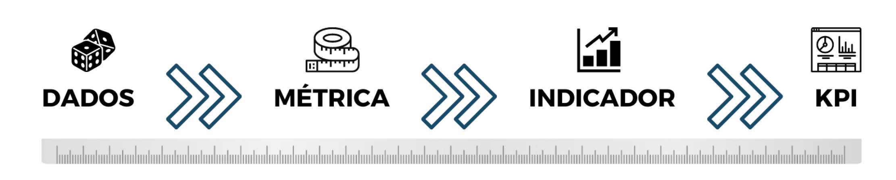
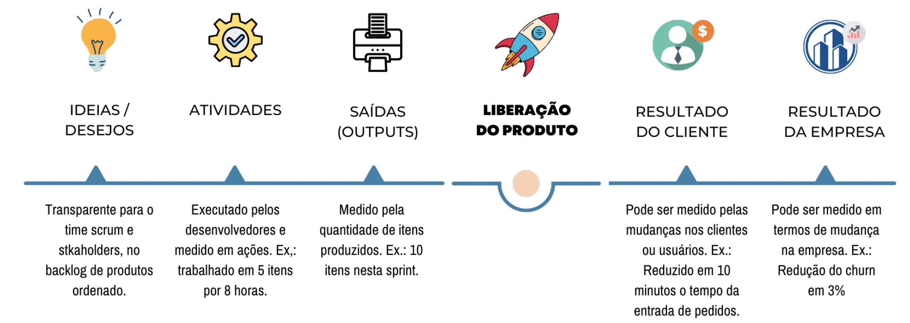
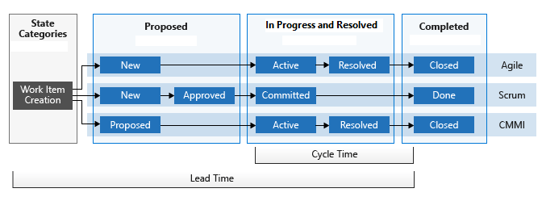

São indicadores quantitativos utilizados para medir o desempenho, produtividade e o progresso de um projeto de software. Características que reforçam a importância das métricas :

* Antes que perguntem: 
    * As métricas servem só para avaliar as pessoas? NÃO, não é uma boa escolha.
    * Para que eu quero saber a produtividade individual de cada integrante da squad se não for para fazer alguma:
        * Premiação;
        * Punição;
        * Tempo de trabalho.
* As métricas proporcionam uma percepção clara e transparente sobre os projetos.
* O TIME pode ter uma abordagem mais fundamentada e assertiva.
* O TIME identifica problemas e gargalos no processo de desenvolvimento.
* As métricas permitem a implementação de ações corretivas.

Por fim,a importancia de medir é a de se ter uma visão objetiva do progresso e desempenho do projeto, permitindo tomar decisões embasadas, identificar áreas de melhoria e obter transparência.

{width="900" height="600" style="display: block; margin: 0 auto"}

## Métricas e Frameworks ou Metodologias

| Modelo | Entenda |
| -----  | ------- |
| Lean   | Concentram em minimizar o desperdício e enviar continuamente software de qualidade para seus usuários. Alguns exemplos incluem tempo de entrega e tempo de ciclo. |
| Kanban | Concentram em seu fluxo de trabalho, priorizando tarefas e realizando o trabalho. Um exemplo seria o fluxo cumulativo. |
| Scrum  | Concentram na produtividade, consistência e previsibilidade da equipe. Alguns exemplos incluem gráficos de burndown e velocidade. |

### Métricas técnicas
São um tipo de métrica muito utilizada, como no Kanban e no Scrum, para avaliar aspectos técnicos e de qualidade do software em desenvolvimento.

* Cobertura de testes
* Complexidade de código
* Taxa de defeitos
* Tempo de resposta

## Métricas de Negócio
São um tipo de métrica  para medir a eficácia do que entregamos, ou seja, focamos mais em analisar a quantidade do que foi entregue, em vez da qualidade.

* Ticket médio
* Número de pessoas usuárias
* Índice de satisfação

## Métricas Organizacionais
São um tipo de métrica para observar o desempenho, o progresso e o impacto das práticas ágeis em nível organizacional.

* Squad Health Check ou checagem de saúde da equipe.
* Nível de motivação

## Métricas de Processo
 São um tipo de métrica para avaliar a eficiência, a eficácia e o desempenho de um processo organizacional, fornecendo informações sobre qualidade, produtividade e conformidade.

* Lead Time(Tempo total decorrido desde o início até a conclusão de um determinado processo) e Cycle Time (Tempo médio necessário para concluir uma única tarefa)
* Taxa de retrabalho;
* Nível de conformidade;

## Gráficos

| Modelo           | Entenda |
| -----            | ------- |
| Gráfico Burndown | Mostra a quantidade de trabalho que foi concluída em um sprint time-boxed e quanto trabalho resta. A quantidade de trabalho (ou esforço) restante é representada pela linha denominada "real", enquanto o tempo é exibido no eixo horizontal. A linha "ideal" representa o fechamento ideal das saídas dentro do prazo escolhido e leva em consideração seus dias de folga. |
| Gráfico Burnup   | Semelhante a um gráfico de burndown, pois rastreia visualmente o progresso de sua equipe durante um sprint ou epic. um gráfico de burnup difere na medida em que apresenta duas linhas que representam seu trabalho total criado (ou escopo) ao lado de seu progresso. |
| Fluxo cumulativo | Mostra como os problemas e as tarefas 'fluem' por diferentes estados – de novo a fechado. O eixo vertical exibe o número de questões, enquanto o eixo horizontal mostra o tempo. Cada banda de cor representa uma pista em seu tabuleiro, enquanto a largura da banda representa o número de cartas nessa pista. |
| Gráfico de velocidade | Aumento constante da carga de trabalho que está sendo tratada. Exibe a quantidade média de trabalho que sua equipe está concluindo durante um sprint ou iteração. |
| Gráfico de lead time | Mostrar uma grande melhoria na redução da quantidade de dias em que um problema é deixado em aberto. Quanto tempo leva para um problema ir de aberto a fechado. |

### Cumulative Flow Diagram  (CDF) 
É um dos gráficos que nos dá uma visão geral do que está acontecendo em um projeto ou nas atividades de um produto.
O eixo horizontal representa um período e o vertical indica a contagem cumulativa de itens no processo. Cada área pintada no gráfico está relacionada a uma etapa do fluxo de trabalho (por exemplo, a fazer, em andamento, concluído). 

| Item                         | Descrição                                                                                            |
| ------------                 | ----------                                                                                           |
| Backlog(New)                 | Histórias de usuários que precisam ser refinadas.                                                    |
| Ready to Dev(Approved)       | Histórias de usuários com critérios de aceitação definidos e com uma definição explícita de pronto.  |
| Em desenvolvimento(Commited) | Histórias de usuários em desenvolvimento.                                                            |
| Teste(Commited)              | Histórias de usuários na validação de controle de qualidade.                                         |
| Aceito (Done)                | Histórias de usuários lançadas em produção.                                                          |

# Método Kanban e Widgets
O lead time é calculado desde a criação do item de trabalho até a entrada em um estado Aceito. O tempo de ciclo é calculado desde a primeira entrada em um estado Em andamento até a entrada em um estado Concluído, conforme visualizado abaixo:
{width="800" height="500" style="display: block; margin: 0 auto"}

Na página Configuração , você pode selecionar a equipe, o nível do backlog e o período de tempo. Você também tem a opção de filtrar ainda mais o backlog usando critérios de campo.

# Simulações de Monte Carlo para Gerenciar Projetos
H. James Harrington: "A medição é o primeiro passo que leva ao controle e, eventualmente, à melhoria. Se você não pode medir algo, você não pode entendê-lo. Se você não pode obtê-lo, você não pode controlá-lo. Se você não pode controlá-lo, não pode melhorá-lo."
## Modelo de Monte Carlo ou Método de Monte Carlo (MMC) 
É uma metodologia estatística que se baseia em uma grande quantidade de amostragens aleatórias para se chegar em resultados próximos de resultados reais. 
### Como fazer uma Simulação
Quando deparamos com situações de algum nível de incerteza e quiser utilizar a simulação de Monte Carlo terá que passar por 4 passos:
* Passo 1 – Modelar o problema;
* Passo 2 – Gerar valores aleatórios para as incertezas do problema (Planning Poker);
* Passo 3 – Substituir as incertezas por valores para calcular o resultado;
* Passo 4 – Obter uma estimativa para a solução do problema;

# Métricas de desempenho de entrega de software (Baseadas 2022 ACCELERATE - Relatório State of DevOps)
## Desempenho da entrega de software 
As quatro métricas principais do desempenho da entrega de software, que são frequência de implantação, tempo de lead para alterações, taxa de falha nas alterações e tempo de restauração do serviço.
## Desempenho operacional
A quinta métrica principal, que é a confiabilidade.
## Desempenho da organização
Se aorganização consegue cumprir as metas de desempenho e de lucratividade.

| Métrica de desempenho na entrega de software | Baixo                                             | Médio                                      | Alto                                               |
| -------------------------------------------- | -----                                             | -----                                      | -----                                              |
| Frequência de implantação                    | Entre uma vez por mês e uma vez a cada seis meses | Entre uma vez por semana e uma vez por mês | Sob demanda (várias implantações por dia)          |
| No caso de aplicativos ou serviços principais em que você trabalha, com que frequência sua organização implanta códigos na produção ou os libera para usuários finais?                             |
| Tempo de lead para alterações                | Entre um mês e seis meses                         | Entre uma semana e um mês                  | Entre um dia e uma semana                          |
| No caso de aplicativos ou serviços principais em que você trabalha, qual é o tempo de lead para alterações (ou seja, quanto tempo leva para ir da confirmação do código à execução do código na produção)? |
| Tempo de restauração do serviço              | Entre uma semana e um mês                         | Entre um dia e uma semana                  | Menos de um dia                                    |
| No caso de aplicativos ou serviços principais em que você trabalha, quanto tempo geralmente leva para restaurar o serviço quando ocorre um incidente ou um defeito que afeta os usuários (por exemplo, interrupção não planejada ou deficiência do serviço)? |
| Taxa de falha nas alterações                 | 46% a 60%                                         | 16% a 30%                                  | 0% a 15%          |
| No caso de aplicativos ou serviços principais em que você trabalha, qual porcentagem de alterações na produção ou liberadas para os usuários resulta em queda no serviço (por exemplo, leva à deficiência ou interrupção do serviço) e, posteriormente, exige remediação (por exemplo, exige um hotfix, reversão, correção de encaminhamento, patch)? |

# State of DevOps Report
As organizações de alta confiança incentivam um bom fluxo de informações, colaboração interfuncional, responsabilidades compartilhadas, aprendizado com falhas e novas ideias;
A satisfação no trabalho é aquele que diz antes, que prediz no nº 1 do desempenho organizacional. Um trabalho desafiador e significativo e de ter o poder de exercitar nossas habilidades e julgamento. 
Também sabemos que onde há satisfação no trabalho, os funcionários trazem o melhor de si para o trabalho: seu engajamento, sua criatividade e seu pensamento mais forte. 
Isso contribui para mais inovação em qualquer área do negócio, incluindo TI.

| Ano  | Empresas                                           | Respostas | N Países | Resultado |
| ---- | ----------                                         | ------:   | ------:  | -----                 |
| 2014 | Puppet Labs, IT Revolution Press and ThoughtWorks  | 9.200     |     110  | Implantando código 30 vezes mais frequentemente com 50% menos falhas. |
| 2015 |                                                    |           |          |                                                                       |
| 2016 |                                                    |           |          |                                                                       |
| 2017 |                                                    |           |          |                                                                       |
| 2018 |                                                    |           |          |                                                                       |
| 2019 |                                                    |           |          |                                                                       |

### Métricas Desenvolvimento
| Grupo                                 | Métrica                             | Definição |
| -----                                 | -------                             | ---------  |
| Git/PR/MR                             | TEMPO DE CODIFICAÇÃO                | O tempo decorrido entre o primeiro commit e o tempo de abertura para Pull Requests. O alto tempo de codificação é um grande risco para o alto tempo de ciclo. Os desenvolvedores devem dividir grandes recursos em pequenos pedaços e manter o tempo de codificação curto para cada PR. |
|                                       | TEMPO DE REVISÃO                    | O tempo decorrido entre o tempo de abertura e o tempo de mesclagem para Pull Requests. O alto tempo de revisão é um bloqueador para as equipes de desenvolvimento. Não deixe que seu código fique obsoleto.                                                                             |
|                                       | RISCOS DO PR/MR                     | Identifica as solicitações pull obsoletas, vencidas e superdimensionadas. NÃO deixe de efetuar a quebra de tarefas.                                                                                                                                                                     |
|                                       | TAMANHO DO PR/MR                    | Tamanho total (linhas adicionadas, removidas e alteradas) de solicitações pull. Os revisores geralmente não se aprofundam no código se o tamanho da solicitação pull for muito alto.                                                                                                    |
|                                       | PR/MR NÃO REVISADOS                 | Identifica relâmpagos e solicitações pull autorrevisadas. Isso ajuda a evitar possíveis bugs e erros acidentais.                                                                                                                                                                        |
|                                       | RETRABALHO                          | Código que foi reescrito/excluído em pouco tempo pelo mesmo colaborador. (Possíveis problemas de qualidade)                                                                                                                                                                 |
|                                       | ALTA REFATORACAO                    | Grande quantidade de edições e atualizações feitas no código. (Possíveis problemas de qualidade)                                                                                                                                                                     |
|ANÁLISE DE IMPLANTAÇÃO E MÉTRICAS DORA | TEMPO PARA MUDANÇAS                 | A quantidade de tempo que um commit leva para entrar em produção. (Métricas DORA) |
|                                       | FREQUÊNCIA DE IMPLANTAÇÃO           | Com que frequência sua equipe libera com sucesso para produção. (Métricas DORA).  |
|                                       | TAXA DE FALHA DE MUDANÇA            | A porcentagem de implantações que causam uma falha na produção. (Métricas DORA) |
|                                       | HORA DE RESTAURAR O SERVIÇO         | Quanto tempo leva para uma organização se recuperar de uma falha na produção. (Métricas DORA) |
|                                       | AGUARDANDO IMPLANTAÇÃO              | O tempo decorrido entre o PR mesclado e o pipeline de implantação iniciado. |
|                                       | TEMPO DE IMPLANTAÇÃO                | O tempo decorrido entre o pipeline de implantação acionado e concluído com êxito.  |
| ANÁLISE E MÉTRICAS ÁGIL               | PRECISÃO DE PLANEJAMENTO            | A porcentagem de sucesso da estimativa do SPRINT. Os problemas adicionados após o início do sprint (trabalho urgente ou paralelo) afetam a precisão do planejamento e o foco prioritário de maneira negativa. |
|                                       | TEMPO DE REAÇÃO                     | O tempo de reação é a medida de quanto tempo uma tarefa permanece nos estados **'não iniciada'** (to do, backlog etc.). |
|                                       | CYCLE TIME                          | O tempo de ciclo é a medição de quanto tempo passa entre o trabalho iniciado em um item (WIT curta) até que esteja pronto para entrega. (Trabalho iniciado - em andamento - para trabalho concluído.) |
|                                       | LEAD TIME.                          | Lead time é a medida de quanto tempo passa entre a criação da tarefa e quando o trabalho é concluído. (Tarefa criada para trabalho concluído.) |

### Desempenho de Desenvolvimento
| Métrica de desempenho na entrega de software | Baixo                                             | Médio                                      | Alto                                               |
| -------------------------------------------- | -----                                             | -----                                      | -----                                              |
| Frequência de implantação                    | Entre uma vez por mês e uma vez a cada seis meses | Entre uma vez por semana e uma vez por mês | Sob demanda (várias implantações por dia)          |
| No caso de aplicativos ou serviços principais em que você trabalha, com que frequência sua organização implanta códigos na produção ou os libera para usuários finais?                             |
| Tempo de lead para alterações                | Entre um mês e seis meses                         | Entre uma semana e um mês                  | Entre um dia e uma semana                          |
| No caso de aplicativos ou serviços principais em que você trabalha, qual é o tempo de lead para alterações (ou seja, quanto tempo leva para ir da confirmação do código à execução do código na produção)? |
| Tempo de restauração do serviço              | Entre uma semana e um mês                         | Entre um dia e uma semana                  | Menos de um dia                                    |
| No caso de aplicativos ou serviços principais em que você trabalha, quanto tempo geralmente leva para restaurar o serviço quando ocorre um incidente ou um defeito que afeta os usuários (por exemplo, interrupção não planejada ou deficiência do serviço)? |
| Taxa de falha nas alterações                 | 46% a 60%                                         | 16% a 30%                                  | 0% a 15%          |
| No caso de aplicativos ou serviços principais em que você trabalha, qual porcentagem de alterações na produção ou liberadas para os usuários resulta em queda no serviço (por exemplo, leva à deficiência ou interrupção do serviço) e, posteriormente, exige remediação (por exemplo, exige um hotfix, reversão, correção de encaminhamento, patch)? |

## Métricas DORA (DevOps Research and Assessment (DORA) metrics)
O gerenciamento do fluxo de valor fornece a visibilidade ponta a ponta de todo o ciclo de vida de entrega de software, permitindo que equipes e gerentes entendam todos os aspectos de produtividade, qualidade e entrega.
### Frequência de implantação
A frequência de implantação é medida pelo número médio de implantações por dia em um determinado ambiente, com base no horário de término da implantação. Quantidade de implementações em um período de tempo previamente determinado.

A primeira etapa é avaliar a cadência de lançamentos de código entre grupos e projetos. A seguir, você deve considerar:

* Adicionando testes automatizados.
* Adicionando validação automatizada de código.
* Dividindo as alterações em iterações menores.

### Tempo para implantações (Lead Time for Changes)
Mede o tempo que a equipe demora para fazer o código sair do status de “commited” para "executado com sucesso”, ou seja, analisa o tempo médio de desenvolvimento e implantação de um software.
### Taxa de falhas nas implantações (change failure rate)
Basta dividir a quantidade de defeitos identificados pelo número de implantações do período avaliado.
### Tempo para restaurar o serviço (time to restore service)
Mede o tempo médio para que a funcionalidade de um sistema ou aplicativo seja reparada ou restaurada

Todos nos comprometermos a eliminar um pouco de trabalho a cada semana com alguma boa engenharia, limparemos nossos serviços de forma constante e poderemos direcionar nossos esforços coletivos para a engenharia em escala, arquitetando a próxima geração de serviços.

## Desafios na adoção das métricas
O acompanhamento das DORA Metrics é essencial para aprimorar o trabalho da equipe de DevOps, mas existem alguns desafios que podem dificultar a sua adoção.
### Informações dispersas
Nossa empresa em grande porte, têm diversas fontes de dados (svn,gitlab,azure-devops,bitbucket), o que dificulta o levantamento de todas as informações pertinentes para o cálculo das métricas.
### Agile x DevOps: Os Benefícios

| Destaque                               | Entenda |
| -------                                | ------- |
| Ciclos de entrega de valor mais curtos | A empresa DEVE estabelecer um processo de criação e entrega de produto com mais rapidez e eficiência. |
| Cultura de colaboração entre negócios e tecnologia | Reagrupa as equipes em torno de Value Streams.                                            |
| Fomento a uma cultura de inovação      | Minimum Viable Product (MVP) é a construção da versão mais simples e enxuta de um produto, empregando o mínimo possível de recursos para entregar a sua principal proposta de valor. |

#### Produto Mínimo Viável

* Defina as hipóteses e valor do produto
* Encontre as funcionalidades essenciais
* Defina os indicadores de desempenho
