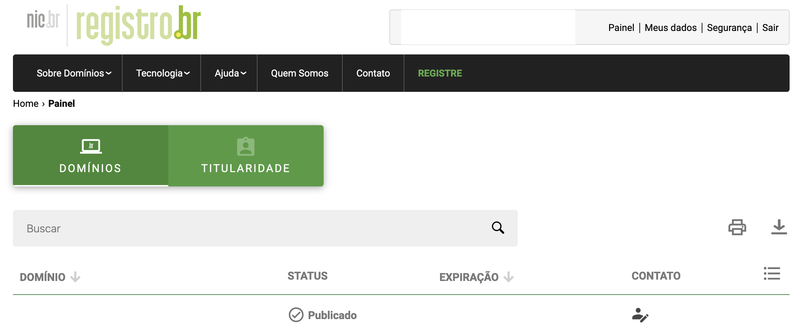
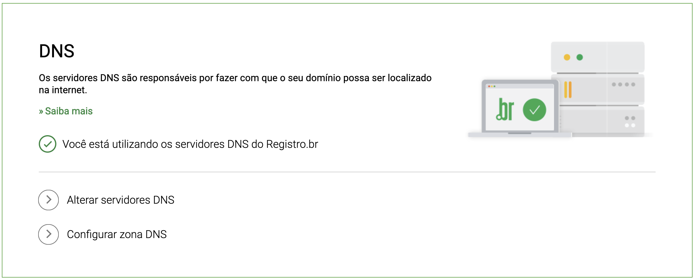
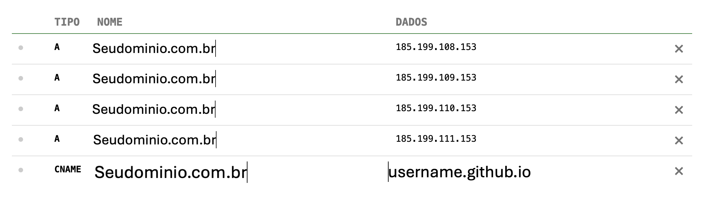

Para registrar um domínio no Registro.br, siga os passos abaixo:

- [x] Acesse o site do [Registro.br](https://registro.br/).
- [x] Pesquise o domínio: Utilize a barra de busca na página inicial para verificar se o domínio desejado está disponível. Digite o nome que você quer e clique em "Pesquisar".
- [x] Escolha o domínio: Se o domínio estiver disponível, você verá opções para prosseguir com o registro.
- [x] Se não estiver, tente uma variação ou outro nome.
- [x] Inicie o registro: Clique no botão para registrar o domínio desejado.
- [x] Crie uma conta ou faça login: Se você já tem uma conta, faça login. Caso contrário, será necessário criar uma nova conta informando seus dados pessoais, como CPF ou CNPJ, e e-mail.
- [x] Preencha as informações do domínio: Forneça os dados solicitados, como informações de contato (quem é o proprietário, dados de cobrança, etc.).
- [x] Escolha o período de registro: Selecione por quanto tempo deseja registrar o domínio (geralmente de 1 a 5 anos).
- [x] Revise os dados: Verifique se todas as informações estão corretas antes de prosseguir.
- [x] Efetue o pagamento: Escolha a forma de pagamento e finalize a transação. O Registro.br aceita várias formas de pagamento, como cartão de crédito e boleto bancário.
- [x] Confirmação: Após o pagamento, você receberá um e-mail de confirmação. O domínio será ativado após a  confirmação do pagamento.
- [x] Gerencie seu domínio: Depois que o domínio estiver registrado, você pode acessá-lo através da sua conta no Registro.br para gerenciar configurações, como DNS, dados de contato, etc.
{width="600" height="300" style="display: block; margin: 0 auto"}
- [x] Efetue a seguinte configuração:
{width="600" height="300" style="display: block; margin: 0 auto"}
- [x] Acesse sua conta no Registro.br. Vá até "Meus Domínios" e selecione o domínio que você deseja usar.
- [x] Clique em "Editar Zona" ou  **CONFIGURAR ZONA DNS**.
      - [x] Caso você esteja utilizando o **MODO BÁSICO**, efetue a alteração para o **MODO AVANÇADO**. Em alguns casos, esta mudança poderá demorar um pouco.
- [x] Ajuste a configuração conforme a imagem abaixo.
{width="600" height="300" style="display: block; margin: 0 auto"}
- [x] Aguarde a propagação DNS: Após fazer as alterações, pode levar algumas horas para que as configurações de DNS se propaguem. Você pode usar ferramentas como "Whatsmydns.net" para verificar se o domínio já está apontando corretamente.