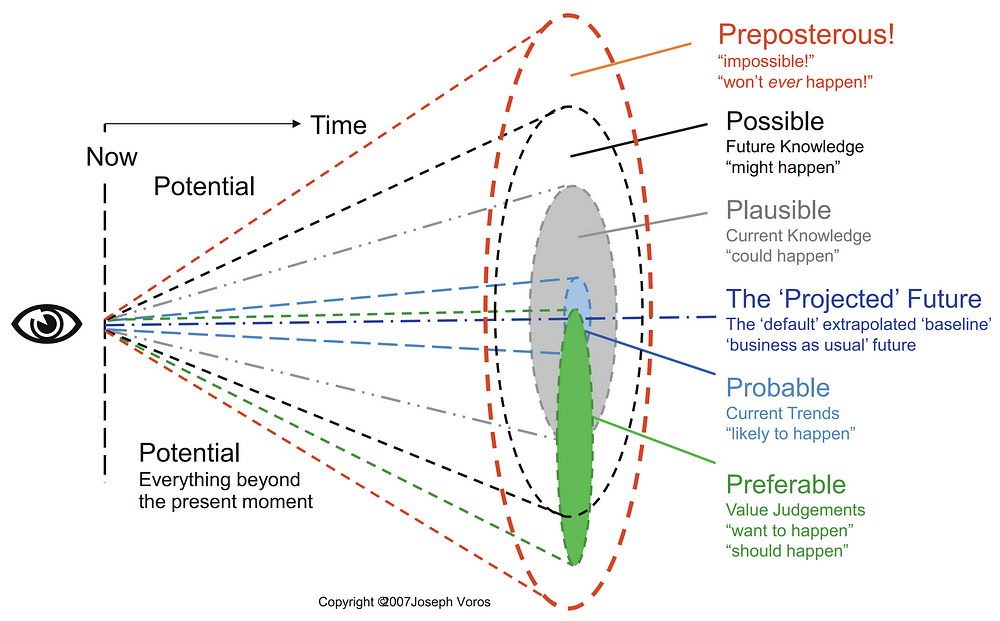
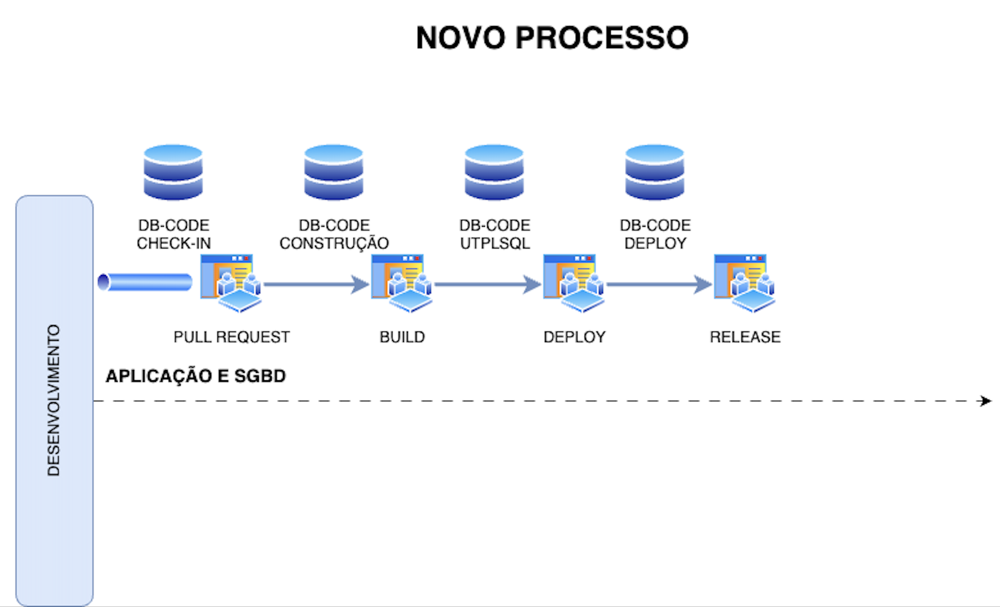
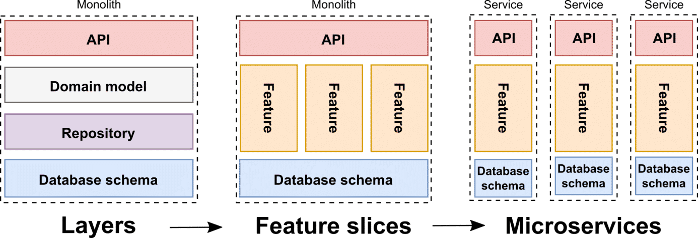
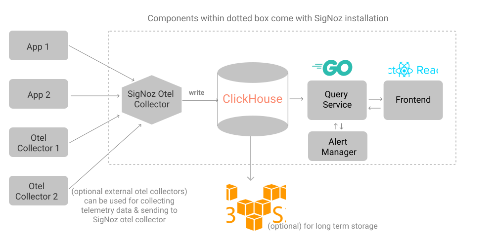
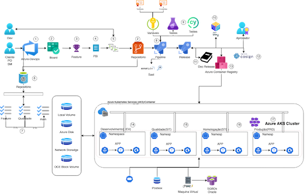

{width="400" height="300" style="display: block; margin: 0 auto"}

Ao receber uma demanda necessitamos estabelecer, um critérios objetivos como devemos atende-la, para tal cito alguns questionamentos básicos.

- [x] A demanda tem um objetivo claro e definido que busca entregar uma funcionalidade nova ou uma mudança significativa?
- [x] A demanda possui um escopo bem delimitado, com entregas e prazos específicos?
- [x] A demanda impacta o produto existente de forma que altera sua funcionalidade ou seu valor percebido pelos usuários?
- [x] A implementação da demanda requer recursos e esforços significativos (equipe, tempo, orçamento)?
- [x] A demanda é única e não deve se repetir no futuro, ou faz parte de uma série de melhorias planejadas?
- [x] O produto já existente, porem novas funcionalidades deverão ser abarcadas e/ou modificadas em função de pequenas alterações.

Com os critérios acima respondidos, então podemos classificar esta demanda como **Melhoria Contínua/Bug** ou um **Novo Produto**. 

Em ambos os casos seguimos o conceito do PMBOK, que define um projeto como um esforço temporário empreendido para criar um produto, serviço ou resultado único, enfatizando sua natureza temporária e sua unicidade.

Então, sendo o foco de entregar um resultado específico, que pode ou não se tornar um produto e tendo seus objetivos alcançados ou quando cancelado, designaremos como: Bug ou Melhoria Contínua. 

Logo, um produto é uma solução que é desenvolvida para atender às necessidades dos usuários de forma contínua, geralmente tem um roadmap e uma visão de longo prazo.

## **Gestão e Liderança**
Pontos interessantes a serem discutidos no "projeto". 

- [x] Pare de Focar em Resultados, resultados são consequencias de Processos + Pessoas, sendo o que otimiza Processos e Pessoas de fato é a **Gestão e Liderança**.
- [x] Não se foca na consequencia, se foca na CAUSA da consequencia, que é a **otimização de processos e otimização de pessoas**.
- [x] Confiança se constroi com **diálogo** e **atitude**. 
- [x] Gestores NÃO são acostumados a lidar com pessoas:
      - [x] 100% dos clientes são pessoas..
      - [x] 100% dos funcionários são pessoas..
      - [x] Logo, entender de pessoas é entender de negócio..
      - [x] Promovemos gestores por: Comportamento e conhecimento específicos, Inteligencia Exata, Extroversão, Não ter vergonha ir a público, Raciocínio Dinamico, ou seja, performance não atrelado ao cuidado. 
- [x] Transformando pessoas, em uma máquina de lucros:
      - [x] Pessoas **NÃO são despesas** e sim o **maior ativo** de uma empresa, desde que bem GESTIONADA;
      - [x] Não procure: **Convencer, Concordancia e Consenso**. Não sendo falta de ética, não sendo CRIME, vamos abandonar as três coisas e estabelecer uma quarta: **COMPROMISSO**.
      - [x] Como é que fazemos o PROJETO ser FUNCIONAL? Se é aqui que queremos estar, se é aqui que EU, quero estar, se a gente faz AQUI, ACONTECER, temos que deixar de pedir ao TRABALHO, o que não NÃO dará e focar no **RESULTADO/COMPROMISSO**.
- [x] O que preciso fazer para melhorar a liderança?
      - [ ] Quanto tempo você irá esperar para algo melhorar? Qual o prazo? O que precisa acontecer, para você sentir que mudou? O que te leva a crer, por histórico, que isso irá mudar?
      - [ ] Lista de Comportamento Concreto e observável.
      - [ ] Quando vc não sabe reconhecer quando chega ou quando falta.
      - [ ] Não temos como localizar um **CULPADO**, nós inventamos uma estrutura, que é difícil mudar a direção de forma SIMPLES. 
      - [ ] Novos anseios, mentalidade, novas visões que talvez faça sentido para a gente, pode NÃO fazer sentido para outros.
      - [ ] Infelizmente não temos respostas prontas..mas cabe a gente tomar uma decisão.
      - [ ] Hoje, seguro mais os meus anseios, mentalidade e novas visões,  que talvez faça sentido para mim, mas pode NÃO fazer sentido para outros.

## **Calendários dos Projetos(Sugestão)**
|                         | Seg  | Ter  | Qua  | Qui  | Sex  | Sab  | Dom  | Seg  | Ter  | Qua  | Qui  |  Sex |
|---------------------    |-----:|-----:|-----:|-----:|-----:|-----:|-----:|-----:|-----:|-----:|-----:|-----:|
| Treinamento             | 30   |  30  |  30  |  30  |  30  |   -  |   -  |  30  |  30  | 30   |  30  |   30 |
| Refinamento do Backlog* |      | 60   |      |      |      |      |      |      | 60   |      |      |      |
| Planejamento da Sprint  | 120  |      |      |      |      |      |      | 120  |      |      |      |      |
| Daily Scrum             | 15   | 15   | 15   | 15   | 15   | -    | -    | 15   | 15   | 15   | 15   | 15   |
| Revisão da Sprint       |      |      |      |      |      |      |      |      |      |      |      | 120  |
| Retrospectiva da Sprint |      |      |      |      |      |      |      |      |      |      |      | 90   |

## Criamos o conceito: Ilusão da Previsibilidade
- [x] AVT (Análise de Viabilidade Técnica);
- [x] AVE (Análise de Viabilidade Econômica);
- [x] AVF (Análise de Viabilidade Financeira);
- [x] **NÃO sabemos, mas temos que ESTIMAR, ou melhor, dar o PRAZO ou META e depois a cobrança você se COMPROMETEU a este PRAZO.**

[](https://mermaid.live/edit#pako:eNotjMsKgzAQRX8lzErBL8i2dlmUPnbZDGZsA05GkkmhFf-9it0dzj3cBQbxBBY4RM84u2hMEtGq6q9d-7h3db0rY07CcxIOOcshLqR4UJ_w-5fnrIFRwxuhAabEGPx2vuyrA30RkwO7oacRy6QOXFy3FIvK7RMHsJoKNVBmj0ptwGdCBjvilGn9Abc8ONY){width="450" height="300" style="display: block; margin: 0 auto"}

<p align="justify">Quando faz uma estimativa esta trabalhando com certo nível de incerteza, como:</p>

- [x] Experiência do time, 
- [x] Diversidade de níveis dos envolvidos na execução da atividade, 
- [x] Baixo nível de detalhamento do que será feito entre outros fatores provenientes da atividade.

## Quais os fatores

- [x] O fator principal de uma estimativa é ajudar a tomar uma decisão. 
- [x] O melhor jeito de fazer estimativas é pensar em intervalos e não cravar. 
- [x] É muito difícil acertar se os valores e respostas forem precisos. 
- [x] Um outro componente da estimativa é o nível de confiança, ele diz sobre a certeza de acerto da estimativa.
- [x] Quanto maior o intervalo, maior a confiança que a estimativa tem, pela sua margem de confiança. 
- [x] A estimativa (é um cálculo que é feito a partir da avaliação **estatística**, geralmente realizado em uma **amostra** e não em todo o conjunto) de tamanho é composta por 3 componentes:

| Dica        | Entenda            |
| ---------   | --------------     |
| Esforço     | Tarefas que necessitam de mais trabalho; É uma estimativas do trabalho e do esforço necessário desde o início da execução até a entrega;  |
| Complexidade| Tarefas que possuem muitas possibilidades;                                                                                                |
| Incerteza   | Quando a tarefa possui vários caminhos duvidosos.                                                                                         |

- [x]  Medida é um item de dado bruto que é medido diretamente, e que será utilizado para calcular uma métrica;
- [x]  Métrica é uma interpretação de uma medida que você utiliza para orientar o seu projeto.

## Estimativas
<p align="justify">Então se tem uma discrepância ali, uma diferença muito grande de opinião, as pessoas param e discutem: "espera lá, então é provável que o seu entendimento sobre essa funcionalidade tenha sido diferente do meu, vamos conversar".</p>

No meu caso para: **MELHORAR, ESTIMAR e PARA ENGENHEIRAR**.

## Estimativas (Esforço)
__PRODUTOS NÃO SE ATRASAM. Eles levam o tempo que for necessário para serem concluídos. Nosso trabalho é definir o que está “feito” e revisar as estimativas com frequência.__
{width="450" height="300" style="display: block; margin: 0 auto"}

- [x] A estimativa é uma suposição com conhecimento parcial, mas somos tendenciosos a ver o que está lá e não o que está faltando.
- [x] Fazemos estimativas com base nas informações que nos são disponibilizadas e ainda querem que acertemos.
- [x] O fator principal de uma estimativa é ajudar a tomar uma decisão.
- [x] O melhor jeito de fazer estimativas é pensar em intervalos. 
- [x] Baseia-se nas melhores informações disponíveis no momento.
- [x] É um intervalo (ou distribuição de probabilidade), não um número. Se sua estimativa for um número, é uma meta.
- [x] É muito difícil acertar se os valores e respostas forem precisos. Um outro componente da estimativa é o nível de confiança, ele diz sobre a certeza de acerto da estimativa.

| Definição    | Entenda                                           |
| ------       | ------------                                      |
| Esforço      | Tarefas que necessitam de mais trabalho;          |
| Complexidade | Tarefas que possuem muitas possibilidades;        |
| Incerteza    | Quando a tarefa possui vários caminhos duvidosos. |

Então, usaremos o **ESFORÇO**, __contrariando__ o **FRAMEWORK SCRUM** (não são convertidas em horas, servindo somente para medir o esforço de cada história do usuário, já estimando suas tarefas técnicas), nossas estimativas serão realizadas em **HORAS**. 

### Estimativa em função do T-Shirt Sizing (Unidade Horas)
- [x] No início do projeto, quando começamos a usar story points, a subjetividade **é** muito alta.
- [x] Com a inclusão de mais critérios de pontuação,tais como:       
       - [x]  Complexidade do Teste;
       - [x]  Dependência de pessoas que não fazem parte da equipe (internas ou externas);
       - [x]  Riscos relacionados aos PBIs;
- [x] Diminuímos a variabilidade do lead time e aumentamos a taxa de entrega dos cartões dividindo o cartão em outros menores.
- [x] Fazer o time pensar não só no desenvolvimento, mas também na duração do processo como um todo (**considerando as etapas de revisão de código, testes, deploy, etc**) e convidar mais pessoas para compartilhar suas preocupações sobre as ESTIMATIVAS, ajuda a melhorar a previsibilidade do time.
- [x] Métodos de ESTIMATIVAS consideram apenas o momento em que uma demanda está sendo trabalhada, e não consideram/não podem prever o tempo que uma demanda ficará esperando para ser trabalhada.
- [x] Pensando o quanto é difíficil estimar em PRODUTOS NOVOS, onde o grau da INCERTEZA é muito alto e o medo á GRANDE, elaboramos um QUADRO, para que possamos "ESTIMAR" em um primeiro momento com a EXPERIÊNCIA em PRODUTOS ANTERIORES nos MOTS.

| **Compare**                                                                                   | PP          | P     | M       | G       | GG        |
| :------------------                                                                           | :------:    |:-----:| :-----: | :-----: | :-------: |
| Preparação do Ambiente                                                                        |             |       | 72    |      |
| Compare - Analise                                                                             |             |       | 24    |      |            |
| Total de Horas                                                                                |             |       |       |      |            |
|                                                                                               |             |       |       |      |            |
| **Planejamento e criação de software**                                                        |  PP         |  P    |   M   | G    |  GG        |
| Entender o desafio/propor a melhor estratégia (Tema)                                          | 3           | 8     | 16    | 24   | 32         |
| Planejar: Analista de Negócios,Designer UX/UI e um Arquiteto de Software (Desing/Arquitetura) |             |       |       | 24   | 32         |
| Total de Horas                                                                                |             |       |       |      |            |
|                                                                                               |             |       |       |      |            |
| **Relatórios/Serviços REST Get**                                                              |  PP         |  P    |   M   | G    |  GG        |
| Estimativa Técnica (Especificaçao Técnica, Codificaçao, Testes, entraga e documentaçao)       | 16          | 40    | 80    | 120  | 160        |
| Estimativas Funcionais (Especificaçao Funcional, Testes e Aceite do usuário)                  | 40          | 50    | 80    | 130  | 190        |
| Total de Horas                                                                                | 56          | 90    | 160   | 250  | 350        |
|                                                                                               |             |       |       |      |            |
| **Interfaces**                                                                                |  PP         |  P    |   M   | G    |  GG        |
| Estimativa Técnica (Especificaçao Técnica, Codificaçao, Testes, Entrega e Documentaçao)       | 24          | 40    | 80    | 160  | 200        |
| Estimativas Funcionais (Especificaçao Funcional, Testes e Aceite do usuário)                  | 40          | 50    | 80    | 130  | 190        |
| Total de Horas                                                                                | 64          | 90    | 160   | 290  | 390        |
|                                                                                               |             |       |       |      |            |
| **Conversões**                                                                                |  PP         |  P    |   M   | G    |  GG        |
| Estimativa Técnica (Especificaçao Técnica, Codificaçao, Testes, entraga e documentaçao)       | 24          | 40    | 80    | 160  | 200        |
| Estimativas Funcionais (Especificaçao Funcional, Testes e Aceito do usuário)                  | 40          | 50    | 80    | 130  | 190        |
| Total de Horas                                                                                | 64          | 90    | 160   | 290  | 390        |
|                                                                                               |             |       |       |      |            |
| **Melhorias / Novas Funcionalidades**                                                         |  PP         |  P    |   M   | G    |  GG        |
| Estimativa Técnica (Especificaçao Técnica, Codificaçao, Testes, entraga e documentaçao)       | 16          | 40    | 80    | 120  | 160        |
| Estimativas Funcionais (Especificaçao Funcional, Testes e Aceito do usuário)                  | 40          | 50    | 80    | 130  | 190        |
| Total de Horas                                                                                | 56          | 90    | 160   | 250  | 350        |
|                                                                                               |             |       |       |      |            |
| **Workflow**                                                                                  |  PP         |  P    |   M   | G    |  GG        |
| Estimativa Técnica (Especificaçao Técnica, Codificaçao, Testes, entraga e documentaçao)       | 24          | 40    | 80    | 120  | 160        |
| Estimativas Funcionais (Especificaçao Funcional, Testes e Aceito do usuário)                  | 40          | 50    | 80    | 130  | 190        |
| Total de Horas                                                                                | 64          | 90    | 160   | 250  | 350        |
|                                                                                               |             |       |       |      |            |
| **Queries**                                                                                   |  PP         |  P    |   M   | G    |  GG        |
| Estimativa Técnica (Especificaçao Técnica, Codificaçao, Testes, entraga e documentaçao)       | 8           | 16    | 24    | 40   | 80         |
| Estimativas Funcionais (Especificaçao Funcional, Testes e Aceito do usuário)                  | 10          | 15    | 20    | 30   | 40         |
| Total de Horas                                                                                | 18          | 31    | 44    | 70   | 120        |

## Metodologia de Sprint de Design
A metodologia Design Sprint é um processo de cinco dias para testar ideias e resolver problemas complexos. O princípio por trás disso é simples: começar é mais importante do que estar certo.

Design Sprint Kit é um recurso de código aberto para líderes de design, proprietários de produtos, desenvolvedores ou qualquer pessoa que esteja aprendendo ou executando Design Sprints. 

{width="450" height="300" style="display: block; margin: 0 auto"}

### Planejar um Design Sprint

| N. | Passo                                       | Entenda                                        |
| ---- | ----                                      | ----                                                                  |                 
|  1  | Entenda o desafio que você precisa resolver | Familiarize-se com o problema,pesquisa o tema.                        |   
|  2  | Objetivo claro | Cada workshop bem sucedido começa com um objetivo final claramente definido.                       |
|    |                | “Por que estamos fazendo isso? O que queremos alcançar? Onde esperamos estar daqui a seis meses?”  |
|  3  | Recrute sua equipe de sonho           | Decisor(Gerente de Produto), Partes interessadas e Especialistas.           |
|  4  | Escreva o seu resumo de Design Sprint | Documento que você compartilhará com sua equipe da Sprint com antecedência para prepará-los para a próxima sessão.  |
|  5  | Prepare a sala e reúna os materiais necessários | Post-it , Papel branco A4 e etc. |

- [x] Compreender: Crie uma base de conhecimento compartilhada em todos os participantes. Peça para cada especialistas em conhecimento  realizar uma palestra **CURTA**, para articular o espaço do problema dos ângulos de negócios, usuários, concorrentes e tecnológicos.
- [x] Defina:A equipe avalia tudo o que aprendeu na fase Compreender para estabelecer o foco. 
- [x] Esboço: Compartilhamento das ideias como indivíduos. Cada participante do Design Sprint gerará individualmente ideias para consideração. A partir daí, a equipe reduzirá as ideias como grupo a um único e bem articulado Solution Sketch por pessoa.
- [x] Decidir: Cada participante compartilhará seu Esquete da Solução e a equipe encontrará consenso sobre uma única ideia por meio de exercícios de tomada de decisão. 
- [x] Protótipo: Você terá como objetivo criar um protótipo que seja real o suficiente para validar, e você vai fazê-lo muito rápido. como um experimento para testar uma hipótese. Não há necessidade de construir um back-end funcional completo ou resolver cada fluxo em seu produto.
- [x] Validar: colocará seu conceito na frente dos usuários - este é o seu momento de verdade! Você coletará feedback de usuários que interagem com seu protótipo e, se for relevante, você realizará revisões de viabilidade técnica e de stakeholders.

### Cronograma do [Design Sprint](https://www.workshopper.com/post/design-sprint-101)

| Dia	|  Parte | Atividade | Descrição                            | Participantes              |
| ----  |  :----:  | -----     | ------                               | -----------                |
| Dia 1	|   1    | Defina o desafio  | Fazer o onboarding, entendimento da complexidade e abrangência que nossa solução terá.  | Entrevistas de Especialistas.  |
|       |        |                   | Perguntas Como Podemos - How Might We? (HMW)?
|       |   2    | Produzir soluções |  Descoberta, Exposição do desafio, Enriquecimento do desafio e visão do especialista, fazer com que as pessoas pesquisem e pensem em todas as maneiras pelas quais podem gerar soluções. |          | 
| Dia 2	|   1    | Vote em soluções	 | Agrupe as ideias similares. Votem naquelas que acreditam ser mais coerentes com o desafio e darão suas justificativa. Storyboard.  |Especialistas, Designer e Time Técnico. |
|       |            | Votação das Ideias, Voto de Decisão, Fluxo de Teste, Seleção dos Usuarios.                                                                |
| Dia 3	|         | Prototipar e refinar a solução final. Dia de construção é o dia em que todos os designers e prototipadores no convés colocam a cabeça para baixo e começar a trabalhar.  |
|       |         | Fluxo ou jornada. No caso de um fluxo, o protótipo deverá incluir as principais interfaces entre o produto e o usuário, representando de maneira minimalista e intuitiva o passo-a-passo para a execução do objetivo.  | Designer e Engenheiros |
|       |            | Distribuição tarefas, Protótipo, Planejamento de Testes, Planejamento de Testes                                                           | 
| Dia 4	|    1       | Teste com os usuários e retrospectiva | Aquecimento para o teste, teste com os usuários ,Retrospectiva | Designer, Usuários e Equipes |
|       |            |  boa zona de amortecimento para corrigir quaisquer pequenas inconsistências de design, mudanças de cor ou erros de digitação (esses coisas acontecem quando você está se movendo na super velocidade!). 
| Dia 5	| Testar	 | Refinamento do processo de  Design Sprint.                  |

#### Nada é tão simples...
- [x] Foi bem difícil fazer com que as pessoas estivessem online no tempo exato que precisávamos delas, a Internet falha.
- [x] Convencer as pessoas a congelarem cinco dias da sua agenda para a dinâmica é um desafio à parte no processo de planejamento do seu sprint, principalmente se for a primeiro.
- [x] Pense no espaço, reveja checklist para não faltar nada (post its, canetas, flipcharts, lanches), preparando câmera para filmar e tirar fotos.

## **SCRUM MASTER**
O Scrum Master é o responsável por ajudar todos os envolvidos na equipe de projeto, ele facilita as interações e ensina os stakeholders a utilizar o Scrum. Ele utiliza os seus conhecimentos e técnicas para lidar com as pessoas e ajudar o Product Owner e a equipe de desenvolvimento a se tornarem mais eficientes no seu trabalho. Relacione o time de Scrum Masters, que você pode trabalhar.
<div class="center-table" markdown>
| Nome                                 | Corpo do Conhecimento | Seleção |
| ------------------------------------ | --------------------- | :-----: |
|                                      |                       |    ☑️    |
</div>
**Observação**: Ao selecionar o Scrum Master troque o emoji de não selecionado (☑️) para o selecionado (✅).

### **Diferimento**
<div class="mdx-columns3" markdown>
- [ ] Diferido - Produto
- [ ] Diferido - Evolução
- [ ] Diferido - Correção
</div>
### **Tipo de Projeto**
<div class="mdx-columns3" markdown>
- [ ] Desenvolvimento de Fluxo
- [ ] Desenvolvimento de Integração
- [ ] Desenvolvimento de Extensão para aplicações MOTS
- [ ] Desenvolvimento de Aplicações Mobile
- [ ] Desenvolvimento de Aplicações Progressive Web Apps
- [ ] Desenvolvimento de Aplicações Low-Code
- [ ] Software Internos
</div>
### **DEVELOPER/FUNCIONAL**
<p align="justify">ERelacione os papéis de um Analista Funcional, que  atua como intermediário entre as partes interessadas (stakeholders) e a equipe técnica, assegurando que os requisitos do negócio sejam bem compreendidos e implementados e um Developer, que é responsável por escrever, testar e manter o código de software. Eles transformam requisitos técnicos e funcionais em soluções programáticas.</p>
<div class="mdx-columns2" markdown>
| Nome                                    |  X   | Nome                                    | X    |
| -----                                   | ---- | ------                                  | ---- |
|                                         |  ☑️   |                                         | ☑️    |
|                                         |  ☑️   |                                         | ☑️    |
</div>
### **ENTENDA O PROJETO**
Além de entender o negócio, você precisa olhar para os Requisitos de Arquiteturais (RA) e os Variáveis Arquiteturais(VA).

| Nascente                    | Entenda                                                                                   |
| -----                       | -------                                                                                   |
| Entendimento do Negócio     | Alinhe o projeto de software com objetivos empresariais claros.                           |
| Levantamento de Requisitos  | Aprenda a capturar requisitos de sistema e de usuário de forma eficaz.                    |
| Consolidação de Dados       | Descubra métodos para organizar informações chave de forma eficiente.                     |
| Arquitetura Lógica e Física | Explore as visões que formam a espinha dorsal do seu software.                            |
| Decisões Tecnológicas       | Estabeleça critérios para escolhas tecnológicas que impulsionam inovação e crescimento.   |

#### Requisitos de Arquiteturais 
<div class="mdx-columns2" markdown>
- [ ] Disponibilidade
- [ ] Segurança
- [ ] Manutenabilidade
- [ ] Performance
- [ ] Escalabilidade
</div>
O time deverá discutir o projeto, cada um seguindo a sua especialidade, arquitetura, riscos de segurança e automatização de teste.
<div class="mdx-columns2" markdown>
- [ ] Business
- [ ] Developer;
- [ ] Operations;
- [ ] Quality
- [ ] Security
</div>
### **Relacione os Product Owner/Manager e Stakeholders**
<div class="mdx-columns2" markdown>
- [ ] __________________
- [ ] __________________
- [ ] __________________
- [ ] __________________
- [ ] __________________
</div>
### **Tipo de Servidores**
<div class="mdx-columns3" markdown>
- [ ] Bare Metal(Desktop);
- [ ] Virtual Machine;
- [ ] Container
</div>
### **Provedor Serviço em nuvem**
<div class="mdx-columns2" markdown>
- [ ] Amazon Web Services (AWS)
- [ ] Microsoft Azure
- [ ] Google Cloud Platform (GCP)
- [ ] Oracle Cloud Infrastructure (OCI)
</div>
### **Tipos de Serviços de Computação em nuvem**
<div class="mdx-columns2" markdown>
- [ ] Infraestrutura como Serviço (IaaS)
- [ ] Plataforma como Serviço (PaaS)
- [ ] Software como Serviço (SaaS)
</div>
### **Tipo de Serviço**
<div class="mdx-columns2" markdown>
- [ ] App Service
- [ ] Kubernetes Service (AKS)
- [ ] Virtual Machines
- [ ] Storage/Bucket
- [ ] Outros: _________________
</div>
### **Ambientes Operativos**
<div class="mdx-columns2" markdown>
- [ ] DEV — Development
- [ ] SIT — System Integration Test
- [ ] UAT — User Acceptance Test
- [ ] PRD — Production
</div>
### **Controle de Atividades**
<div class="mdx-columns2" markdown>
- [ ] Project Portfolio Management (PPM)
- [ ] [Azure DevOps](https://devops.azure.com/60pportunities-lab)
</div>
### **Source Control Management**
- [ ] **Monolito**
<div class="mdx-columns3" markdown>
<div class="grid" markdown>
- [ ] Front-End
- [ ] Back-End
- [ ] Biblioteca
- [ ] Documentos
- [ ] Inserir outro projeto: ___________
</div>
</div>
- [ ] **Monorepo**
<div class="mdx-columns3" markdown>
<div class="grid" markdown>
- [ ] Yarn Workspaces
- [ ] Lerna
- [ ] Nx
- [ ] Bit
- [ ] Turborepo
</div>
</div>
### **Estratégias de Branch**
<div class="mdx-columns3" markdown>
- [ ] Git Flow
- [ ] GitHub Flow
- [ ] GitLab Flow
- [ ] TBD
- [ ] Sem estrategia
</div>
### **Tecnologia Oracle**
<div class="mdx-columns3" markdown>
- [ ] PL/SQL
- [ ] Oracle Forms
- [ ] Oracle Reports
- [ ] Oracle Application Framework (OAF)
- [ ] Oracle Workflow
- [ ] Oracle Advanced Queuing (AQ)
- [ ] Oracle XML Publisher
- [ ] PeopleTools
- [ ] PeopleCode
- [ ] Application Designer
- [ ] Integration Broker
- [ ] Component Interface
- [ ] Oracle Tuxedo
</div>
### **Generate REST APIs**
<div class="mdx-columns3" markdown>
- [ ] Oracle Rest Data Service
- [ ] [REST APIs MySql](https://github.com/o1lab/xmysql)
</div>
### **Servidor de Aplicação**
<div class="mdx-columns3" markdown>
- [ ] Apache Tomcat
- [ ] WildFly
- [ ] Apache HTTP Server
- [ ] Oracle WebLogic Server
- [ ] Nginx 
- [ ] Microsoft Internet Information Services (IIS) 
</div>
### **Front/Back**
<div class="mdx-columns3" markdown>
- [ ] AngularJs
- [ ] JavaScript
- [ ] TypeScript
- [ ] PHP
- [ ] Node.js
- [ ] Deno.js
- [ ] Go
- [ ] Groovy 
- [ ] Kotlin
- [ ] Flutter
- [ ] Java
- [ ] Ruby
- [ ] Elixir
- [ ] Erlang
- [ ] Rust
</div>
### **Low-Code Platform**
<div class="mdx-columns3" markdown>
- [ ] [Oracle Apex(Low Code)](https://apex.oracle.com/en/)
- [ ] [ServiceNow](https://www.servicenow.com/)
- [ ] [Microsoft Power Platform](https://www.microsoft.com/pt-br/power-platform/?ef_id=_k_Cj0KCQjw0MexBhD3ARIsAEI3WHKIa9cQStsum7qoCfj24Jfu3dXy50nb_Ss76FGFk6tatTZT2fUSJ0oaAqRkEALw_wcB_k_&OCID=AIDcmmp8nuwpcd_SEM__k_Cj0KCQjw0MexBhD3ARIsAEI3WHKIa9cQStsum7qoCfj24Jfu3dXy50nb_Ss76FGFk6tatTZT2fUSJ0oaAqRkEALw_wcB_k_&gad_source=1&gclid=Cj0KCQjw0MexBhD3ARIsAEI3WHKIa9cQStsum7qoCfj24Jfu3dXy50nb_Ss76FGFk6tatTZT2fUSJ0oaAqRkEALw_wcB)
</div>
### **Trace/Logs**
<div class="mdx-columns3" markdown>
- [ ] [Jaeger](https://www.jaegertracing.io/)
- [ ] [Log4j](https://logging.apache.org/log4j)
- [ ] [Monolog](https://github.com/Seldaek/monolog)
</div>
### **Container**
<div class="mdx-columns3" markdown>
- [ ] [OpenTofu](https://opentofu.org/)
- [ ] [Terraform](https://www.terraform.io/)
- [ ] [Cosign](https://docs.sigstore.dev/system_config/installation/)
- [ ] [Furiko](https://furiko.io/)
- [ ] [Kyverno](https://kyverno.io/)
</div>
### **Gerenciadores de Banco de Dados**
<div class="mdx-columns3" markdown>
- [ ] Oracle Database
- [ ] MySQL 
- [ ] PostgreSQL
- [ ] Microsoft SQL Server
- [ ] SQLite 
- [ ] MongoDB 
- [ ] Redis
- [ ] Cassandra
</div>
### **Documentação Produto**
<div class="mdx-columns3" markdown>
- [ ] Wiki
- [ ] Sharepoint
- [ ] Mkdocs
- [ ] C4 Model
</div>
### **Documentação Técnica**
<div class="mdx-columns3" markdown>
- [ ] [Swagger](https://swagger.io/)
- [ ] [Redoc](https://redocly.github.io/redoc/)
- [ ] [API Docs](https://api-docs.io/)
- [ ] [JavaDoc](https://docs.oracle.com/javase/8/docs/technotes/tools/windows/javadoc.html)
- [ ] [PLDoc](https://github.com/cyevgeniy/pldoc) ou [PLDoc](https://pldoc.sourceforge.net)
- [ ] [PHPDoc](https://www.phpdoc.org/)
- [ ] [Allure Report](https://allurereport.org/) 
</div>
### **Emulador**
<div class="mdx-columns3" markdown>
- [ ] [cmder](https://cmder.app/)
- [ ] [Putty](https://www.putty.org/)
</div>
### **Framework**
<div class="mdx-columns3" markdown>
- [ ] [Framework Quarkus](https://quarkus.io/about/)
- [ ] [Framework Yii](https://www.yiiframework.com/) 
- [ ] [Framework Laravel](https://laravel.com/)
</div>
### **BPMS**
<div class="mdx-columns2" markdown>
- [ ] [Supravizio](https://www.venki.com.br/blog/ferramenta-para-monitorar-processos-de-negocio/)
- [ ] [Camunda](https://camunda.com/)/[Cawemo](https://cawemo.com/)
</div>
### **Content Management System(CMS)**
<div class="mdx-columns2" markdown>
- [ ] [Joomla](https://www.joomla.org/)
- [ ] [WordPress](https://wordpress.com/pt-br/ppc/lohp-campaign/?utm_source=google&utm_campaign=google_wpcom_search_brand_desktop_br_pt&utm_medium=paid_search&keyword=wordpress&creative=592729400098&campaignid=662299893&adgroupid=134066930583&matchtype=e&device=c&network=g&targetid=kwd-313411415&utm_content=&gad_source=1&gclid=CjwKCAjwxLKxBhA7EiwAXO0R0EWYUHXPSgPAyWqbSkff1qLTPmmwxvUwBsMZuFSOyBj_OT2WJINhvxoC2uYQAvD_BwE)
</div>
### **Containers**
<div class="mdx-columns3" markdown>
- [ ] [Docker](https://www.docker.com/#build)
- [ ] [Docker Compose](https://docs.docker.com/compose/)
- [ ] [Kubernetes](https://kubernetes.io/pt-br/)
- [ ] [Nomad](https://www.nomadproject.io/)
</div>
### **Framework de Teste Unitário**
<div class="mdx-columns3" markdown>
- [ ] [JUnit](https://junit.org/junit5/)
- [ ] [PHPUnit](https://phpunit.de/index.html)
- [ ] [utPLSQL](https://www.utplsql.org/index.html)
- [ ] [ExUnit](https://hexdocs.pm/ex_unit/ExUnit.html)
- [ ] [Cucumber](https://cucumber.io/)
</div>
### **Code Coverage Tool**
<div class="mdx-columns3" markdown>
- [ ] [JaCoCo](https://github.com/jacoco/jacoco)
- [ ] [jscoverage](https://www.npmjs.com/package/jscoverage)
- [ ] [SimpleCov](https://github.com/simplecov-ruby/simplecov)
- [ ] [Coverage.py](https://coverage.readthedocs.io/en/7.5.0/)
- [ ] [Xdebug](https://xdebug.org/), [PHPUnit](https://phpunit.de/index.html)
</div>
### **Framework de Teste**
<div class="mdx-columns3" markdown>
- [ ] [JMeter](https://jmeter.apache.org/)
- [ ] [ApacheBench (ab)](https://httpd.apache.org/docs/current/programs/ab.html)
- [ ] [vegeta](https://github.com/tsenart/vegeta)
- [ ] [Cypress](https://www.cypress.io/)
</div>
### **Framework de API/Contrato/Stress**
<div class="mdx-columns2" markdown>
- [ ] [Insonia](https://insomnia.rest)
- [ ] [Postman](https://www.postman.com/)
- [ ] [K6](https://k6.io/)
- [ ] [Gatling](https://gatling.io/)
- [ ] [JMeter](https://jmeter.apache.org/)
</div>
### **Gerenciadores de Dependências**
<div class="mdx-columns3" markdown>
- [ ] [NPM](https://www.npmjs.com/)
- [ ] [Yarn](https://yarnpkg.com/)
- [ ] [Composer](https://getcomposer.org/)
- [ ] **[Maven](https://maven.apache.org/download.cgi)**   
- [ ] [Gradle](https://gradle.org/)
- [ ] [NuGet](https://www.nuget.org/)
- [ ] [Pip](https://pypi.org/project/pip/)
- [ ] [Rubygem](https://rubygems.org/?locale=pt-BR)
</div>
#### **Maven Archtype**
<div class="mdx-columns2" markdown>
- [ ] maven-archetype-portlet
- [ ] maven-archetype-webapp
- [ ] maven-archetype-quickStart
- [ ] 60opt-archetype-plsql
</div>   
### **RPA**
<div class="mdx-columns3" markdown>
- [ ] Microsoft Power Automate
- [ ] [TagUi](https://github.com/aisingapore/TagUI)
- [ ] [DataLoad](https://dataload.com/downloads/index.html)
</div>
### **ETL/ELT/ELTT (Extract, Load, Transform, Transfer) Ferramentas**
<div class="mdx-columns2" markdown>
- [ ] [Apache Hop](https://hop.apache.org/)
- [ ] [Pentaho Data Integration](https://docs.hitachivantara.com/)
</div>
### **Exposição de Dados**
<div class="mdx-columns2" markdown>
- [ ] [Microsoft PowerBI](https://app.powerbi.com/singleSignOn?ru=https%3A%2F%2Fapp.powerbi.com%2F%3FnoSignUpCheck%3D1)
- [ ] [Grafana](https://grafana.com/)
</div>
### **Azure-Devops**
<div class="mdx-columns2" markdown>
- [x] Processo 60pportunitiesπdev_Scrum
- [ ] Projeto/Produto
- [ ] Sustentação
- [ ] Time:  PDTIC - ________ 
- [ ] Demanda -________
</div>
### **Repository Management**
<div class="mdx-columns2" markdown>
- [x] Azure-Artifacts 
- [ ] Sonatype Nexus Repository
- [ ] Azure-Artifacts Feed Compartilhado:____________________
</div>
## **Estratégia de Desenvolvimento**
### **Escrita de Código**

### **Convenções de Desenvolvimento**

### **Preenchimento do Board/Timesheet**

### **Code Review**
- [x] Pratique revisões pequenas de código;
- [ ] Cultura de qualidade;
- [x] Boa documentação na base de código para manutenção(PLDoc,JavaDoc,PHPDoc)
- [ ] Discutão soluções alternativas;
- [ ] Guia de forma colaborativa;
- [x] Mantenha um cronograma de Code Review
### **Cultura,Automação,Lean,Medição e Sharing**
<div class="mdx-columns2" markdown>
- [ ] Aceite Mudanças;
- [ ] Ponte Dev e OPS;
- [ ] Pipeline de Integração;
- [ ] Lotes Pequenos;
- [ ] Reduzir WIP;
- [ ] Telemetria;
- [ ] Colaboração;
- [ ] Transparencia;
</div>
## **Segurança**
### **Autenticação**
- [ ] Não use `Basic Auth`. Use padrões de autenticação (exemplo: JWT, OAuth).
- [ ] Implemente funcionalidades de limite (_`Max Retry`_) e bloqueio de tentativas de autenticação.
- [ ] Limite as tentativas de , e Login APIs Verify One Time Password(OTP) para um usuário específico. Tenha um conjunto de espera exponencial ou/ou algo como um desafio baseado em captcha.
- [ ] Use criptografia em todos os dados confidenciais.
### **JWT (JSON Web Token)**
- [ ] Use uma chave `JWT Secret` para tornar ataques de força bruta menos eficientes.
- [ ] Não utilize o algoritmo de criptografia informado no cabeçalho do payload. Force o uso de um algoritmo específico no _back-end_ (`HS256` ou `RS256`).
- [ ] Defina o tempo de vida do _token_ (`TTL`, `RTTL`) o menor possível.
- [ ] Não armazene informações confidenciais no JWT, pois elas podem ser [facilmente decodificadas](https://jwt.io/#debugger-io).
- [ ] Evite armazenar muitos dados.
### **Acesso**
- [ ] Limite a quantidade de requisições (_Throttling_) para evitar ataques DDoS e de força bruta.
- [ ] Use HTTPS no seu servidor para evitar ataques MITM (_Man In The Middle Attack_).
- [ ] Use cabeçalho `HTTP Strict Transport Security (HSTS)` com SSL para evitar ataques _SSL Strip_.
- [ ] Para APIs privadas, permita o acesso apenas de IPs/hosts da whitelist.
## **Requisição**
- [ ] Utilize o método HTTP apropriado para cada operação, `GET (obter)`, `POST (criar)`, `PUT(atualizar)` e `DELETE (apagar)`. Não esqueça as operações no e-BS.
- [ ] Valide o tipo de conteúdo informado no cabeçalho `Accept` da requisição (_Content Negotiation_) para permitir apenas os formatos suportados pela sua API (ex. `application/xml`, `application/json` ... etc), respondendo com o status `406 Not Acceptable` se ele não for suportado.
- [ ] Valide o tipo de conteúdo do conteúdo da requisição informado no cabeçalho `Content-Type` da requisição para permitir apenas os formatos suportados pela sua API (ex. `application/x-www-form-urlencoded`, `multipart/form-data, application/json` e etc).
- [ ] Valide o conteúdo da requisição para evitar as vulnerabilidades mais comuns (ex. `XSS`, `SQL-Injection`, `Remote Code Execution` ... etc).
- [ ] Não utilize nenhuma informação sensível (credenciais, senhas, _tokens_ de autenticação) na URL. Use o cabeçalho `Authorization` da requisição.
- [ ] Use apenas criptografia do lado do servidor.
- [ ] Use um serviço _gateway_ para a sua API para habilitar _cache_, limitar acessos sucessivos (ex. por quantidade máxima permitida (_Quota_), por limitar tráfego em situações de estresse (_spike arrest_) ou por limitar o número de conexões simultâneas na sua API (_Concurrent Rate Limit_)), e facilitar o _deploy_ de novas funcionalidades.
## **Processamento**
- [ ] Verifique continuamente os _endpoints_ protegidos por autenticação para evitar falhas na proteção de acesso aos dados.
- [ ] Não utilize ID's incrementais. Use UUID.
- [ ] Se você estiver processando arquivos XML, verifique que _entity parsing_ não está ativada para evitar ataques de XML externo (XXE - _XML external entity attack_).
- [ ] Se você estiver processando arquivos XML, verifique que _entity expansion_ não está ativada para evitar _Billion Laughs/XML bomb_ através de ataques exponenciais de expansão de XML.
- [ ] Use Content Delivery Network(CDN) para _uploads_ de arquivos, arquivos estáticos como fotos e vídeos para aplicações de modo mais rápido e eficiente.
- [ ] Se você estiver trabalhando com uma grande quantidade de dados, use _workers_ e _queues_ (fila de processos) para retornar uma resposta rapidamente e evitar o bloqueio de requisições HTTP.
- [ ] Não se esqueça de desativar o modo de depuração (_DEBUG mode OFF_).
- [ ] Use stacks não executáveis quando disponíveis.
## **Resposta**
- [ ] Envie o cabeçalho `X-Content-Type-Options: nosniff`, onde o navegador é instruído a não tentar adivinhar o tipo de conteúdo do arquivo e deve seguir estritamente o tipo de conteúdo fornecido pelo servidor.
- [ ] Envie o cabeçalho `X-Frame-Options: deny`, impossibilitando que outros sites renderizem em um iframe.
- [ ] Envie o cabeçalho `Content-Security-Policy: default-src 'none'`.
```
<meta>http-equiv="Content-Security-Policy"content="default-src 'self'; img-src https://*; child-src 'none';" />
```
- [ ] Remova os cabeçalhos de identificação dos _softwares_ do servidor - `X-Powered-By`, `Server`, `X-AspNet-Version`.
- [ ] Envie um cabeçalho `Content-Type` na sua resposta com o valor apropriado (ex. se você retorna um JSON, então envie um `Content-Type: application/json`).
- [ ] Não retorne dados sensíveis como senhas, credenciais e tokens de autenticação.
- [ ] Utilize o código de resposta apropriado para cada operação. Ex. `200 OK` (respondido com sucesso), `201 Created` (novo recurso criado), `400 Bad Request` (requisição inválida), `401 Unauthorized` (não autenticado), `405 Method Not Allowed` (método HTTP não permitido) ... etc.
## **CI & CD**
- [ ] Monitore a especificação e implementação do escopo da sua API através de testes unitários e de integração.
- [ ] Use um processo de revisão de código, escolha o `mais experiente` para `code review`;
- [ ] Execute continuamente testes de segurança (análise estática/dinâmica) em seu código.
- [ ] Verifique suas dependências (software e sistema operacional) para vulnerabilidades conhecidas.
- [ ] Implemente funcionalidade de reversão de _deploy_ (_rollback_).
# **Criação do Projeto**
Esta rotina deverá ser executada em ambiente Linux/MacOS e deverá possuir os seguintes softwares instalados:
<div class="mdx-columns3" markdown>
- [x] [git](https://git-scm.com/downloads)
- [x] [curl](https://curl.se/docs/install.html)
- [x] [jq](https://jqlang.github.io/jq/download/)
- [x] [az-cli](https://learn.microsoft.com/pt-br/cli/azure/install-azure-cli)
</div>
#### **Ajustes no Azure-Devops**
- [x] Após a criação do PROJETO e/ou TIMES, há a necessidade em se IGUALAR os BOARDS.
- [x] Acesse o Board do Time e efetue as seguintes alterações, em Boards --> Columns:
<div class="center-table" markdown>
| De       | Para         | Split | WIP limit |
| ----     | ----         | ---   | :----:    |
| New      | Backlog      | Não   | ----      |
| Approved | Pronto p/Dev | Sim   | 5         |
| Commited | Desenvolvedor| Sim   | 5         |
| Validated| Qualidade    | Sim   | 5         |
| Done     | Produção     | Não   | ----      |
</div>
- [x] Limitar a WIP ao número de desenvovedores do PRODUTO;
- [x] **Ajuste Swimlanes**
- [x] Bug              - <p style="color: #ffffff; background-color: #ff0000">Vermelho</p>
- [x] Demanda Expressa - <p style="color: #ffffff; background-color: #006400">Verde</p>
- [x] Projeto

- [x] Boards --> Configuração --> Fields --> Product Backlog --> Additional Fields --> Add Field --> iSBlocked
#### **Dashboard Team**
<div class="center-table" markdown>
| De                                  | Query                         |
| ----                                | ----                          |
| Quantidade de Features              |  query_feature.wiq            |
| Horas para Diferimento              |  query_horasdiferimento.wiq   |
| Horas Trabalhadas                   |  query_horasrealizadas.wiq    |
| Quantidade de Impedimentos          |  query_impedimento.wiq        |
| Quantidade de PBI                   |  query_pbi.wiq                |
| Quantidade de Splited               |  query_spllited.wiq           |
| Quantidade de Tarefas               |  query_task.wiq               |
| Quantidade Wits sem recurso         |  query_task_sem_dono.wiq      |
| Teste Cases                         |  query_test_case.wiq          |
</div>
#### **Ajustes no Github**
<div class="mdx-columns2" markdown>
- [x] Secrets Detection
- [x] Static Application Security Testing (SAST)
- [x] Dynamic Application Security Testing (DAST)
- [x] Software Composition Analysis (SCA)
- [x] Infrastructure as Code (IaC) Security
- [x] Cloud Security Posture Management (CSPM)
- [x] Penetration Testing
</div>
### **Pipeline - DevSecops**
<div class="mdx-columns2" markdown>
- [x] Secrets Detection
- [x] Static Application Security Testing (SAST)
- [x] Dynamic Application Security Testing (DAST)
- [x] Software Composition Analysis (SCA)
- [x] Infrastructure as Code (IaC) Security
- [x] Cloud Security Posture Management (CSPM)
- [x] Penetration Testing
</div>
### **Teams (WebHook)**
<div class="mdx-columns3" markdown>
- [x] 60OPT - Operações - Equipe
- [x] Gestão de Atendimento
- [ ] PowerBI
</div>
### **Registrar Produto**
<div class="mdx-columns2" markdown>
- [x] Registrar a Aplicação
- [ ] Definir Schema - CASO ORACLE(xx60pportunities)
</div>
## **Gerenciamento da Identidade e Acesso**
<div class="mdx-columns3" markdown>
- [ ] LDAP
- [ ] Microsoft Entra Domain Services
- [ ] [Keycloack - Clientid/Grupos/Roles](https://www.keycloak.org/)
</div>
### **Provedor de Identidade (IdP)**
<div class="mdx-columns3" markdown>
- [ ] Nome do Realm  :
- [ ] Nome do Clients:
      - [ ] Access Type: bearer-only
- [ ] Nome das Roles: 
      - [ ] API to API :  
      - [ ] User to API:  
</div>
# **Desevolvimento**
## **Validação de Campos Utilizando Expressões Regulares**
RegEx ou RegExp são usadas para englobar um padrão de caracteres usando alguns caracteres especiais. 

Associe a validação do RegEx a um código de erro e grave o erro na tabela de mensagens, na lingua desejada.

???+ note "Expressões Regulares"

    | Objeto      | Expressão Regular                     | Codigo Erro        |
    | ------      | -------------                         | ----------         |

### ***Mensagens Padronizadas***
- [ ] Mensagens serão divididas em n grupos: 
      - [ ] Códigos de Status HTTP
      - [ ] Mensagens da Aplicação

???+ note "Mensagens Padronizadas"

     - [ ] Prefixo  =  60OPT ;
     - [ ] Prefixo  do módulo ou aplicação;
     - [ ] LogLevel = DEBUG,INFO,WARN,ERROR,FATAL
     - [ ] Sequencial = Numero sequencial no formato: 999999

## **Apresentação dos Membros do Projeto Autodescrição**
<div class="center-table" markdown>
| Informações Autodescrição | Entenda/Exemplo                                           |
| -------                   | ---------                                                 |
| Nome Social               | Horacio                                                   |
| Cor da Pele               | Preta                                                     |
| Cor dos Olhos             | olhos castanhos escuros                                   |
| Cabelo                    | Inexistente, mas era preto e black-power                  |
| Outros atributos          | Uso de óculos, armação preta, multifocal                  |
| Vestimentas               | Quando de sua apresentação ao VIVO, ou com CAMERA LIGADA. |
</div>

???+ note "Fluxo de valor"
    
    | Referência  | Entenda      |
    | -----       | ----         |
    | Estratégia para portfólio | Análise da demanda de serviços, criação de roteiros de serviços e atividades como estabelecimento de padrões e políticas. |
    | Requisito                 | As atividades típicas de criação de serviços, planejamento, análise de requisitos, design, desenvolvimento, teste e implantação. Estrutura para criar/fornecer novos serviços oumodificar aqueles que já existem. |
    | Solicitação                | Estrutura que conecta os vários consumidores (usuários empresariais, profissionais de TI ou clientes finais) com bens e serviços que são usados para satisfazer necessidades deprodutividade e inovação.          |
    | Detectar para corrigir       | Atividades são detecção de eventos, alarmes, diagnóstico para determinar as causas raízes, determinação do impacto nos negócios em caso de problemas e resolução deincidentes.                                    |

???+ note "Maneira de Trabalhar"

    Discuta com o TIME a melhor forma de trabalhar antes de iniciar o PROJETO.

    - [x] No Azure-DEVOPS os Projetos são caracterizados por TIMES e o PROJETO na URL refere-se ao PRODUTO. O TIME descreve um ou mais requisitos;
           - [x] Sprints quinzenais;
           - [x] As estimativas deverão considerar a criação dos Teste Unitários, Testes UAT?
           - [x] Como serão realizadas os lançamento no Azure-Devops?
           - [x] Como se dará o Fluxo no KanBan Board (DoR/DoD)? 
           - [x] O que fazer com os itens que estão em **IMPEDIMENTO**? Bloquear mantendo o PBI ou tira do lugar?
    - [x] Ferramentas de comunicação e bate-papo: 
           - [x] Utilize o Microsoft Teams;
           - [x] Utilize preferencialmente um número limitado de opções para informar as equipes; utilize os CANAIS do TEAMS;
     - [x] Faça uma classificação dos tipos de informação a serem propagadas;
           - [x] Propague DATAS/MARCOS importantes;
           - [x] Férias ou Abonos do Jogador do TIME;
           - [x] Transmita as notificações ao DONO DO PRODUTO;
     - [x] Quais as ferramentas que serão utilizadas no Projeto? 
     - [x] Quais os plug-ins instalados em seus ambientes de desenvolvimento para auxiliar o processo de desenvolvimento?
           - [x] Estilos de Codificação, Regras e Nomenclaturas a serem utilizadas.
           - [x] Gerenciadores de Pacotes: maven, pip, compose, gradle;
           - [x] Responsável pelo **Gerenciamento de Configuração**  
      - [x] Commit 
           - [x] Um commit é criado por um desenvolvedor e implementa um item de trabalho.
           - [x] Utilize as convenções de Commit;
     - [x] Quem é o reponsável pela "quebra" de uma build?      
     - [x] Solicitação pull
           - [x] Defina as Templates do Pull Request e como será a revisão. 
           - [x] A solicitação pull refere-se a um item de trabalho, para que o desenvolvedor saiba qual commit estava envolvido e qual código do aplicativo ele tem que revisar;                 
           - [x] Adicione os modelos com os nomes das branches em `<repository root>/.azuredevops/pull_request_template/branches/branch_name.md`;
     - [x] Reuniões
           - [x] Qual a melhor data/horário para a realização das reuniões? Qual o público alvo? 
     - [x] Quantos repositórios serão criados? (Doc, QA, Front-End, Back-End)       
     - [x] Estratégia de ramificação (Use uma estratégia de ramificação simples: Fluxo de trabalho baseado em tronco ou a um fluxo de trabalho de **ramificaçãode recursos**);
           - [x] Quais as Templates serão necessárias e o que deverá ter em cada uma delas?
           - [x] Mantenha as ramificações de recursos de curta duração.
           - [x] Sincronize as branches regularmente;
           - [x] Caso trabalhe de forma Offline ou sem acesso a Internet, sincronize o trabalho em um pendrive;

???+ note "Segurança"

    - [x] Use um cofre para armazenar tokens, chaves, segredos e senhas.
    - [x] Refine o acesso definindo permissões para um usuário ou grupo.
    - [x] Execute uma análise de vulnerabilidade em bibliotecas de terceiros.
    - [x] Verifique bibliotecas de terceiros em busca de malware ou vírus.
    - [x] Os testes de segurança são automatizados. Além do DAST, pode ser executado um teste de penetração (pentest);
    - [x] Armazene binários (artefatos e dependências) em um repositório de artefatos;
          - [x] Repository Management: Azure-Artifacts será criado para o 60OPT-Java e 60OPT-PHP;
    - [x] Não recupere bibliotecas ou recursos externos diretamente de um local na Internet;
    - [x] Código de pipeline, código de automação e orquestração, scripts e designs de pipeline são todos armazenados no repositório do PRODUTO , portanto,são versionados.
    - [x] Todas as alterações são rastreáveis.
          - [x] Somente artefatos construídos por um pipeline podem ser implantado em produção; O ambiente de produção aceita apenas artefatos assinados. As implantações manuais devem ser evitadas; O controle de acesso deve ser configurado de forma que apenas os servidores nos quais as ferramentas CI/CD estão instaladas possam se conectar ao ambiente de destino.
    - [x] Use apenas bibliotecas externas autenticadas e programas autorizados pela Arquitetura ou que estão no Artifact.
    - [x] Os recursos associados a uma versão não podem ser excluídos, isso significa que se uma versão for criada e implementada em um ambiente de produção,o código no repositório de código, o artefato, o item de trabalho, as solicitações pull e todos os outros recursos relacionados não poderão ser excluídos.
    - [x] Todo o código é revisado por pares. O código é verificado por um colega antes de ser incorporado a branch main.

???+ note "Problemas"  

    - [x] Gerenciamento de problemas: Todos os problemas devem ser registrados como **Bug** na ferramenta Azure-DEVOPS;
    - [x] Ferramenta de design colaborativo para modelagem de ameaças e arquitetura: Não possuimos [iriusrisk](https://www.iriusrisk.com/iriusrisk-on-demand-demo-v2).

# **Pré-Produção**
<div class="mdx-columns2" markdown>
- [ ] [keptn - Application Life-Cycle Orchestration](https://keptn.sh/stable/)
</div>
## Métricas
### **Definição das Métricas**
<div class="mdx-columns2" markdown>
- [x] Tempo de Lead;
- [x] Tempo de Ciclo;
- [x] Tempo de Espera;
- [x] Vazão ou throughput;
</div>
### **Front-End: Core Web Vitals (Google)**
<div class="mdx-columns2" markdown>
- [x] Maior exibição de conteúdo (LCP)
- [x] Interaction to Next Paint (INP)
- [x] Cumulative Layout Shift (CLS)
</div>
### **Métricas de Dados**  
<div class="mdx-columns2" markdown>   
- [x] Erros relacionados à conformidade regulatória;
- [x] Taxa de sucesso/falha;
- [x] Contagem de alterações de esquema;
- [x] Tempos de backup e recuperação;
- [x] Taxa de crescimento de dados;
- [x] Volume do log de auditoria; 
</div>
### **Métricas para Desempenho do Banco de Dados**
A observabilidade do banco de dados também se estende ao desempenho do próprio banco de dados incluir:
<div class="mdx-columns2" markdown>  
- [x] Tempo de resposta da consulta;
- [x] Tempos de conexão do banco de dados;
- [x] Utilização da CPU;
- [x] Uso de memória;
- [x] Taxa de transferência de E/S de disco;
- [x] Latência do usuário final;
</div>
### **Métricas para segurança de Banco de Dados**
As medições de observabilidade do banco de dados podem colocar em foco a segurança e a conformidade do banco de dados, elevando o nível de segurança dos dados.
<div class="mdx-columns2" markdown> 
- [x] Frequência da verificação de segurança;
- [x] Tempo de resposta a incidentes;
- [x] Tempo médio para recuperação de incidentes de segurança;
- [x] Compilações de segurança com falha;
- [x] Cobertura de testes de segurança automatizados (%);
</div>
## Documentação
### **Catálogo de Serviços**
- [ ] Registrar a Aplicação no Catálogo de Sistemas Internos;
- [ ] Associar demanda do Catálogo de Sistemas Internos ao Projeto;
- [ ] Elaborado plano junto a area de segurança para realização/revogação de acesso;
- [ ] Elaborado documentação para Equipe de N1.
## Segurança
### **Lei Geral de Proteção de Dados Pessoais (LGPD) e Acesso**
Realização de OPT-In e OPT-Out para a Segurança?
<div class="mdx-columns3" markdown>
- [ ] OPT-IN;
- [ ] OPT-OUT;
</div>
### **API Security**
- [ ] Testes de segurança - API([csaf](https://codes.dilettant.life/docs/csaf/) report);
## **Application Performance Management/Monitoramento**
<div class="mdx-columns3" markdown>
- [ ] [Zabbix](https://www.zabbix.com/)
- [ ] [Nagios](https://www.nagios.org/)
- [ ] [Prometheus](https://prometheus.io/)
- [ ] [OpenTelemetry](https://opentelemetry.io/)
- [ ] [SigNoz](https://signoz.io/)
- [ ] [Dynatrace](https://www.dynatrace.com/)
- [ ] [Datadog](https://www.datadoghq.com/)
</div>

## **Periodicidade de Clonagem**
| Ambiente Origem           | Ambiente Destino            | Periodicidade | Frontend | Backend | Persistencia |
| -------                   | ---------                   | -------       | ----     | ----    | ----         |
| Produção                  | Desenvolvimento             |               |          |         |              |
|                           |                             |               |          |         |              |
|                           | Homologação                 |               |          |         |              |
|                           |                             |               |          |         |              |

# **Complemente a Leitura**
<div class="center-table" markdown>
| Material                                                                   | Material                                    | Material                                  | Material |
| ----                                                                       | ----                                        | ----                                      | ----     |
| [The Twelve Factors](https://12factor.net/) | [Contribuição e Estilos](CONTRIBUTING.md) | [Código de Conduta](CODE_OF_CONDUCT.md) | [GitFlow 2010 a released 2020](https://nvie.com/posts/a-successful-git-branching-model/) |    |
</div>   

# Modelo Base
A [metodologia doze-fatores](https://12factor.net/pt_br/) pode ser aplicada a aplicações escritas em qualquer linguagem de programação, e que utilizem qualquer combinação de serviços de suportes (banco de dados, filas, cache de memória, etc). Os contribuidores deste documento, possuem experiencia em desenvolvimento, operação através do seu trabalho na plataforma Heroku.

### [The Twelve Factors](https://12factor.net/) ou Fourteen Factors(*)
| Fator              | Motivação                                                                                                                              |
| ----------         | --------                                                                                                                               |
| Base de Código     | Sempre rastreada em um sistema de controle de versão, como Git.                                                                        |
| Configurações      | Configuração de uma aplicação é tudo o que é provável variar entre deploys (homologação, produção, ambientes de desenvolvimento, etc). |
| Dependências       | Declara todas as dependências, completa e exatamente, por meio de um manifesto de declaração de dependência.                           |
| Serviços de Apoio  | Qualquer serviço que o app consuma via rede como parte de sua operação normal. Exemplos incluem armazenamentos de dados (como MySQL ou CouchDB), sistemas de mensagens/filas (tais como RabbitMQ, MTT, Kafka ou Beanstalkd), serviços SMTP para emails externos (tais como Postfix), e sistemas de cache (tais como Memcached, Redis). |
| IaM/IdM            | Gestão de identidades e acessos, o processo de automatizar e auditar concessões de acesso de uma instituição.  (By Horacio).           |
| DaC                | Document as Code como forma de evidenciar manuais para o usuário de forma rápida e tratativa como Codigo.   (By Horacio).              |
| Build-Release-Run  | Converter um repositório de código em um pacote executável, construção produzida pelo estágio de construção e a combina com a atual configuração do deploy e estágio de execução roda o app no ambiente de execução, através do início de alguns dos processos do app com um determinado lançamento. |
| Processos          |  A aplicação como um ou mais processos que não armazenam estado. São stateless(não armazenam estado) e share-nothing. Quaisquer dados que precise persistir deve ser armazenado em um serviço de apoio stateful(que armazena o seu estado), tipicamente uma base de dados. |
| Vínculo de Portas  | Apps web as vezes são executadas dentro de container de servidor web. O aplicativo doze-fatores é completamente auto-contido e não depende de injeções de tempo de execução de um servidor web em um ambiente de execução para criar um serviço que defronte a web. |
| Concorrência       | Processos na aplicação doze-fatores utilizam fortes sugestões do modelo de processos UNIX para execução de serviços daemon, o desenvolvedor pode arquitetar a aplicação dele para lidar com diversas cargas de trabalho, atribuindo a cada tipo de trabalho a um tipo de processo.  |
| Descartabilidade   | São descartáveis, significando que podem ser iniciados ou parados a qualquer momento. Isso facilita o escalonamento elástico, rápido deploy de código ou mudanças de configuração, e robustez de deploys de produção. |
| Paridade entre desenvolvimento e produção | Projetado para implantação contínua deixando a lacuna entre desenvolvimento e produção pequena. |
| Logs               | Um app doze-fatores nunca se preocupa com o roteamento ou armazenagem do seu fluxo de saída. Ele não deve tentar escrever ou gerir arquivos de logs. No lugar, cada processo em execução escreve seu próprio fluxo de evento, sem buffer, para o stdout. |
| Processos administrativos | Rode tarefas de administração/gestão em processos pontuais. |

- [x] Obviamente o 14 fatores NÃO existem no mercado, mas estava trabalhando para tal.
- [x] Podíamos ter utilizado a suite SharePoint, OneDrive,Power Apps e Microsoft Forms, mas optei em utilizar um Static Site Generatir - MkDocs e fazer tudo como se fosse código.

## Arquitetura Proposta
<p align="justify">Já se foi o tempo em que todos os serviços eram gerenciados a partir de um único servidor ou local. Estamos vivendo a era de poder criar software em uma ampla rede de máquinas e software gerenciado por sua própria equipe ou por serviços externos. Este blueprint de serviços tecnológicos, permite a visualização, das relações entre diferentes componentes de software/hardware, estabelecendo caminhos a serem seguidos para a melhoria do atendimento e garantia da segurança.</p>

{width="900" height="600" style="display: block; margin: 0 auto"}

## Centralização de Logs
[Configuração de Logs](recipe_60pportunities_conf_logs.md)

## Arquitetura Proposta Nomenclaturas
{width="900" height="600" style="display: block; margin: 0 auto"}

## Projetos
<p align="justify">Um projeto é um “esforço temporário empreendido para criar um produto, serviço ou resultado único” em uma organização. No entanto, para ser verdadeiramente competitiva, uma organização precisa ser capaz de fornecer um fluxo contínuo de mudanças. A estrutura define explicitamente um fim: um ponto em que o projeto será concluído.</p>

{width="800" height="500" style="display: block; margin: 0 auto"}

Em vez disso, deve ser entendido que cada **PRODUTO** se destina a alcançar um ou mais resultados de negócios e, para isso, deve mudar e melhorar continuamente.

{width="800" height="500" style="display: block; margin: 0 auto"}

Padronize-se no Estilo `hipster`:

- [x] [Contribuição e Estilos](CONTRIBUTING.md)
- [x] [Código de Conduta](CODE_OF_CONDUCT.md)

## Command Query Responsibility Segregation
É um padrão de arquitetura de software que propõe separar as operações de leitura (queries) das operações de escrita (commands). 

* Responsibility Segregation (Segregação de Responsabilidades): Refere-se à ideia de que diferentes partes do sistema têm responsabilidades diferentes.
* Command (Comando): Representa uma ação que causa uma mudança de estado no sistema.Os comandos são usados para operações de escrita, como criar, atualizar ou excluir recursos.
* Query (Consulta): Representa uma solicitação de informações do sistema. As consultas são usadas para operações de leitura, como recuperar dados ou realizar operações de busca.

{width="800" height="500" style="display: block; margin: 0 auto"}
## Oracle REST Data Services
É um serviço de dados baseado em Java Enterprise Edition (Java EE) que fornece segurança aprimorada, recursos de cache de arquivos e serviços Web RESTful, no caso da 60pportunities, optou-se na implantação com o uso de servidores Apache Tomcat.

## Volumes Docker
<p align="justify">Volumes persistentes no Docker são uma maneira de manter os dados dos containers mesmo após o container ser desligado ou excluído. Isso é especialmente útil para aplicações que precisam armazenar dados ou configurações que devem persistir entre diferentes execuções do container.</p>
{width="800" height="500" style="display: block; margin: 0 auto"}

## Estratégias de Branch
Consulte Material - Registro de Arquitetura Estratégia de Branch.


NÃO deixe de ler o material de Vincent Driessen sobre o modelo de ramificação git-flow, apresentada em sua [publicação em 2010 e released em 2020](https://nvie.com/posts/a-successful-git-branching-model/).

```
Os aplicativos da Web normalmente são entregues continuamente, não são revertidos e você não precisa oferecer suporte a várias versões do software em execução.
Esta não é a classe de software que eu tinha em mente quando escrevi a postagem no blog há 10 anos. Se sua equipe estiver fazendo entrega contínua de software, sugiro adotar um fluxo de trabalho muito mais simples (como GitHub flow ) em vez de tentar encaixar o git-flow em sua equipe.
```
## Diretório Pipeline
<p align="justify">Quando se trata de organizar a estrutura de pipelines em um projeto, é importante manter uma organização clara e coerente que facilite a compreensão, manutenção e execução dos pipelines. Dentro de cada diretório de pipeline, há um arquivo pipeline.yml que descreve os passos e etapas a serem executados no pipeline correspondente. Além disso, pode haver outros arquivos ou diretórios conforme necessário para armazenar recursos ou configurações relacionadas a cada tipo específico de pipeline.</p>
{width="400" height="300" style="display: block; margin: 0 auto"}

### Documentos as Code
É uma abordagem na qual a documentação do projeto é tratada e gerenciada como código-fonte. Estruture o documento seguindo o modelo PORTIFÓLIO.

* Versionamento: A documentação é versionada e mantida EM um sistema de controle de versão, permitindo rastrear alterações, revisar históricos e identificar facilmente quem fez cada alteração.
* Colaboração: As mesmas práticas de colaboração e revisão de código podem ser aplicadas à documentação.
* Automatização: Ferramentas de automação podem ser usadas para gerar documentação a partir do código-fonte ou para atualizar automaticamente a documentação conforme o código é alterado.
* Testabilidade: A documentação DEVE SER parte do processo de integração contínua (CI). 
* Implantação Contínua: A documentação DEVE SER  implantada automaticamente em um ambiente de produção ou em um sistema de publicação sempre que houver alterações.

{width="1000" height="600" style="display: block; margin: 0 auto"}

* Garante com isso Maior Consistência, Transparência, Facilidade de Manutenção, Melhor Colaboração, Agilidade e Redução de Erros.
* O projeto 60OPT_ADMISTRAÇÃO, possui um **monorepo** POROTIFÓLIO, e um diretório para cada documentação de PRODUTO, tornando o gerenciamento muito mais fácil.
* No repositório PORTIFOLIO, use o diretório **documentacao** e crie uma entrada utilizando o submodule, para cada produto a ser documentado.
* Caso o `produto` seja novo, ajuste o arquivo de DOCUMENTAÇÃO - mkdocs.yml, para incluir o seu submodule.
* Adicionando um repositório a Documentação, ao repositório 60OPT ADMINISTRAÇÃO no repositório PORTIFOLIO.

     * git submodule deinit --force backstage (excluir um submódulo Git)
     * git rm --force backstage (Remove the submodule directory from Git)
     * rm -rf .git/modules/backstage (Remove the submodule directory from .git/modules/)
     * git submodule add --name backstage https://github.com/P0010/mkdocs.yml.git backstage (Adiciono o submodulo)
* Alterando o mkdocs.yml, para inclusão da Documentação
     * Vá até a entrada `nav` e procure o seu sistema.
     * `'!include ./documentacao/APLICACAO/mkdocs.yml'`
60opt-documento-produto
{width="1000" height="600" style="display: block; margin: 0 auto"}

### Estrutura padrão        
Seguir o nodelo Nomenclatura de Repositórios de documentação - PRODUTO - FINALIDADE - ESTRUTURA.
Verifique e ajuste o modelo de PORTIFÓLIO para a sua necessidade EXEMPLO.

```
 mkdocs-project/        Local do projeto onde estão todos os arquivos MkDocs.
      mkdocs.yml           Arquivo de configuração do Mkdocs.
      docs/                Pasta onde existem Markdown e outros arquivos de conteúdo.
        *.md               Arquivos em Markdown
        img/               Pasta contendo arquivos de imagens
          *.regex          Arquivos `^[^\s]+\.(jpg|jpeg|png|gif|bmp)$`
        objetos/           Pasta contendo o javadoc, godoc, plsqldoc ou phpdoc
          *.html           Arquivos gerados normalmente em html
        unitest            Pasta contendo informações sobre o resultado dos Testes Unitários  
        moldb              Modelo de Dados
          *.html           Arquivos gerados normalmente em html
        allure             Arquivos de Testes
          *.html           Arquivos gerados normalmente em html    
        swagger            Pasta contendo os arquivos json Openapi
          *.json           Arquivos extraídos do ORDS ou gerados pelo editor swagger
          index.md         Arquivo contendo uma página com as entradas dos JSON.  
      site/                Pasta criada automaticamente pelo software MkDocs, quando build.
        index.html         Página de destino padrão para site estático.
        muitos outros arquivos Cada markdown virará uma pasta
```

* Exemplo de criação:
```
.
├── README.md
├── docs
│   ├── allure
│   │   └── .gitkeep
│   ├── img
│   │   ├── .gitkeep
│   │   ├── favicon.ico
│   │   ├── how-it-works.png
│   │   └── logo.jpg
│   ├── index.md
│   ├── moldb
│   │   └── .gitkeep
│   ├── objetos
│   │   └── .gitkeep
│   ├── swagger
│   │   └── .gitkeep
│   ├── unitest
│   │   └── .gitkeep
│   └── versions.json
└── mkdocs.yml
```

* git remote remove origin
* git remote add origin `<remote-repo-url>`
* git pull `<remote-repo-url>` main
* git commit --amend
* git push -u origin main

## Projetos MOTS
<p align="justify">É um repositório de controle de versão que contém vários projetos, aplicativos ou componentes relacionados em um único repositório. Para aplicativos MOTS (Many Off-The-Shelf), que são aplicativos prontos para uso, há vários exemplos de produtos que adotam essa abordagem.</p>

<p align="justify">Temos tido muitas integrações de produtos internos ou outros ERPs, o que nos leva a pensar ONDE deixar o objeto, logo, podemos sempre deixar no PROJETO do MOTS, para tal há a necessidade em se trabalhar com submodules do git.</p>
{width="800" height="400" style="display: block; margin: 0 auto"}

<p align="justify">A utilização de submódulos, no git, faz-se necessária quando está delegando uma parte do projeto/produto a outro produto e deseja integrar o trabalho deles em um momento ou lançamento específico.</p>

   | Processo | Comando | Ententa | 
   | -----    | -----   | ----    |
   | Clona Repositório | git clone -b `<sprint|develop>` --recursive --single-branch --jobs n `<remote-repo-url>` && git submodule update --init --recursive | Clona  um repositório incluindo seus submódulos |
   | Recuperando atualizações | git pull --recurse-submodules | atualizar o repositório com fetch/pull como faria normalmente. Para extrair tudo, incluindo os submódulos. |
   | Adicionar um submodule | `git submodule add -b main`<remote-repo-url>`  && git submodule init | Adicionar um submódulo, poderá especificar qual ramificação deve ser rastreada por meio do parâmetro -b, sugestão sempre ser da `main`. |
   | Atualize de tempos em tempos | git submodule update --remote | Traz novos commits para o repositório principal e seus submódulos. Ele também altera os diretórios de trabalho dos submódulos para o commit da ramificação rastreada. |
   | Excluindo Submodule | git submodule deinit --force `<submodule_diretorio>` && git rm --force `<submodule_diretorio>` && rm -rf `.git/modules/<submodule_diretorio>` && git commit  && git push | Elimina o submodule |

* Publique a alteração do submódulo antes de publicar a alteração no superprojeto que faz referência.
* Lembre-se de confirmar todas as suas alterações antes de executar,git submodule update.
   
## Projetos Internos
<p align="justify">Para sistemas internos, desenvolvidos internamente são cruciais ter um processo bem definido para garantir a eficiência, qualidade e segurança do desenvolvimento e implantação de software.</p>
{width="500" height="400" style="display: block; margin: 0 auto"}

   | Processo | Comando | Ententa | 
   | -----    | -----   | ----    |
   | Clona Repositório | git clone -b `<sprint|develop>` --single-branch `<remote-repo-url>` | Clone de uma Específica Branch |
   | Inicializa caso NÃO exista |  git init  && git commit --allow-empty -m "Initial commit" && git checkout -b `<sprint|develop>` main  && git remote add origin  `<remote-repo-url>` | Inicializa o diretório |
   | Criar Feature | git checkout -b wip/numberwit-description `<sprint|develop>` | Criar um branch de recurso |
   | Publicar remoto | git checkout `wip/numberwit-description` && git push origin `wip/numberwit-description`  | Publica a feature de desenvolvimento |
   | Busca remoto     | git checkout `wip/numberwit-description`  && git pull --rebase origin `wip/numberwit-description` | Busca branch remota | 
   | Finalizando Branch para Qualidade | git checkout `wip/numberwit-description` && git branch -m `wit/numberwit-description` && git push origin -u `wit/numberwit-description` && git push origin --delete `wip/numberwit-description` | Renomeia a branch,publica e deleta a branch de trabalho |
   | Qualidade efetua os TESTES na Branch liberada | -- | ---- |
   | Finalizando após o teste de qualidade (*REVER)| git checkout `sprint` && git merge --no-ff `wit/numberwit-description` && git branch -d `wit/numberwit-description` | Qualidade testa e rotina NÃO apresenta problemas. |
   | Criando uma release | git checkout -b `release/vmajor.minor.patch` sprint | 
   | Release branch para o Remoto | git checkout `release/vmajor.minor.patch` && git push origin `release/vmajor.minor.patch` | Envia a release branch para o remoto |
   | Busca release branch remoto | git checkout `release/vmajor.minor.patch` && git pull --rebase origin `release/vmajor.minor.patch` | Recupera a release branch do remoto. | 
   | Libera a versão nova | git checkout main &&  git merge --no-ff `release/vmajor.minor.patch` &&  git tag -a `vmajor.minor.patch` &&  git checkout develop && git merge --no-ff `release/vmajor.minor.patch` && git branch -d `release/vmajor.minor.patch` | Libera a versão para a Produção |
   | Resolvendo Bugs WIT | git clone -b `wit/numberwit-description` --single-branch `<remote-repo-url>` && git branch -m  `wip/numberwit-description` && git push origin -u `wip/numberwit-description` && git push origin --delete `wit/numberwit-description` | Baixa a branch de recurso que estava na qualidade. |
   | Resolvendo Bugs main | git clone -b `main` --single-branch `<remote-repo-url>` && git checkout -b `hotfix/vmajor.minor.patch` [commit] |
   | Finalizando Bug | git checkout main && git merge --no-ff `hotfix/vmajor.minor.patch` && git tag -a `vmajor.minor.patch` && git checkout `<sprint|develop>` &&  git merge --no-ff `hotfix/vmajor.minor.patch` &&  git branch -d `hotfix/vmajor.minor.patch` | Finaliza o Hotfix |

## Keycloack
<p align="justify">Uma solução de Identity and Access Management (IAM) de código aberto que oferece uma série de benefícios e justificações para sua utilização em projetos de software.</p>

* IAM (Identity and Access Management):
    * Refere a um conjunto de políticas, processos e tecnologias utilizadas para gerenciar e controlar identidades de usuários, bem como suas permissões de acesso a sistemas, aplicativos e recursos.
* IDM (Identity Management):
    * Subcategoria do IAM e se concentra especificamente na gestão de identidades de usuários em sistemas de TI. Envolve o gerenciamento de informações sobre usuários, incluindo seus atributos, credenciais de autenticação, permissões e outros dados relacionados.
{width="720" height="480" style="display: block; margin: 0 auto"}
## Arquétipos Maven
<p align="justify">São templates de projetos que possibilitam iniciar o desenvolvimento de novos projetos de forma padronizada. É uma poderosa ferramenta de gerenciamento de construção para projetos para ajudar a executar uma estrutura de ciclo de vida de construção. A base do Maven é o conceito de POM (Project Object Model) em que todas as configurações podem ser feitas com a ajuda de um arquivo `pom.xml`.</p>
Efetue a [instalação do maven](https://maven.apache.org/download.cgi), você NÃO precisa abrir chamado para efetuar a instalação do maven. A instalação do Apache Maven é um processo simples de extrair o arquivo e adicionar o `bin` diretório com o mvn comando ao arquivo `PATH`.

### Maven Wrapper
<p align="justify">O Maven Wrapper garante que nosso projeto tenha tudo o que é necessário para executar a construção do Maven, instalando e gerenciando automaticamente uma versão específica do Maven. Por exemplo, se enviarmos um projeto Maven para o GitHub que desenvolvemos usando o Maven versão 3.9.6 e outra pessoa tentar construí-lo localmente usando uma versão mais antiga como 3.7, a compilação poderá falhar. O Maven Wrapper baixa e instala automaticamente a versão correta do Maven, se necessário, garantindo que o projeto use a versão correta do Maven, independentemente da instalação local do Maven.</p>

#### Gerar arquivos Maven Wrapper
* Certifique-se de que nosso sistema instalou o Maven. Podemos verificar isso executando: `mvn --version`
* Navegue até o diretório raiz do projeto Maven: `cd repositorio\PRODUTO`
* Execute o seguinte comando para gerar arquivos Maven Wrapper. `mvn wrapper:wrapper`
* Agora, em vez de usar mvn para construir o projeto, podemos usar ./mvnw (no Linux ou macOS) ou mvnw.cmd(no Windows) para construir o projeto.
* O comando gerará os arquivos mvnw, mvnw.cmd e .mvn/wrapper/maven-wrapper.jar e .mvn/wrapper/maven-wrapper.properties no diretório do projeto.

##### Repositório local Maven
É o local onde o Maven armazena todos os arquivos jars do projeto, bibliotecas ou dependências. Por padrão, o nome da pasta é '.m2'

##### Repositório Central Maven
O repositório central do Maven é o local padrão 'http://artifacty.com/' para o Maven baixar todas as bibliotecas de dependência do projeto. Para qualquer biblioteca necessária no projeto, o Maven primeiro procura na pasta .m2 do Repositório Local; se não encontrar a biblioteca necessária, procura no Repositório Central e baixa a biblioteca no repositório local.

As etapas detalhadas são: Tenha uma instalação do JDK em seu sistema. Defina a `JAVA_HOME` variável de ambiente apontando para a instalação do JDK ou tenha o java executável no seu arquivo PATH.

* Extraia o arquivo de distribuição em qualquer diretório.
* Instale o arquétipo: `60opt-archtype-plsql`, através do comando `mvn clean install`.

```
$ mvn -B archetype:generate -DarchetypeGroupId=br.com.60pportunities.archetypes -DarchetypeArtifactId=60opt-archetype-plsql -DarchetypeVersion=1.0-SNAPSHOT -DgroupId=br.com.60pportunities -DartifactId=exemploplsql
$ mvn wrapper:wrapper
```

### Ciclo de Vida
O ciclo de vida é uma sequência predefinida de fases que guiam o build de um projeto por meio da execução de objetivos.

|           | Entenda                                                                                                                                                      | 
| -----     | ----------                                                                                                                                                   |
| Clean     |  é responsável por limpar o diretório de destino do build da aplicação, removendo todos os artefatos gerados em compilações anteriores.                      |
| Default   | é responsável por lidar com o build e deploy da aplicação, por meio da execução das seguintes fases: validate,compile,test,package, verify,install e deploy. |
| validate  | Valida se todas as informações necessárias do projeto estão disponíveis e corretas;                                                                          |
| compile   | Compila o código fonte;                                                                                                                                      |
| test      | Executa os testes automatizados do projeto;                                                                                                                  |
| package   | Empacota o código compilado em um formato específico, como JAR, WAR ou EAR;                                                                                  |
| verify    | Realiza verificações adicionais, normalmente testes de integração ou aqueles especificados por plug-ins;                                                     |
| install   | Instala o pacote no repositório local do Maven (~/.m2/repository), permitindo que ele seja usado como dependência em outros projetos locais;                 |
| deploy    | Copia o pacote final para o repositório remoto para compartilhamento com o time de desenvolvimento e projetos.                                               |

## Instalação do [Liquibase](https://github.com/liquibase/liquibase/releases/tag/v4.27.0)
Liquibase pode ser usado como uma ferramenta de linha de comando executada em macOS, Windows, Unix e Linux. Use a CLI do Liquibase para migrar seu banco de dados da linha de comando sem precisar integrar o Liquibase ao seu aplicativo ou instalar uma ferramenta de construção.

* Baixe e execute o instalador apropriado.
* Certifique-se de adicionar Liquibase ao seu PATH.

## Camada de Persistência
Estratégia CI/CD (Integração Contínua/Entrega Contínua) para a camada de persistência utilizando Liquibase, será da seguinte forma.

{width="600" height="300" style="display: block; margin: 0 auto"}

## **Vertical Slice Architecture**
<p align="justify">A Vertical Slice Architecture nasceu da dor de trabalhar com Arquiteturas em Camadas.  A Vertical Slice Architecture, por outro lado, organiza o código em torno de recursos ou casos de uso.  Cada fatia representa uma funcionalidade especifica do projeto. E dentro de cada fatia cabe ao desenvolvedor definir qual caminho seguir para efetuar o comportamento dessa funcionalidade, ou seja, não é necessário encaixar cada pedaço do sistema dentro de uma estrutura rígida de camadas na hora de desenvolver. Portanto cada pedaço é desenvolvido de forma isolada seguindo seu próprio estilo de implementação.</p>

<p align="justify">Um recurso é um caso de uso de um problema que você está tentando resolver. Com a Vertical Slice Architecture,você organiza seu código em um recurso em vez de camadas.  Isso significa que você pegará todas as questões técnicas relacionadas a um recurso e organizará esse código em conjunto. Concentre-se na organização pelos recursos e capacidades do seu sistema. </p>

Ao fazer isso, você está lidando com o acoplamento de uma maneira diferente, porque as fatias são, em sua  maior parte, independentes.

{width="600" height="400" style="display: block; margin: 0 auto"}

<p align="justify">Em fatias verticais, cada fatia pode ter seu próprio método de acesso a dados em um armazenamento de dados. Uma fatia poderia usar micro-ORMs, enquanto outra poderia usar um ORM completo e outra poderia usar uma API externa. Você pode acabar com a duplicação de código e está tudo bem. Este é o preço a pagar pela autocontenção e pelo acoplamento frouxo com fatias verticais.</p>

{width="300" height="240" style="display: block; margin: 0 auto"}

## Monitoramento de Aplicação/Experiência do Usuário
<p align="justify">É fundamental para monitorar e otimizar o desempenho de aplicações em produção. Monitoramento de contêineres, orquestradores, bancos de dados, cache e sistemas de armazenamento para garantir que estejam funcionando corretamente  para garantir que os aplicativos estejam sendo executados corretamente e escalados conforme necessário.</p>

{width="600" height="300" style="display: block; margin: 0 auto"}

## Pipeline 60OPT
{width="1000" height="500" style="display: block; margin: 0 auto"}

### Build Artifacts x Pipeline Artifacts x Azure Artifacts
Os artefatos são criados para quase todos os processos de desenvolvimento de software , incluindo codificação, configuração, compilação, testes automatizados, arquivamento, empacotamento, documentação, requisitos mínimos viáveis de produto e etc.

Também posso restringir o artefato, como sendo qualquer tipo de arquivo que sua construção produz, ou que você pode querer reutilizar em outra construção, outro trabalho de sua construção ou um pipeline de implantação ou lançamento.

No Azure DevOps, os artefatos podem ser subdivididos em três categorias principais:  Build Artifacts x Pipeline Artifacts x Azure Artifacts.

#### Build Artifacts
Os artefatos de construção são publicados por meio da tarefa **Publish Build Artifacts** e podem ser baixados com a tarefa **Download Build Artifact**. Os artefatos de construção podem ser consumidos de outros trabalhos no mesmo pipeline e de outros pipelines.
Build Pipelines pode ser usado se você quiser consumir seu artefato de um Release Pipeline acionado pela conclusão da construção.
Isso pode incluir arquivos executáveis, arquivos .dll, modelos de dados, bibliotecas ou arquivos de banco de dados. aqui estão alguns exemplos:

* Casos de teste, suítes de teste, relatórios de teste, Microsserviços, Código compilado.

#### Pipeline Artifacts
Estas são a versão mais recente , por assim dizer, do Build Artifacts e, como tal, podem ser usadas apenas nos pipelines YAML. Um dos principais benefícios dos artefatos de pipeline é que eles podem reduzir drasticamente o tempo necessário para fazer upload e download dos artefatos devido à forma como os arquivos são carregados e armazenados.
Para publicar os artefatos de pipelines, você pode usar a tarefa Publish Pipeline Artifact baixá-los usando a tarefa  Download Pipeline Artifact.

#### Build vs Pipeline Artifacts
Os artefatos Build e Pipeline são muito genéricos, você pode salvar o que quiser neles, e o que o Azure DevOps faz é apenas empacotar os arquivos em um arquivo zip e salvá-lo em algum lugar.

#### Azure Artifacts
É mais um serviço de software específico do que uma categoria de artefato, mas vale a pena mencioná-lo aqui devido ao seu lugar no cenário do Azure DevOps. Azure Artifacts é um serviço pago para repositórios de artefatos superiores a 2 GB.
É um repositório onde ele suporta vários tipos de pacotes, como NuGet, npm, Python, Maven e etc. você pode basicamente vê-lo como uma alternativa ao Artifactory, Nexus e pacotes GitHub.

* [Preço](https://azure.microsoft.com/en-us/pricing/details/devops/azure-devops-services/)

Outra grande diferença é quanto ao preço. Quer você use Build Artifacts ou Pipeline Artifacts, você não terá que pagar um único centavo por eles, não importa quantos arquivos você armazene ou quão grandes eles sejam. Os Artefatos do Azure, por outro lado, são cobrados por tamanho.

| Build Artifacts       | Pipeline Artifacts     | Azure Artifacts                             |
| -------------         | -------------          | -------------                               |
| OLDER                 |  NEWER                 | SERVIÇO DIFERENTE                           |
| CLASSIC E YAML        |  YAML                  |  CLASSIC E YAML                             |
| LENTO                 |  RAPIDO                |  RAPIDO                                     |
|TIED TO A PIPELINE RUN | TIED TO A PIPELINE RUN | INDEPENDENT                                 |
| CAN TRIGGER CD        |  CAN TRIGGER CD        | CAN TRIGGER CD                              |
| CANNOT BE SHARED      | CANNOT BE SHARED       | SHAREABLE WITH TEAMS,ORGANIZATIONS PUBLICY  |
| CAN STORE ANYTHING    | CAN STORE ANYTHING     | TYPED PACKAGES                              |
| FREE                  | FREE                   | 2GB FREE, THEN PAID                         |
          
* Build Artifacts somente se estiver usando Build Pipelines Clássicos.
* Pipelines Artifacts se você estiver em YAML Pipelines e não precisar compartilhar o resultado do seu CI com outras equipes.
* Artefatos do Azure se precisar compartilhar pacotes dentro da mesma equipe, entre organizações ou até mesmo publicamente.

#### Repositório de Artefatos
Mantém todos os artefatos seguros e com controle de versão. As ferramentas de construção ajudam a gerenciar dependências e outros artefatos compilados. Essas ferramentas fornecem uma fonte única de pacotes, gráficos Helm, imagens de contêiner e outros artefatos para integração perfeita com ferramentas de CI/CD e avanço no ciclo de vida de desenvolvimento de software.

## Observabilidade
Refere-se a ferramentas de software e práticas para agregar, correlacionar e analisar um fluxo contínuo de dados de desempenho de uma aplicação distribuída, juntamente com o hardware e a rede em que ela opera permitindo monitorar, depurar e solucionar problemas na aplicação ou comportamento do mesmo.

- [x] Monitoramento

## Capacitando a melhor Análise de Negócios com Inteligencia Artificial
Imagine que quase tudo o que você faz é auxiliado por um agente/assistente de IA? 
Uma ferramenta de IA treinada para ser um  Business Analysis ou treinada especificamente para ser um  Business Analysis da sua organização?

Estamos vendo inúmeros prompts que escrevem histórias de usuários e critérios de aceitação, tomarem e analisarem notas de reuniões e muito mais! 

Agora, e se tudo isso estivesse em um "agente" e você não precisasse "solicitar" isso. 

Isso já está acontecendo e evoluirá rapidamente nas próximas semanas/meses. Algumas maneiras pelas quais isso está acontecendo:

- [x] GPTs personalizados (públicos ou privados)
- [x] Ferramentas do fornecedor (requisitos, modelos, análises e muito mais baseados em IA)
- [x] Ferramentas de automação SDLC
- [x] E, mais por vir, tenho certeza!

 E, BAs que são bem treinados nas habilidades, técnicas e habilidades de pensamento crítico corretas de BA usarão essas ferramentas e terão um desempenho dramaticamente melhor do que aqueles sem habilidades de BA em técnicas de BA, mentalidade e outras habilidades críticas de BA.

✅ Define o problema a ser resolvido e para quem estamos resolvendo antes de qualquer trabalho técnico ser definido. 
BAs ocupados definem os detalhes técnicos das soluções solicitadas, muitas vezes causando retrabalho. ✅ Obtém 100x o trabalho feito no valor entregue sobre o trabalho real que está sendo feito. Eles se concentram no valor em vez de fazer o trabalho de "requisitos", documentos concluídos e detalhes definidos. Dica... a maioria dos documentos e detalhes na verdade não precisa ser feita e não agrega valor. Nosso trabalho como BA é descobrir isso. BAs ocupados fazem tudo o que todos pedem deles, e é muito, mas agrega pouco valor.

✅ Use o tempo dos stakeholders de forma tão eficiente que eles estejam implorando por mais tempo dos BAs! Eles demonstram seu valor com a forma como criam conversas com os stakeholders, mostrando que há muito mais para falar, sem contar isso aos stakeholders. Um BA ocupado sempre sente que precisa de mais tempo dos stakeholders e normalmente não está realmente usando seu tempo de forma eficaz, na maioria das vezes está duplicando conversas que os stakeholders já tiveram com outros.

✅ Cria e reutiliza modelos visuais e outros artefatos para inspirar análises em si mesmos e nos outros. Essa análise é onde as lacunas nos requisitos são realmente encontradas. Um BA ocupado cria novos para cada projeto e os trata como entregas versus ativos usados ​​continuamente.

## Gamificação
O objetivo é aumentar o engajamento, a motivação, bem como, a participação dos usuários. Este conceito envolve a utilização de pontuações, níveis, recompensas e desafios, para transformar atividades comuns em experiências mais interativas e divertidas.

- [x] [Kahoot!](https://kahoot.com/): Plataforma permite criar quizzes gamificados que engajam pessoas em tempo real. Util para perguntas e respostas, tornando o aprendizado mais atraente, pois incentiva a participação ativa. Ajuda no desenvolvimento de habilidades, como trabalho em equipe e resolução de problemas, e com isso melhorando o engajamento dos funcionários, aumentando a produtividade e promovendo uma cultura organizacional positiva. 
- [x] [KARMA](https://todoist.com/pt-BR/karma): É uma ferramenta que gamifica o gerenciamento de tarefas, recompensando os usuários com pontos à medida que completam tarefas.
