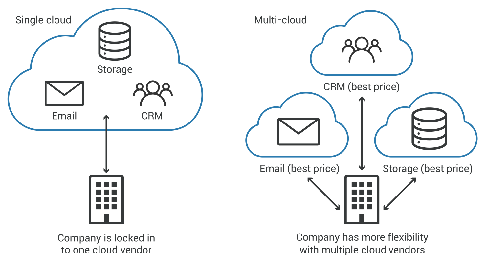

Um tesauro é uma ferramenta linguística que organiza e relaciona palavras e expressões, apresentando sinônimos e, às vezes, antônimos. 

Criamos este tesauro como forma de reunir em um único lugar os acrônimos que iremos utilizar nos mais diversos documentos que serão apresentados.

O tesauro ou thesaurus é um vocabulário que serve para traduzir a linguagem natural utilizada nos sistemas da 60portinities.

| Tipo          | Entenda |
| ------        | ------- |
| Abstração     | É o ato de simplificar uma entidade do mundo real em seus atributos e comportamentos essenciais e mais necessários no contexto do propósito do software. |
| Atributo      | É uma propriedade (variável) que contém valores diferentes dependendo do status do objeto. |
| Comportamento | É uma ação que o objeto pode executar. |
| Integridade conceitual | significa que há um tema unificador tão forte que parece que foi programado por um desenvolvedor. |
| Coesão        | Descreve o quão simples é um módulo ou um propósito de classe. Um módulo de alta coesão significa que seu objetivo é claro e não é mais complexo do que o necessário. Por outro lado, uma baixa coesão significa que é muito complicado e seu objetivo não é claro. |
| Implementação | Este é o processo de criação de um sistema de trabalho fora do projeto. Simplificando, é o processo de escrever o código. |
| Tipo de dado abstrato | Este é um tipo de dados que é definido por seu comportamento e não possui implementação. |
| Manutenção    | Isso se refere a corrigir, melhorar ou alterar recursos após a entrega do sistema. |
| Flexibilidade | Refere-se a quão fácil é aplicar alterações ou adicionar recursos ao seu sistema sem quebrá-lo. |
| Acoplamento   | Este é um termo da engenharia de software que descreve quando duas partes de um sistema dependem uma da outra de forma que cada uma delas não pode ser reutilizada individualmente em outro contexto. |
| Generalização | Isso envolve a refatoração de atributos e métodos comuns em uma classe separada, onde podem ser reutilizados com mais frequência. Isso garantirá que seu sistema seja menos acoplado. |
| Polimorfismo  | Esta é a capacidade de interagir com diferentes tipos de objetos da mesma maneira. |
| Decomposição  | A decomposição é quebrar uma entidade grande ou inteira em partes menores e mais simples, onde é fácil integrar e formar a entidade maior.  |
| Code smells   | São um conjunto de sinais comuns que indicam que seu código não é bom o suficiente e precisa ser refatorado para finalmente ter um código limpo. |

| Categoria(CAT) | Termo Geral(TG) | Abreviação | Termo Relacionado (TR) | Nota Explicativa (NE) | 
| ----- | ----- | ----- | ----- | ----- |
| GERAL |  | | Alucinação | No contexto da IA, as alucinações ocorrem quando o sistema gera informações imprecisas, incoerentes ou sem sentido, geralmente devido a erros ou limitações em seus recursos de treinamento, compreensão ou processamento. |
| GERAL |  | | Análise SWOT (SWOT Analysis) | Análise da competitividade de uma organização, considerando as variáveis Forças, Oportunidades, Fraquezas e Ameaças, popularmente chamada de “FOFA”. |
| GERAL |  | | B2B | “Business to Business” e trata-se do comércio entre empresas. |
| GERAL |  | | B2C | “Business to Consumer” e trata-se do comércio entre a empresa e o consumidor final. |
| GERAL |  | | Benchmarking | Análise estratégica das melhores práticas de empresas do mesmo ramo. |
| GERAL |  | | Big data | Conjuntos de dados grandes e complexos que são substanciais demais para serem processados ou analisados com o uso de ferramentas tradicionais ferramentas tradicionais de gerenciamento de dados |
| GERAL |  | | Brainstorming | Atividade feita para explorar a potencialidade criativa de um indivíduo ou de um grupo para objetivos da organização. |
| GERAL |  | | Break-even | “Ponto de equilíbrio”, é quando os custos da empresa são iguais às suas receitas. |
| GERAL |  | | Budget| Orçamento. | 
| GERAL |  | | Business Intelligence (Inteligência de Negócios) | É o processo de coleta, organização, análise, compartilhamento e monitoramento de informações que fornecem suporte a gestão de negócios. |
| GERAL |  | | Buzzword | Palavra ou expressão que se torna popular por um período de tempo. |
| GERAL |  | | Capital de Giro | Recursos financeiros utilizados para cobrir os custos do dia a dia e o prazo entre o pagamento de despesas e o recebimento da receita. |
| GERAL |  | | CCO | Chief Communications Officer |
| GERAL |  | | CDO | Chief Digital Officer - Diretor Digital ou Chief Design Officer - Diretor de Design ou Chief Diversity Officer - Diretor de Diversidade | 
| GERAL |  | | CEO | Chief Executive Officer. É o termo usado para se referir ao diretor executivo, pessoa com maior autoridade na hierarquia operacional de uma organização. |
| GERAL |  | | CFO | Chief Financial Officer, ou Diretor Financeiro, é responsável pela direção financeira da empresa, fazendo toda a administração e o planejamento estratégico. |
| GERAL |  | | Chatbot | Um assistente virtual utilizado para se comunicar por texto com usuários. |
| GERAL |  | | ChatGPT | Generative Pre-trained Transformers |
| GERAL |  | | CIO | Chief Information Officer ou Diretor de Informação ou Informática. |
| GERAL |  | | CMO | Chief Marketing Officer, ou Diretor de Marketing. |
| GERAL |  | | Commodities | Produtos primários, geralmente com grande participação no comércio internacional. | 
| GERAL |  | | COO | Chief Operating Officer, ou Diretor de Operações, é o braço direito da presidência e cuida de perto da parte comercial |
| GERAL |  | | CRM | Sigla para Customer Relationship Management, traduzida como Gestão de Relacionamento com o Cliente. |
| GERAL |  | | CTO | Chief Technology Officer, ou Diretor de Tecnologia, é o diretor-chefe da área de tecnologia de uma empresa. |
| GERAL |  | | Endomarketing | Marketing interno feito através de um conjunto de ações desenvolvidas para conscientizar, informar e motivar o colaborador dentro da empresa. |
| GERAL |  | | ERP | Enterprise Resource Planning, é um sistema que automatiza e integra a gestão de todas as áreas de uma empresa. |
| GERAL |  | | ESG |
| GERAL |  | | IA generativa | refere-se a um tipo de inteligência artificial que é capaz de criar novos conteúdos, como textos, imagens, músicas ou até mesmo vídeos, com base em padrões aprendidos a partir de dados existentes. |
| GERAL |  | | Internet das coisas-IoT | Rede de objetos digitais incorporados em nosso mundo físico. |
| GERAL |  | | KPI | Key Performance Indicator, traduzida como Indicadores-Chave de Performance e trata-se de uma ferramenta de gestão para analisar os indicadores mais importantes da empresa. |
| GERAL |  | | Lead | É um potencial consumidor que representa uma oportunidade de negócio, pois já demonstrou interesse na sua empresa de alguma forma. |
| GERAL |  | | LLM | Large Language Model ou Modelo de linguagem grande - LLM. poderoso sistema de inteligência artificial desenvolvido com base em dados extensos e algoritmos sofisticados, o que lhe permite entender, gerar e manipular a linguagem humana com notável proficiência. |
| GERAL |  | | Networking | É a ação de estabelecer e manter uma rede de contatos de cunho profissional. |
| GERAL |  | | PDCA | Plan, Do, Check e Act, que traduzido fica Planejar, Executar, Verificar e Agir. |
| GERAL |  | | ROI | Sigla para Return on Investment, que significa Retorno sobre Investimento. |
| GERAL |  | | Team Building | Conscientização dos profissionais da importância e do motivo pelo qual é necessário o trabalho em equipe, promovendo motivação e entusiasmo nas pessoas para realizar suas tarefas diárias. |
| INVEST |  |  | Independent/Independente    | Significa que uma boa história de usuário não depende de outras e que outras não dependem dela;                                           |
| INVEST |  |  | Negotiable/Negociável      | Uma história deve capturar a essência de um requisito, mas não os seus detalhes, que devem ser criados de forma colaborativa e emergente; |
| INVEST |  |  | Valuable/Valiosa         | Quer dizer que toda história deve agregar valor ao produto                                                                                |
| INVEST |  |  | Estimable / Estimável       | Histórias elas precisam ser pequenas e claras, com detalhes suficientes e bom nível de entendimento entre negócio e técnicos              |
| INVEST |  |  | Small (Pequena) | Entregá-la em no máximo uma sprint      |
| INVEST |  |  | Testable (Testável) | Precisamos ter clareza no objetivo, a ponto de ter clareza em como testar o sucesso da entrega, sejam testes manuais e/ou automatizados. |
| DEEP |  |  | Detalhado  | Detalhes suficientes para garantir clareza que propicie execução |
| DEEP |  |  | Estimado   | Quer dizer que todo item quando chega a um nível de detalhamento suficiente deve ter uma estimativa de esforço |
| DEEP |  |  | Emergente  | Backlog evolui conforme o Product Owner vai aprendendo sobre o produto.  |
| DEEP |  |  | Priorizado | Quer dizer que a ordem em que os elementos estão dispostos no backlog importa.  |
| TIPO BUG | | | Engano   | Ë uma ação humana que produz um resultado incorreto, introduzindo um erro. |
| TIPO BUG | | | Erro     | É a diferença entre um resultado obtido e um resultado esperado, podendo gerar um defeito. |
| TIPO BUG | | | Defeito  | É a manifestação de um erro e pode acarretar uma falha. |
| TIPO BUG | | | Falha    | É quando um software não cumpre seu objetivo, com ou sem exceção. |
| TIPO BUG | | | Exceção  | É um evento que causa a suspensão da execução normal de um programa. |
| BANCO DE DADOS | | | Relacional | Os dados são armazenados em formatos tubulares, ou seja, o dado fica na coluna, enquanto a descrição fica em linhas e atributos. |
| BANCO DE DADOS | | | Não-relacionais | 
| BANCO DE DADOS | | | Orientados a objetos | As informações são organizadas em blocos de informações com identificadores.  |
| BANCO DE DADOS | | | Autônomos | Um tipo de banco de dados gerenciado por machine learning, na nuvem. |
| BANCO DE DADOS | | | Data warehouses | Permitem a integração de dados de diferentes fontes. Além de manter os dados atuais, também é possível consultar um histórico. Geralmente, o Data warehouse é indicado para criação de relatórios de análise. |
| BANCO DE DADOS | | | Gráficos | Armazenam estruturas de dados complexas, que seriam incompatíveis em uma base tradicional. |
| AGILIDADE ||| Lean Startup | Busca evitar desperdício de tempo e recursos em um produto obtendo mais qualidade em seu processo final. |
| AGILIDADE ||| Design Thinking |Abordagem prática para a solução de problemas complexos através de um olhar mais humano. |
| AGILIDADE ||| Lean | É focado na criação de um fluxo / estratégia de negócios para aumentar a satisfação e entrega de valor aos clientes, utilizando o mínimo de recursos necessários. |
| AGILIDADE ||| MVP (Mínimo Produto Viável) | Significa justamente algo que você consiga transmitir uma ideia, mas que também proporcione uma experiência completa para o cliente. |
| AGILIDADE ||| DevOps | São **práticas** utilizadas para melhorar a integração entre equipes de tecnologia.DevOps são simplesmente **conceitos**. DevOps não é, nem trata de ferramentas diretamente. |
|           ||| Integração Contínua | É um dos conceitos contidos dentro da disciplina de DevOps que viabiliza o feedback rápido aos times envolvidos (fail-fast). Conhecida como *Continous Integration (CI)*, assim como o DevOps, também não é uma ferramenta, e sim conceitos.  |
|           ||| Jenkins | Atualmente a ferramenta mais utilizada para viabilizar os processos de integração contínua. Podemos assumir o Jenkins como o orquestrador do processo de CI, responsável por obter os códigos-fonte, avaliar, compilar, testar e prover um feedback aos interessados.  
|           ||| Docker | Plataforma de Containers, com ela iremos construir uma imagem personalizada de Jenkins. Esta imagem, por sua vez, nos irá garantir reprodutibilidade, escala e rápida resposta a desastres.   |
|           ||| Kubernetes |  Orquestrador de Containers, gerencia todo o processo de instalação e execução de containers, ele será responsável por gerir a execução da nossa imagem Jenkins e também prover recursos para a construção dos nossos códigos. |
|        ||| WWW   |  WORLD WIDE WEB |
|        ||| PAN   |  PERMANENT ACCOUNT NUMBER |
|        ||| URL   | UNIFORM RESOURCE LOCATOR |
|        ||| JPEG  | JOINT PHOTOGRAPHICS EXPERS GROUP |
|        ||| OTP   | One time password                |
|        ||| PIN   | Personal Identificaton Number    |
|        ||| QRCode | Quick Responde Code             |
|        ||| SMS    | Short Message Service           |
|        ||| MMs    | Multimedia Message Service      |
|        ||| WIFI   | Wireless Fidelity               |
|        ||| GIF    | Graphic Interchange Format      |
|        ||| GPS    | Global Position System          |

# Lock-in
O aprisionamento tecnológico se refere a uma situação em que o custo de se trocar um fornecedor por outro diferente é tão alto que o cliente fica basicamente preso ao fornecedor original. 

## Como evitar ou mitigar os riscos
* Estratégia de multinuvem ou de nuvem híbrida:  multinuvem incorpora vários provedores de nuvem, reduzindo a dependência de qualquer fornecedor único. Em uma nuvem híbrida, alguns dados permanecerão sob o controle direto de uma organização, seja em uma nuvem privada ou armazenados localmente.
* Garantir que os dados possam ser migrados facilmente: As empresas que utilizam computação em nuvem devem fazer um esforço para manter a portabilidade de seus dados,
* Avalie cuidadosamente os serviços em nuvem: As empresas devem fazer uma pesquisa rigorosa sobre um fornecedor de nuvem antes de assumir um compromisso, de preferência com a implantação de uma prova de conceito para ter certeza de que o nível de serviço do fornecedor é suficiente.

{width="900" height="600" style="display: block; margin: 0 auto"}
